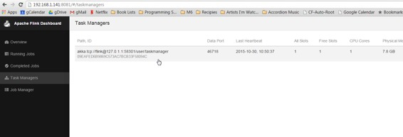

# 使用Flink和Spark Clusters安装Zeppelin教程

原文链接 : [http://zeppelin.apache.org/docs/0.7.2/quickstart/install_with_flink_and_spark_cluster.html](http://zeppelin.apache.org/docs/0.7.2/quickstart/install_with_flink_and_spark_cluster.html)

译文链接 : [http://www.apache.wiki/pages/viewpage.action?pageId=10030622](http://www.apache.wiki/pages/viewpage.action?pageId=10030622)

贡献者 : [片刻](/display/~jiangzhonglian) [ApacheCN](/display/~apachecn) [Apache中文网](/display/~apachechina)

本教程非常入门级。它假定没有Linux，git或其他工具的先前知识。如果你仔细地输入我告诉你的内容，你应该可以让Zeppelin运行。

## 在群集模式下使用Flink和Spark安装Zeppelin

本教程假定用户有一台机器（真正的或[虚拟的](https://www.virtualbox.org/wiki/Downloads)，安装最新的[Ubuntu 14.04.3服务器](http://www.ubuntu.comhttp://cwiki.apachecn.org/download/server)。

**注意：**根据虚拟机的大小要求，有些用户在使用默认虚拟机大小时报告了问题，特别是硬盘驱动器至少需要16GB，其他用户没有此问题。

有很多关于如何在虚拟盒子上安装Ubuntu Server的很好的教程，[这里是其中之一](http://ilearnstack.com/2013/04/13/setting-ubuntu-vm-in-virtualbox/)

### 所需程序

假设安装最少，我们需要在Zeppelin，Flink和Spark之前安装几个程序。

*   Git
*   OpenSSH服务器
*   OpenJDK 7
*   Maven 3.1+

对于git，openssh-server和OpenJDK 7，我们将使用apt包管理器。

**Git**

从命令提示符：

```
sudo apt-get install git 
```

**OpenSSH服务器**

```
sudo apt-get install openssh-server
```

**OpenJDK** 7

```
sudo apt-get install openjdk-7-jdk openjdk-7-jre-lib
```

```
使用Ubuntu 16.04的笔记：要openjdk-7在Ubuntu 16.04上安装，必须添加一个存储库。 资源
```

```
sudo add-apt-repository ppa:openjdk-r/ppa 
sudo apt-get update 
sudo apt-get install openjdk-7-jdk openjdk-7-jre-lib
```

```
Maven 3.1+
```

```
Zeppelin需要maven版本3.x. 写入时在仓库中可用的版本是2.x，所以maven必须手动安装。
```

```
清除任何现有版本的maven。
```

```
sudo apt-get purge maven maven2
```

```
下载maven 3.3.9二进制文件。
```

```
wget "http://www.us.apache.org/dist/maven/maven-3/3.3.9/binaries/apache-maven-3.3.9-bin.tar.gz"
```

```
取消归档二进制文件并移动到/usr/local目录。
```

```
tar -zxvf apache-maven-3.3.9-bin.tar.gz 
sudo mv ./apache-maven-3.3.9 /usr/local 
```

```
创建符号链接/usr/bin。
```

```
sudo ln -s /usr/local/apache-maven-3.3.9/bin/mvn /usr/bin/mvn
```

### 安装Zeppelin

这可以从源代码快速概述Zeppelin安装，但是鼓励读者查看“ [Zeppelin安装指南”](http://www.apache.wiki/pages/viewpage.action?pageId=10030536)

**从命令提示符：克隆Zeppelin。**

```
git clone https://github.com/apache/zeppelin.git
```

**输入Zeppelin根目录。**

```
cd zeppelin
```

**打包Zeppelin。**

```
mvn clean package -DskipTests -Pspark-1.6 -Dflink.version=1.1.3 -Pscala-2.10
```

```
-DskipTests跳过构建测试 - 你不是开发（还），所以你不需要做测试，克隆版本应该构建。
```

`-Pspark-1.6`告诉maven用Spark 1.6构建一个Zeppelin。这很重要，因为Zeppelin有自己的Spark解释器，版本必须相同。

`-Dflink.version=1.1.3` 告诉maven专门用Flink版本1.1.3构建Zeppelin。

- `-Pscala-2.10`告诉maven建立与Scala v2.10。

**注意：**您可能希望包含其他构建标志，例如`-Ppyspark`或`-Psparkr`。有关[详细信息，](https://github.com/apache/zeppelin#build)请参阅[github的构建部分](https://github.com/apache/zeppelin#build)。

**注意：**您可以针对具有Zeppelin构建配置文件的任何版本的Spark构建。关键是要确保您查看匹配版本的Spark来构建。在撰写本文时，Spark 1.6是最新的Spark版本。

**注意：**构建失败。现在已经安装了齐柏林30多次，我会告诉你，有时这个构建似乎没有理由失败。只要你没有编辑任何代码，由于你所做的事情，构建是不太可能失败的。往往会发生什么，是maven试图下载的一些依赖是无法访问的。如果你的构建失败了这一步这里有一些提示： - 不要气馁。 - 向上滚动阅读日志。那里会有线索。- 重试（即`mvn clean package -DskipTests -Pspark-1.6`再次运行） - 如果有线索不能下载依赖关系等待几个小时甚至几天，然后重试。编译时开源软件试图下载所需的所有依赖项，如果一台服务器是离线的，那么你什么也不能做，但等待它回来。** - 确保您仔细遵循所有步骤。**** - 请社区帮助您。**[去这里](http://zeppelin.apache.org/community.html)加入用户邮件列表。人们在那里帮助你。确保复制并粘贴构建输出（控制台中发生的所有事件），并将其包含在消息中。

**启动Zeppelin守护进程。**

```
bin/zeppelin-daemon.sh start
```

```
使用ifconfig以确定主机的IP地址。如果你不熟悉如何做，这里可以找到一个相当全面的文章。
```

在连接到与主机相同网络的计算机上（或在使用虚拟机的主机操作系统中）打开Web浏览器。导航到http：// `yourip`：8080，其中yourip是您发现的IP地址`ifconfig`。

请参阅[Zeppelin教程](http://www.apache.wiki/pages/viewpage.action?pageId=10030571)，了解基本的Zeppelin使用情况。还建议您花点时间查看每个Zeppelin安装中附带的教程笔记本，并熟悉基本的笔记本功能。

**Flink测试**

创建一个名为“Flink Test”的新笔记本，并复制并粘贴以下代码。

```
%flink  // let Zeppelin know what interpreter to use. 

val text = benv.fromElements("In the time of chimpanzees, I was a monkey",   // some lines of text to analyze
"Butane in my veins and I'm out to cut the junkie",
"With the plastic eyeballs, spray paint the vegetables",
"Dog food stalls with the beefcake pantyhose",
"Kill the headlights and put it in neutral",
"Stock car flamin' with a loser in the cruise control",
"Baby's in Reno with the Vitamin D",
"Got a couple of couches, sleep on the love seat",
"Someone came in sayin' I'm insane to complain",
"About a shotgun wedding and a stain on my shirt",
"Don't believe everything that you breathe",
"You get a parking violation and a maggot on your sleeve",
"So shave your face with some mace in the dark",
"Savin' all your food stamps and burnin' down the trailer park",
"Yo, cut it") 

/* The meat and potatoes:
 this tells Flink to iterate through the elements, in this case strings,
 transform the string to lower case and split the string at white space into individual words
 then finally aggregate the occurrence of each word. 

 This creates the count variable which is a list of tuples of the form (word, occurances) 

counts.collect().foreach(println(_)) // execute the script and print each element in the counts list 

*/
val counts = text.flatMap{ _.toLowerCase.split("\\W+") }.map { (_,1) }.groupBy(0).sum(1) 

counts.collect().foreach(println(_))  // execute the script and print each element in the counts list
```

```
运行代码以确保内置的Zeppelin Flink解释器工作正常。
```

**Spark 测试**

创建一个名为“Spark Test”的新笔记本，并复制并粘贴以下代码。

```
%spark // let Zeppelin know what interpreter to use. 

val text = sc.parallelize(List("In the time of chimpanzees, I was a monkey",  // some lines of text to analyze
"Butane in my veins and I'm out to cut the junkie",
"With the plastic eyeballs, spray paint the vegetables",
"Dog food stalls with the beefcake pantyhose",
"Kill the headlights and put it in neutral",
"Stock car flamin' with a loser in the cruise control",
"Baby's in Reno with the Vitamin D",
"Got a couple of couches, sleep on the love seat",
"Someone came in sayin' I'm insane to complain",
"About a shotgun wedding and a stain on my shirt",
"Don't believe everything that you breathe",
"You get a parking violation and a maggot on your sleeve",
"So shave your face with some mace in the dark",
"Savin' all your food stamps and burnin' down the trailer park",
"Yo, cut it")) 

/* The meat and potatoes:
 this tells spark to iterate through the elements, in this case strings,
 transform the string to lower case and split the string at white space into individual words
 then finally aggregate the occurrence of each word. 

 This creates the count variable which is a list of tuples of the form (word, occurances)
*/
val counts = text.flatMap { _.toLowerCase.split("\\W+") }
                 .map { (_,1) }
                 .reduceByKey(_ + _) 

counts.collect().foreach(println(_))  // execute the script and print each element in the counts list
```

```
运行代码以确保内置的Zeppelin Flink解释器工作正常。
```

最后，停止Zeppelin守护进程。从命令提示符运行：

```
bin/zeppelin-daemon.sh stop
```

### 安装群集

#### Flink集群

##### 下载二进制文件

建议从源头尽可能推荐，为了简化本教程，我们将下载Flink和Spark二进制文件。

下载Flink二进制使用 `wget`

```
wget "http://mirror.cogentco.com/pub/apache/flink/flink-1.1.3/flink-1.1.3-bin-hadoop24-scala_2.10.tgz"
tar -xzvf flink-1.1.3-bin-hadoop24-scala_2.10.tgz
```

这将下载Flink 1.1.3，与Hadoop 2.4兼容。您不必为此二进制文件安装Hadoop，但如果您使用Hadoop，请更改`24`为适当的版本。

启动Flink群集。

```
flink-1.1.3/bin/start-cluster.sh
```

##### 从源码编译

如果您希望从源代码构建Flink，以下内容将是有益的。请注意，如果您已下载并使用二进制版本，则应跳过此版本。跨平台的构建工具和版本的不断变化的性质使得该部分有点不稳定。例如，建议使用Java8和Maven 3.0.3构建Flink，这在撰写本文时不推荐用于Zeppelin。如果用户希望尝试从源代码构建，本节将提供一些参考。如果遇到错误，请联系Apache Flink社区。

有关更多详细说明，请参阅[Flink安装指南](https://github.com/apache/flink/blob/master/README.md)。

返回到您下载的目录，本教程假定是`$HOME`。克隆Flink，查看release-1.1.3-rc2并构建。

```
cd $HOME
git clone https://github.com/apache/flink.git
cd flink
git checkout release-1.1.3-rc2
mvn clean install -DskipTests
```

```
以独立模式启动Flink群集
```

```
build-target/bin/start-cluster.sh
```

##### 确保集群已启动

在浏览器中，浏览http:// `yourip:`8082查看Flink Web-UI。点击左侧导航栏中的“任务管理器”。确保至少有一个任务管理器存在。



如果没有任务管理器，请使用以下命令重新启动Flink集群：

（如果是二进制文件） `flink-1.1.3/bin/stop-cluster.sh flink-1.1.3/bin/start-cluster.sh`

（如果从源代码构建） `build-target/bin/stop-cluster.sh build-target/bin/start-cluster.sh`

#### Spark 1.6集群

##### 下载二进制文件

建议从源头尽可能推荐，为了简化本教程，我们将下载Flink和Spark二进制文件。

也使用二进制文件

下载Spark Binary使用 `wget`

```
wget "http://d3kbcqa49mib13.cloudfront.net/spark-1.6.3-bin-hadoop2.6.tgz"
tar -xzvf spark-1.6.3-bin-hadoop2.6.tgz
mv spark-1.6.3-bin-hadoop2.6 spark 
```

这将下载Spark 1.6.3，与Hadoop 2.6兼容。您不必为此二进制文件安装Hadoop，但如果您使用Hadoop，请更改`2.6`为适当的版本。

##### 从源头构建

Spark是一个非常大的项目，需要相当长的时间来下载和构建。Flink部分列出的类似原因也容易造成故障。如果用户希望尝试从源代码构建，本节将提供一些参考。如果遇到错误，请联系Apache Spark社区。

有关更多详细说明，请参阅[Spark安装](https://github.com/apache/spark/blob/master/README.md)指南。

返回到您下载的目录，本教程假定是$ HOME。克隆Spark，查看分支1.6，并构建。 **注意：**回想一下，我们只是检查出1.6，因为它是写作时存在Zeppelin配置文件的最新Spark。您可以自由查看其他版本，只需确保您使用正确版本的Spark构建Zeppelin。但是，如果您使用Spark 2.0，则字数计数示例将需要更改，因为Spark 2.0与以下示例不兼容。

```
cd $HOME
```

克隆，签出并构建Spark版本1.6.x.

```
git clone https://github.com/apache/spark.git
cd spark
git checkout branch-1.6
mvn clean package -DskipTests
```

##### 启动Spark群集

```
返回$HOME目录。
```

```
cd $HOME
```

以独立模式启动Spark群集，将webui端口指定为8080以外的其他端口（Zeppelin的webui端口）。

```
spark/sbin/start-master.sh --webui-port 8082
```

**注意：**为什么`--webui-port 8082`？这个文档的末尾有一个解释这个解释。

打开浏览器并导航到http://`yourip:`8082，以确保Spark主机正在运行。


 到页面顶部会有一个_URL_： spark:// `yourhost:`7077。注意这个URL，Spark Master URI，在后面的步骤中将需要它。

 使用Spark master WebUI中的URI启动从站：

```
spark/sbin/start-slave.sh spark://yourhostname:7077
```

返回到根目录并启动Zeppelin守护程序。

```
cd $HOME
zeppelin/bin/zeppelin-daemon.sh start
```

#### 配置解释器

打开一个Web浏览器，然后访问Zeppelin web-ui，网址为：http：// yourip：8080。

现在回到Zeppelin web-ui http://`yourip:`8080，这时候点击右上角的_匿名_，这将打开一个下拉菜单，选择_口译员_进入解释器配置。

在Spark部分中，点击右上角的编辑按钮，使属性值可编辑（看起来像铅笔）。在Spark解释器中唯一需要编辑的字段是主字段。我的这个值是从`local[*]`你用来启动奴隶的URL 改变的`[spark://ubuntu:7077](spark://ubuntu:7077)`。

单击_保存_更新参数，并在询问重新启动解释器时单击_确定_。

现在向下滚动到Flink部分。点击编辑按钮，改变的值_主_从`local`到`localhost`。再次点击_保存_。

重新打开示例并再次执行（即您需要单击屏幕顶部的播放按钮或段落上的按钮。

您应该可以检查Flink和Spark webuis（类似于http://`yourip:`8081，http://`yourip:`8082，http://`yourip:`8083），并查看已针对群集运行作业。

**Digression**对不起，模糊不清，并使用诸如“这样的”这样的术语，但是什么网站是在什么端口将取决于你开始的事情的顺序。您正在将浏览器指向特定端口，即8081,8082和8083\. Flink和Spark都希望将其web-ui放在端口8080上，但运行良好，并且可以使用下一个端口。由于Zeppelin首先启动，它将会获得端口8080.当Flink启动（假设您先启动Flink），它将尝试绑定端口8080，看到它已经被占用，并转到下一个可用，希望8081\. Spark有一个webui为主人和奴隶，所以当他们开始，他们将尝试绑定已经采取了由Zeppelin），然后8081（已经被Flink的webui），然后8082。 `--webui-port &lt;port&gt;` `&lt;port&gt;`

### 下一步

查看[教程](http://zeppelin.apache.org/docs/0.7.1/quickstart/tutorial.md)，了解更多酷炫的东西，你可以用你的新玩具！

[加入社区](http://zeppelin.apache.org/community.html)，提问和贡献！每一点都有帮助。