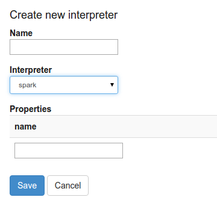
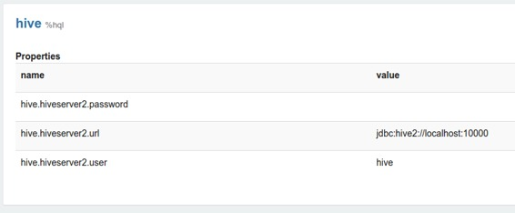
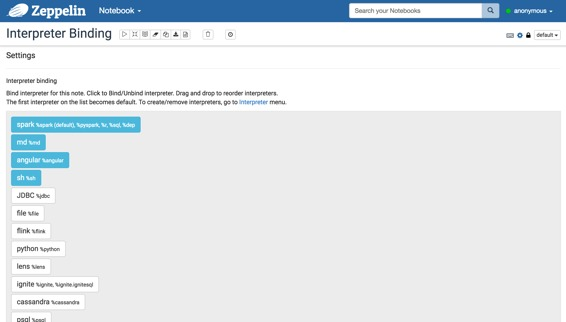
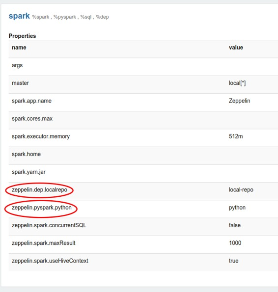
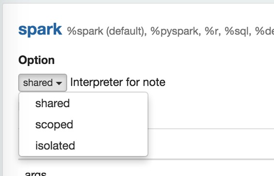
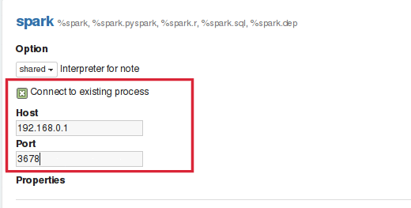

# 概述

原文链接 : [http://zeppelin.apache.org/docs/0.7.2/manual/interpreters.html](http://zeppelin.apache.org/docs/0.7.2/manual/interpreters.html)

译文链接 : [http://www.apache.wiki/pages/viewpage.action?pageId=10030641](http://www.apache.wiki/pages/viewpage.action?pageId=10030641)

贡献者 : [片刻](/display/~jiangzhonglian) [ApacheCN](/display/~apachecn) [Apache中文网](/display/~apachechina)

在本部分中，我们将解释在齐柏林的翻译，解释器组和解释器设置的作用。Zeppelin解释器的概念允许将任何语言/数据处理后端插入到Zeppelin中。

目前，Zeppelin支持许多解释器，如Scala（使用Apache Spark），Python（带有Apache Spark），Spark SQL，JDBC，Markdown，Shell等。

## 什么是Zeppelin解释器

Zeppelin Interpreter是一款插件，可让Zeppelin用户使用特定的语言/数据处理后端。例如，要在Zeppelin中使用Scala代码，您需要`%spark`解释器。

当您`+Create`在解释器页面中单击按钮时，解释器下拉列表框将显示您的服务器上的所有可用的解释器。



## 什么是解释器设置？

Zeppelin解释器设置是Zeppelin服务器上给定解释器的配置。例如，hive JDBC解释器连接到Hive服务器需要这些属性。



当属性名称由高位字符，数字和下划线组成（[A-Z_0-9]）时，属性将导出为环境变量。否则将属性设置为JVM属性。

每个笔记本都可以使用笔记本电脑右上角的设置图标绑定多个解释器设置。



## 什么是解释器组？

每个解释器都属于**解释器小组**。解释器组是start/stop解释器的单位。默认情况下，每个解释器都属于单个组，但该组可能包含更多的解释器。例如，Spark解释器组包括Spark支持，pySpark，Spark SQL和依赖加载器。

技术上来说，来自同一组的Zeppelin口译员正在运行在同一个JVM中。有关更多信息，请[在这里](http://zeppelin.apache.org/docs/0.7.1/development/writingzeppelininterpreter.html)检验。

每个解释器都属于一个单一的团体，并且一起注册。他们的所有属性都列在下面的解释器设置中。



## 解释器绑定模式

每个解释器设置可以选择“共享”，“范围”，“隔离”解释器绑定模式之一。在“共享”模式下，绑定到解释器设置的每个笔记本都将共享单个解释器实例。在“范围”模式下，每个笔记本将在相同的解释器过程中创建新的解释器实例。在“隔离”模式下，每个笔记本都会创建新的口译过程。



## 连接到现有的远程解释器

Zeppelin用户可以开始在其服务中嵌入解释器线程。这将为用户提供灵活性，以便在远程主机上启动解释器。要与您的服务一起开始解释器，您必须创建一个实例`RemoteInterpreterServer`并启动它，如下所示：

```
RemoteInterpreterServer interpreter=new RemoteInterpreterServer(3678);  
// Here, 3678 is the port on which interpreter will listen.     
interpreter.start() 
```

```
上面的代码将会在您的进程中启动解释器线程。解释器启动后，您可以通过检查连接到现有进程复选框来配置zeppelin连接到RemoteInterpreter ，然后提供如下图所示的解释器进程正在侦听的主机和端口：
```

