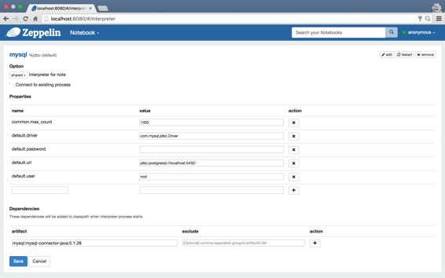
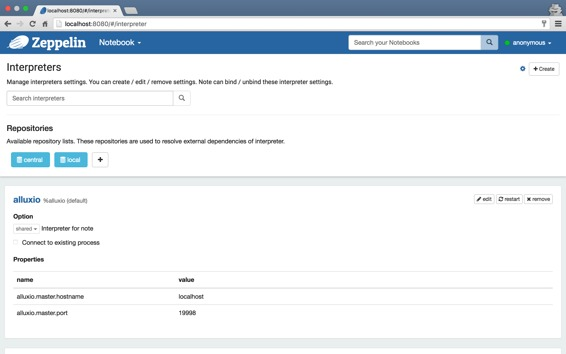
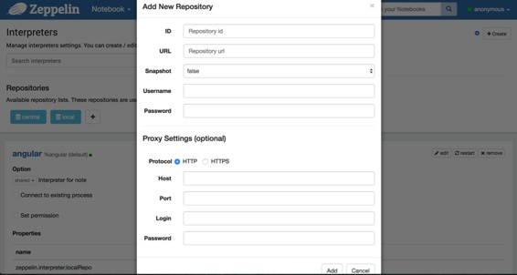

# 解释器依赖管理

原文链接 : [http://zeppelin.apache.org/docs/0.7.2/manual/dependencymanagement.html](http://zeppelin.apache.org/docs/0.7.2/manual/dependencymanagement.html)

译文链接 : [http://www.apache.wiki/pages/viewpage.action?pageId=10030743](http://www.apache.wiki/pages/viewpage.action?pageId=10030743)

贡献者 : [片刻](/display/~jiangzhonglian) [ApacheCN](/display/~apachecn) [Apache中文网](/display/~apachechina)

您可以通过在解释器菜单中设置依赖关系来将外部库包含到解释器中。

当你的代码需要外部库，而不是下载/复制/重新启动Zeppelin，您可以轻松地在此菜单中执行以下作业。

*   从Maven存储库递归加载库
*   从本地文件系统加载库
*   添加额外的maven仓库
*   自动将库添加到SparkCluster

**加载依赖关系到解释器** 

1.  点击导航栏中的“解释器”菜单。
2.  点击要加载依赖关系的解释器的“编辑”按钮。
3.  根据需要填写工件和排除字段。您不仅可以输入groupId：artifactId：version，还可以输入工件字段中的本地文件。
4.  按“保存”，使用加载的库重新启动解释器。

* * *

**添加用于依赖关系解析的存储库 ** 

1.  按 右上角的“解释器”菜单中的图标。它将显示可用的存储库列表。
2.  如果需要解决来自中央maven仓库或本地〜/.m2仓库的依赖关系，请点击图标旁边的存储库列表。
3.  填写表单并单击“添加”按钮，您将可以看到添加了新的存储库。
4.  或者，如果您在企业防火墙后面，您还可以指定所有代理设置，以便Zeppelin可以使用给定的凭据下载依赖项