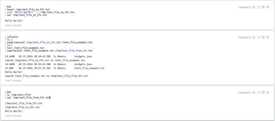

# Alluxio 解释器

原文链接 : [http://zeppelin.apache.org/docs/0.7.2/interpreter/alluxio.html](http://zeppelin.apache.org/docs/0.7.2/interpreter/alluxio.html)

译文链接 : [http://www.apache.wiki/pages/viewpage.action?pageId=10030763](http://www.apache.wiki/pages/viewpage.action?pageId=10030763)

贡献者 : [片刻](/display/~jiangzhonglian) [ApacheCN](/display/~apachecn) [Apache中文网](/display/~apachechina)

## 概述

[Alluxio](http://alluxio.org/)是以内存为中心的分布式存储系统，能够以集群框架的速度实现可靠的数据共享。

## 配置

| Name | Class | Description |
| --- | --- | --- |
| alluxio.master.hostname | localhost | Alluxio master 主机名 |
| alluxio.master.port | 19998 | Alluxio master 端口 |

## 启用Alluxio解释器

在笔记本中，要启用**Alluxio**解释器，请单击“ **齿轮”**图标，然后选择“ **Alluxio”**。

## 使用Alluxio解释器

在段落中，用于`%alluxio`选择**Alluxio**解释器，然后输入所有命令。

```
%alluxio
help 
```

> **提示：**使用（Ctrl +。）进行自动完成。

## 解释器命令

所述**Alluxio**解释器接受下列命令。

| 操作 | 语法 | 描述 |
| --- | --- | --- |
| cat | cat "path" | 将文件的内容打印到控制台。 |
| chgrp | chgrp "group" "path" | 更改目录或文件的组。 |
| chmod | chmod "permission" "path" | 更改目录或文件的权限。 |
| chown | chown "owner" "path" | 更改目录或文件的所有者。 |
| copyFromLocal | copyFromLocal "source path" "remote path" | 将由“source path”指定的指定文件复制到“remote path”指定的路径。如果“远程路径”已经存在，则此命令将失败。 |
| copyToLocal | copyToLocal "remote path" "local path" | 将指定的文件从“remote path”指定的路径复制到本地目的地。 |
| count | count "path" | 显示与“路径”中指定的前缀匹配的文件夹和文件数。 |
| du | du "path" | 显示由输入路径指定的文件或目录的大小。 |
| fileInfo | fileInfo "path" | 打印指定文件的块的信息。 |
| free | free "path" | 从Alluxio的目录下免费一个文件或所有文件。如果文件/目录也在存储下，它将仍然可用。 |
| getCapacityBytes | getCapacityBytes | 获得AlluxioFS的容量。 |
| getUsedBytes | getUsedBytes | 获取AlluxioFS中使用的字节数。 |
| load | load "path" | 将文件或目录的数据从存储下载到Alluxio中。 |
| loadMetadata | loadMetadata "path" | 将文件或目录的元数据从存储下载到Alluxio中。 |
| location | location "path" | 显示具有文件数据的主机列表。 |
| ls | ls "path" | 列出直接在给定路径下的所有文件和目录，其中包含大小等信息。 |
| mkdir | mkdir "path1" ... "pathn" | 在给定路径下创建目录，以及必要的父目录。由空格或制表符分隔的多个路径。如果任何给定路径已存在，则此命令将失败。 |
| mount | mount "path" "uri" | 将基础文件系统路径“uri”作为“路径”安装到Alluxio命名空间中。假设“路径”不存在，并由操作创建。没有数据或元数据从存储下载到Alluxio中。安装路径后，对安装路径下的对象的操作将映射到安装在存储下的对象。 |
| mv | mv "source" "destination" | 将由“source”指定的文件或目录移动到新位置“destination”。如果“destination”已经存在，则此命令将失败。 |
| persist | persist "path" | 将目前仅存储在Alluxio中的文件或目录保留到底层文件系统。 |
| pin | pin "path" | 固定给定文件以避免将其从内存中逐出。如果给定的路径是一个目录，它递归地将所有包含的文件和在此目录中创建的任何新文件进行引用。 |
| report | report "path" | 向主人报告文件丢失。 |
| rm | rm "path" | 删除文件。如果给定的路径是目录而不是文件，则此命令将失败。 |
| setTtl | setTtl "time" | 将文件的TTL（生存时间）设置为毫秒。 |
| tail | tail "path" | 将指定文件的最后1KB打印到控制台。 |
| touch | touch "path" | 在指定的位置创建一个0字节的文件。 |
| unmount | unmount "path" | 卸载安装在Alluxio命名空间中的底层文件系统路径为“路径”。“路径”下的Alluxio物体从Alluxio中移除，但它们仍然存在于先前安装的存储下。 |
| unpin | unpin "path" | 取消固定给定文件以允许Alluxio再次驱逐此文件。如果给定的路径是一个目录，它会递归地解除所有包含的文件和在此目录中创建的任何新文件。 |
| unsetTtl | unsetTtl | 从文件中删除TTL（生存时间）设置。 |

## 如何测试它的工作

一定要正确配置Alluxio解释器，然后打开一个新的段落并键入上述命令之一。

下面一个简单的例子来说明如何与Alluxio解释器进行交互。执行以下步骤：

*   使用sh解释器，在本地机器上创建一个新的文本文件
*   使用Alluxio解释器：
    *   列出了afs（Alluxio File System）根目录的内容
    *   先前创建的文件被复制到afs
    *   再次列出了afs root的内容，以检查是否存在新的复制文件
    *   显示了复制文件的内容（使用tail命令）
    *   之前复制到afs的文件被复制到本地机器
*   使用sh解释器检查从Alluxio复制的新文件的存在，并显示其内容

