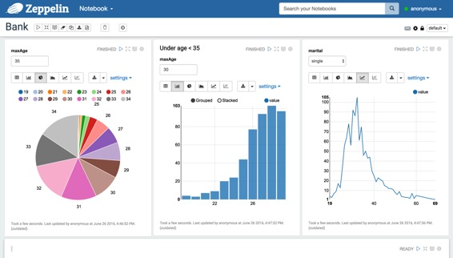
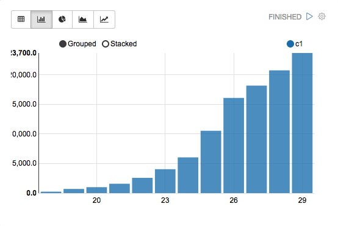
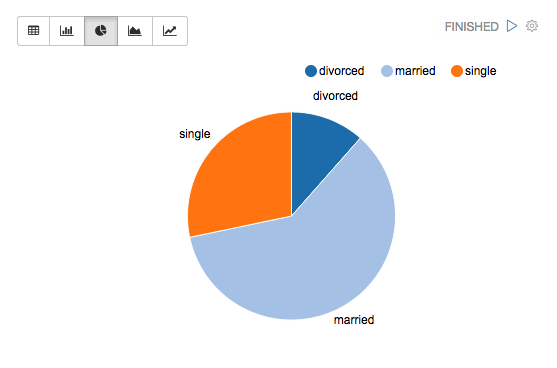
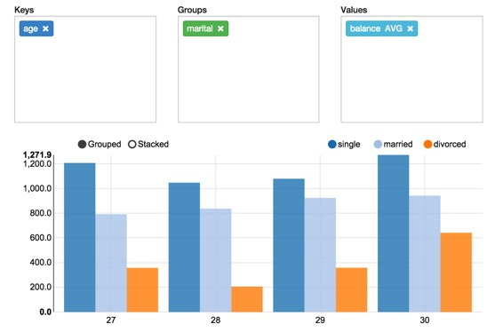
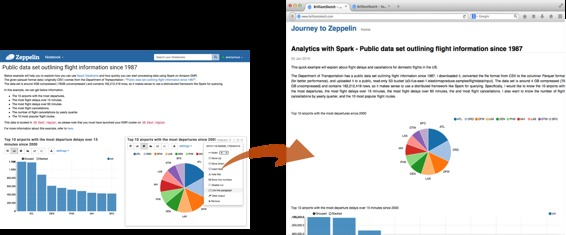

# 什么是Apache Zeppelin?

原文链接 : [http://zeppelin.apache.org/docs/0.7.2/index.html](http://zeppelin.apache.org/docs/0.7.2/index.html)

译文链接 : [http://www.apache.wiki/pages/viewpage.action?pageId=10030475](http://www.apache.wiki/pages/viewpage.action?pageId=10030475)

贡献者 : [片刻](/display/~jiangzhonglian) [ApacheCN](/display/~apachecn) [Apache中文网](/display/~apachechina)

## 多用途笔记本

笔记本是满足您所有需求的地方

  数据摄入

  数据发现

  数据分析

  数据可视化与协作

## 多语言后端

[Apache Zeppelin解释器](http://zeppelin.apache.org/docs/0.7.1/manual/interpreters.html)概念允许将任何语言/数据处理后端插入到Zeppelin中。目前，Apache Zeppelin支持许多解释器，如Apache Spark，Python，JDBC，Markdown和Shell。

                                         

添加新的语言后端是非常简单的。了解[如何创建自己的解释器](http://zeppelin.apache.org/docs/0.7.2/development/writingzeppelininterpreter.html#make-your-own-interpreter)。

### Apache Spark集成

特别是，Apache Zeppelin提供内置的[Apache Spark](http://spark.apache.org/)集成。您不需要为其构建单独的模块，插件或库。

带有Spark集成的Apache Zeppelin提供

*   自动SparkContext和SQLContext注入
*   从本地文件系统或maven仓库运行jar依赖性加载。了解更多[依赖装载机](http://zeppelin.apache.org/docs/0.7.2/interpreter/spark.html#dependencyloading)。
*   取消工作并显示其进度

有关Apache Zeppelin中Apache Spark的更多信息，请参阅[Apache Zeppelin的Spark解释器](http://www.apache.wiki/pages/viewpage.action?pageId=10030923)。

## 数据可视化

Apache Zeppelin中已经包含了一些基本图表。可视化不限于Spark SQL查询，任何语言后端的任何输出都可以被识别和可视化。

|  |  |
| --- | --- |

### 数据透视图

Apache Zeppelin聚合值，并通过简单的拖放将其显示在透视图中。您可以轻松创建具有多个汇总值的图表，包括总和，数量，平均值，最小值，最大值。

详细了解Apache Zeppelin中的[系统显示](http://zeppelin.apache.org/docs/0.7.1/index.html#display-system)。

## 动态表单

Apache Zeppelin可以在笔记本中动态创建一些输入表单。

详细了解[动态表单](http://zeppelin.apache.org/docs/0.7.1/manual/dynamicform.html)。

## 通过共享您的笔记本和段落进行协作

您的笔记本网址可以在协作者之间共享。然后，Apache Zeppelin将会实时播放任何更改，就像Google文档中的协作一样。

Apache Zeppelin提供了仅显示结果的URL，该页面不包括笔记本内的任何菜单和按钮。您可以轻松地将其作为iframe嵌入到您的网站内。如果您想了解更多有关此功能的信息，请访问[此页面](http://zeppelin.apache.org/docs/0.7.1/manual/publish.html)。

## 100％Opensource

Apache Zeppelin是Apache2许可软件，请查看[源库](http://git.apache.org/zeppelin.git)和[如何贡献](https://zeppelin.apache.org/contribution/contributions.html)。

Apache Zeppelin有一个非常活跃的开发社区。加入我们的[邮件列表](https://zeppelin.apache.org/community.html)并报告[Jira Issue跟踪器的问题](https://issues.apache.org/jira/browse/ZEPPELIN)。

## 下一步是什么？

### 快速开始

*   入门
    *   [快速入门](http://www.apache.wiki/pages/viewpage.action?pageId=10030536)安装Apache Zeppelin的基本说明
    *   [ ](http://zeppelin.apache.org/docs/0.7.1/install/configuration.html)Apache Zeppelin的[配置](http://www.apache.wiki/pages/viewpage.action?pageId=10030540)列表
    *   [探索Apache Zeppelin UI](http://www.apache.wiki/pages/viewpage.action?pageId=10030562)：Apache Zeppelin的基本组件
    *   [教程](http://www.apache.wiki/pages/viewpage.action?pageId=10030571)：使用Apache Spark后端的简短漫步教程
*   基本功能指南
    *   [动态表单](http://www.apache.wiki/pages/viewpage.action?pageId=10030585)：创建动态表单的分步指南
    *   [将您的段落结果发布](http://www.apache.wiki/pages/viewpage.action?pageId=10030598)到您的外部网站
    *   [ ](http://zeppelin.apache.org/docs/0.7.1/manual/notebookashomepage.html)用您的笔记本电脑[自定义Zeppelin主页](http://www.apache.wiki/pages/viewpage.action?pageId=10030607)
*   更多
    *   [升级Apache Zeppelin版本](http://www.apache.wiki/pages/viewpage.action?pageId=10030611)：升级Apache Zeppelin版本的手动过程
    *   构建：[从源代码构建](http://www.apache.wiki/pages/viewpage.action?pageId=10030615)

### 解释器

*   [解释器在Apache Zeppelin](http://www.apache.wiki/pages/viewpage.action?pageId=10030641)：什么是解释器组？你如何在Apache Zeppelin中设置解释器？
*   用法
    *   [解释器安装](http://www.apache.wiki/pages/viewpage.action?pageId=10030734)：不仅安装社区管理口译员，还可以安装第三方口译员
    *   [ ](http://zeppelin.apache.org/docs/0.7.1/manual/dependencymanagement.html)当您将外部库包含在[解释器依赖中](http://www.apache.wiki/pages/viewpage.action?pageId=10030743)时，可以进行解释器依赖管理
    *   [ ](http://zeppelin.apache.org/docs/0.7.1/manual/userimpersonation.html)当您要作为最终用户运行解释器时，[解释器的模拟用户](http://www.apache.wiki/pages/viewpage.action?pageId=10030749)
    *   [解释员执行Hook（实验）](http://www.apache.wiki/pages/viewpage.action?pageId=10030757)指定在执行前后段代码时由解释器执行的其他代码
*   可用的解释器：目前，Apache Zeppelin有大约20个解释器。

### 系统显示

*   基本系统显示：[文本，HTML，表格](http://www.apache.wiki/pages/viewpage.action?pageId=10030651)可用
*   Angular API：关于avilable后端和前端AngularJS API的说明
    *   [角度（后端API）](http://www.apache.wiki/pages/viewpage.action?pageId=10030654)
    *   [角度（前端API）](http://www.apache.wiki/pages/viewpage.action?pageId=10030670)

### 更多

*   [笔记本存储](http://www.apache.wiki/pages/viewpage.action?pageId=10030689)：关于将笔记本电脑保存到外部存储器的指南
    *   [Git存储](http://zeppelin.apache.org/docs/0.7.2/storage/storage.html#notebook-storage-in-local-git-repository)
    *   [S3存储](http://zeppelin.apache.org/docs/0.7.2/storage/storage.html#notebook-storage-in-s3)
    *   [Azure存储](http://zeppelin.apache.org/docs/0.7.2/storage/storage.html#notebook-storage-in-azure)
    *   [ZeppelinHub存储](http://zeppelin.apache.org/docs/0.7.2/storage/storage.html#storage-in-zeppelinhub)
*   REST API：Apache Zeppelin中的可用REST API列表
    *   [解释器 API](http://www.apache.wiki/pages/viewpage.action?pageId=10030697)
    *   [笔记本 API](http://www.apache.wiki/pages/viewpage.action?pageId=10031062)
    *   [笔记本资源 API](http://www.apache.wiki/pages/viewpage.action?pageId=10031071)
    *   [配置 API](http://www.apache.wiki/pages/viewpage.action?pageId=10031076)
    *   [凭据 API](http://www.apache.wiki/pages/viewpage.action?pageId=10031082)
    *   [Helium API](http://www.apache.wiki/pages/viewpage.action?pageId=10031086)
*   安全性：Apache Zeppelin中可用的安全支持
    *   [NGINX认证](http://zeppelin.apache.org/docs/0.7.2/security/authentication.html)
    *   [Shiro认证](http://zeppelin.apache.org/docs/0.7.2/security/shiroauthentication.html)
    *   [笔记本授权](http://zeppelin.apache.org/docs/0.7.2/security/notebook_authorization.html)
    *   [数据源授权](http://zeppelin.apache.org/docs/0.7.2/security/datasource_authorization.html)
*   高级
    *   [Apache Zeppelin在Vagrant VM上](http://www.apache.wiki/pages/viewpage.action?pageId=10031029)
    *   [Spark集群模式下的Zeppelin（通过Docker独立）](http://zeppelin.apache.org/docs/0.7.2/install/spark_cluster_mode.html#spark-standalone-mode)
    *   [Spark集群模式下的Zeppelin（通过Docker的YARN）](http://zeppelin.apache.org/docs/0.7.2/install/spark_cluster_mode.html#spark-on-yarn-mode)
    *   [Spark集群模式下的Zeppelin（通过Docker的Mesos）](http://zeppelin.apache.org/docs/0.7.2/install/spark_cluster_mode.html#spark-on-mesos-mode)
    *   [CDH上的Zeppelin（通过Docker）](http://www.apache.wiki/pages/viewpage.action?pageId=10031042)
*   有助于
    *   [撰写Zeppelin翻译](http://zeppelin.apache.org/docs/0.7.2/development/writingzeppelininterpreter.html)
    *   [撰写Zeppelin应用（实验）](http://zeppelin.apache.org/docs/0.7.2/development/writingzeppelinapplication.html)
    *   [写写飞侠拼图（实验）](http://zeppelin.apache.org/docs/0.7.2/development/writingzeppelinspell.html)
    *   [写作飞行员可视化（实验）](http://zeppelin.apache.org/docs/0.7.2/development/writingzeppelinvisualization.html)
    *   [如何贡献（代码）](http://zeppelin.apache.org/docs/0.7.2/development/howtocontribute.html)
    *   [如何贡献（文件网站）](http://zeppelin.apache.org/docs/0.7.2/development/howtocontributewebsite.html)

### 外部资源

*   [邮件列表](https://zeppelin.apache.org/community.html)
*   [Apache Zeppelin维基](https://cwiki.apache.org/confluence/display/ZEPPELIN/Zeppelin+Home)
*   [StackOverflow标签 `apache-zeppelin`](http://stackoverflow.com/questions/tagged/apache-zeppelin)