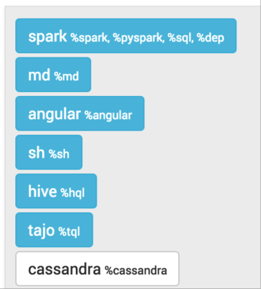
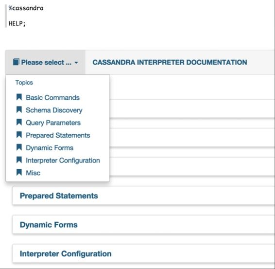
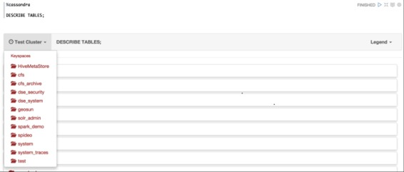

# Cassandra CQL 解释器

原文链接 : [http://zeppelin.apache.org/docs/0.7.2/interpreter/cassandra.html](http://zeppelin.apache.org/docs/0.7.2/interpreter/cassandra.html)

译文链接 : [http://www.apache.wiki/pages/viewpage.action?pageId=10030777](http://www.apache.wiki/pages/viewpage.action?pageId=10030777)

贡献者 : [片刻](/display/~jiangzhonglian) [ApacheCN](/display/~apachecn) [Apache中文网](/display/~apachechina)

| Name | Class | Description |
| --- | --- | --- |
| %cassandra | CassandraInterpreter | 为Apache Cassandra CQL查询语言提供解释器 |

## 启用Cassandra解释器

在笔记本中，要启用**Cassandra**解释器，请单击**Gear**图标并选择**Cassandra。**



## 使用Cassandra解释器

在段落中，使用**_％cassandra_**来选择**Cassandra**解释器，然后输入所有命令。

要访问交互式帮助，请键入**HELP;**



## 解释器命令

所述Cassandra解释器接受下列命令

| Command Type | Command Name | Description |
| --- | --- | --- |
| Help command | HELP | 显示交互式帮助菜单 |
| Schema commands | DESCRIBE KEYSPACE, DESCRIBE CLUSTER, DESCRIBE TABLES ... | 描述Cassandra模式的自定义命令 |
| Option commands | @consistency, @retryPolicy, @fetchSize ... | 将运行时选项注入段落中的所有语句 |
| Prepared statement commands | @prepare, @bind, @remove_prepared | 让您注册一个准备好的命令，并通过注入绑定值重新使用它 |
| Native CQL statements | All CQL-compatible statements (SELECT, INSERT, CREATE ...) | 所有CQL语句都直接针对Cassandra服务器执行 |

## CQL语句

该解释器与Cassandra支持的任何CQL语句兼容。例如：

```
INSERT INTO users(login,name) VALUES('jdoe','John DOE');
SELECT * FROM users WHERE login='jdoe'; 
```

除了以下特殊命令之外，每个语句都应以分号（**;**）分隔：

1.  @准备
2.  @bind
3.  @remove_prepare
4.  @一致性
5.  @serialConsistency
6.  @timestamp
7.  @retryPolicy
8.  @fetchSize
9.  @请求超时

只要它们以分号分隔，就支持多行语句以及同一行上的多个语句。例如：

```
USE spark_demo; 

SELECT * FROM albums_by_country LIMIT 1; SELECT * FROM countries LIMIT 1; 

SELECT *
FROM artists
WHERE login='jlennon'; 
```

支持批处理语句，可以跨多行，以及DDL（CREATE / ALTER / DROP）语句：

```
BEGIN BATCH
    INSERT INTO users(login,name) VALUES('jdoe','John DOE');
    INSERT INTO users_preferences(login,account_type) VALUES('jdoe','BASIC');
APPLY BATCH; 

CREATE TABLE IF NOT EXISTS test(
    key int PRIMARY KEY,
    value text
); 
```

CQL语句不**区分大小写**（列名和值除外）。这意味着以下语句是等同和有效的：

```
INSERT INTO users(login,name) VALUES('jdoe','John DOE');
Insert into users(login,name) vAlues('hsue','Helen SUE'); 
```

所有CQL语句和版本的完整列表如下：

| Cassandra版本 | 文件链接 |
| --- | --- |
| **3.X** | [http://docs.datastax.com/en/cql/3.3/cql/cqlIntro.html](http://docs.datastax.com/en/cql/3.3/cql/cqlIntro.html) |
| **2.2** | [http://docs.datastax.com/en/cql/3.3/cql/cqlIntro.html](http://docs.datastax.com/en/cql/3.3/cql/cqlIntro.html) |
| **2.1＆2.0** | [http://docs.datastax.com/en/cql/3.1/cql/cql _intro_ c.html](http://docs.datastax.com/en/cql/3.1/cql/cql_intro_c.html) |
| **1.2** | [http://docs.datastax.com/en/cql/3.0/cql/aboutCQL.html](http://docs.datastax.com/en/cql/3.0/cql/aboutCQL.html) |

## 声明中的评论

可以在语句之间添加注释。单行注释以**哈希符号**（＃）或**双斜杠**（//）开头。多行注释在/ **和** /之间。例如：

```
#Single line comment style 1
INSERT INTO users(login,name) VALUES('jdoe','John DOE');

//Single line comment style 2

/**
 Multi line
 comments
 **/
Insert into users(login,name) vAlues('hsue','Helen SUE'); 
```

## 语法验证

解释器随附了一个内置的语法验证器。此验证器仅检查基本语法错误。

所有与CQL相关的语法验证都直接**委托**给**Cassandra**

大多数情况下，语法错误是由于语句或**打字错误**之间**的分号丢失**造成的。

## 模式命令

为了使模式发现更容易和更具交互性，支持以下命令：

| 命令 | 描述 |
| --- | --- |
| **DESCRIBE CLUSTER;** | 显示当前的群集名称及其分区 |
| **DESCRIBE KEYSPACES;** | 列出集群中的所有现有密钥空间及其配置（复制因子，持久写入...） |
| **DESCRIBE TABLES;** | 列出集群中的所有现有密钥空间，并列出所有表的名称 |
| **DESCRIBE TYPES;** | 列出集群中的所有现有密钥空间，并列出所有用户定义的类型名称 |
| **DESCRIBE FUNCTIONS;** | 列出集群中的所有现有键空间，并列出所有函数的名称 |
| **DESCRIBE AGGREGATES;** | 列出集群中的所有现有密钥空间，并列出所有聚合名称 |
| **DESCRIBE MATERIALIZED VIEWS;** | 列出集群中的所有现有密钥空间，并列出所有实例化视图名称 |
| **DESCRIBE KEYSPACE &lt;keyspace_name&gt;;_** | 描述给定的密钥空间配置及其所有表的详细信息（名称，列，...） |
| **DESCRIBE TABLE (&lt;keyspacename&gt;).&lt;table_name&gt;;_** | 描述给定的表。如果没有提供密钥空间，则使用当前登录的密钥空间。如果没有登录密钥空间，则使用默认系统密钥空间。如果没有找到表，会出现错误信息 |
| **DESCRIBE TYPE (&lt;keyspacename&gt;).&lt;type_name&gt;;_** | 描述给定类型（UDT）。如果没有提供密钥空间，则使用当前登录的密钥空间。如果没有登录密钥空间，则使用默认系统密钥空间。如果没有找到类型，会出现错误信息 |
| **DESCRIBE FUNCTION (&lt;keyspacename&gt;).&lt;function_name&gt;;_** | 描述给定的功能。如果没有提供密钥空间，则使用当前登录的密钥空间。如果没有登录密钥空间，则使用默认系统密钥空间。如果没有找到功能，则会出现错误信息 |
| **DESCRIBE AGGREGATE (&lt;keyspacename&gt;).&lt;aggregate_name&gt;;_** | 描述给定的聚合。如果没有提供密钥空间，则使用当前登录的密钥空间。如果没有登录密钥空间，则使用默认系统密钥空间。如果没有找到聚合，则会出现错误消息 |
| **DESCRIBE MATERIALIZED VIEW (&lt;keyspacename&gt;).&lt;view_name&gt;;** | 描述给定的视图。如果没有提供密钥空间，则使用当前登录的密钥空间。如果没有登录密钥空间，则使用默认系统密钥空间。如果没有找到任何视图，会出现错误信息 |

模式对象（集群，密钥空间，表，类型，功能和聚合）以表格格式显示。左上角有一个下拉菜单来展开对象细节。右上角的菜单显示“图标”图标。



## 运行时参数

有时您希望能够将运行时查询参数传递给您的语句。

这些参数不是CQL规范的一部分，而是特定于解释器。

以下是所有参数的列表：

| 参数 | 语法 | 描述 |
| --- | --- | --- |
| Consistency Level | **@consistency=_value_** | 将给定的一致性级别应用于段落中的所有查询 |
| Serial Consistency Level | **@serialConsistency=_value_** | 将给定的串行一致性级别应用于段落中的所有查询 |
| Timestamp | **@timestamp=_long value_** | 将给定的时间戳应用于段落中的所有查询。请注意，直接在CQL语句中传递的时间戳值将覆盖此值 |
| Retry Policy | **@retryPolicy=_value_** | 将给定的重试策略应用于段落中的所有查询 |
| Fetch Size | **@fetchSize=_integer value_** | 将给定的提取大小应用于段落中的所有查询 |
| Request Time Out | **@requestTimeOut=_integer value_** | 将给定的请求超时**以毫秒**为**单位应用于段落**中的所有查询 |

一些参数仅接受限制值：

| 参数 | 可能的值 |
| --- | --- |
| Consistency Level | **ALL, ANY, ONE, TWO, THREE, QUORUM, LOCAL_ONE, LOCAL_QUORUM, EACH_QUORUM_** |
| Serial Consistency Level | **SERIAL, LOCALSERIAL** |
| Timestamp | Any long value |
| Retry Policy | **DEFAULT, DOWNGRADING_CONSISTENCY, FALLTHROUGH, LOGGING_DEFAULT, LOGGING_DOWNGRADING, LOGGING_FALLTHROUGH** |
| Fetch Size | Any integer value |

> 请注意，您应该**不**加分号（**;**在每个参数语句的结束）

一些例子：

```
CREATE TABLE IF NOT EXISTS spark_demo.ts(
    key int PRIMARY KEY,
    value text
);
TRUNCATE spark_demo.ts; 

// Timestamp in the past
@timestamp=10 

// Force timestamp directly in the first insert
INSERT INTO spark_demo.ts(key,value) VALUES(1,'first insert') USING TIMESTAMP 100; 

// Select some data to make the clock turn
SELECT * FROM spark_demo.albums LIMIT 100; 

// Now insert using the timestamp parameter set at the beginning(10)
INSERT INTO spark_demo.ts(key,value) VALUES(1,'second insert'); 

// Check for the result. You should see 'first insert'
SELECT value FROM spark_demo.ts WHERE key=1; 
```

有关查询参数的一些注释：

> 1.  **许多**查询参数可以在同一段落中设置
> 2.  如果**相同的**查询参数用不同的值设置很多时间，则解释器仅考虑第一个值
> 3.  每个查询参数都适用于同一**段落**中的**所有CQL语句**，除非您使用纯CQL文本覆盖选项（如强制使用USING子句的时间戳）
> 4.  关于CQL语句的每个查询参数的顺序并不重要

## 支持准备声明

出于性能原因，最好先准备语句，然后通过提供绑定值重用它们。

此解释器提供3个命令来处理准备和绑定的语句：

1.  **@prepare**
2.  **@bind**
3.  **@remove_prepared**

例：

```
@prepare[statement-name]=... 

@bind[statement-name]=’text’, 1223, ’2015-07-30 12:00:01’, null, true, [‘list_item1’, ’list_item2’] 

@bind[statement-name-with-no-bound-value] 

@remove_prepare[statement-name] 
```

#### @prepare

您可以使用语法_“@prepare [statement-name] = SELECT ...”_来创建一个准备好的语句。该_语句名_是**强制性的**，因为翻译准备与Java驱动程序给定的语句，并在保存生成的准备语句**内部哈希表**，使用所提供的_语句名_作为搜索关键字。

> 请注意，内部准备的语句映射与**所有笔记本**和**所有段落**共享，因为**Cassandra**只有一个解释器实例
> 
> 如果解释器遇到**相同的****_statement-name_****（key）的****许多** @prepare，那么只有**第一个**语句才会被考虑。

例：

```
@prepare[select]=SELECT * FROM spark_demo.albums LIMIT ? 

@prepare[select]=SELECT * FROM spark_demo.artists LIMIT ?  
```

对于上述示例，准备好的语句是`SELECT * FROM spark_demo.albums LIMIT ?`。`SELECT * FROM spark_demo.artists LIMIT？被忽略，因为已准备好的语句映射中已经存在一个条目，带有key select。

在**Zeppelin**的背景下，笔记本可以定期执行，因此有必要**避免重新准备许多时间相同的声明（被认为是反模式）**。

#### [@bind](http://zeppelin.apache.org/docs/0.7.1/interpreter/cassandra.html#bind)

一旦准备好声明（可能在分开的笔记本/段落中）。您可以将值绑定到它：

```
@bind[select_first]=10 
```

绑定值不是@bind语句的**强制**值。但是，如果您提供绑定值，则需要遵守一些语法： 

*   字符串值应包含在简单引号（'）之间
*   日期值应包含在简单引号（'）之间，并遵循格式：
    1.  yyyy-MM-dd HH：MM：ss
    2.  yyyy-MM-dd HH：MM：ss.SSS
*   **null**按原样解析
*   **布尔值**（true | false）按原样解析
*   集合值必须遵循**[标准的CQL语法](http://docs.datastax.com/en/cql/3.1/cql/cql_using/use_collections_c.html)**：
    *   列表：['list _item1'，'list_ item2'，...]
    *   设置：{'set _item1'，'set_ item2'，...}
    *   map：{'key1'：'val1'，'key2'：'val2'，...}
*   **元组**值应该在括号之间（见**[元组CQL语法](http://docs.datastax.com/en/cql/3.1/cql/cql_reference/tupleType.html)**）：（'text'，123，true）
*   **udt**值应该在括号之间（见**[UDT CQL语法](http://docs.datastax.com/en/cql/3.1/cql/cql_using/cqlUseUDT.html)**）：{stree _name：'Beverly Hills'，number：104，邮编_：90020，state：'California'，...}

> 可以在批处理中使用@bind语句：
> 
> ```
> BEGIN BATCH
>    @bind[insert_user]='jdoe','John DOE'
>    UPDATE users SET age = 27 WHERE login='hsue';
> APPLY BATCH; 
> ```

#### [@remove_prepare](http://zeppelin.apache.org/docs/0.7.1/interpreter/cassandra.html#remove_prepare)

```
为了避免准备好的语句永远保留在准备好的语句映射中，您可以使用 @remove_prepare [statement-name]语法将其删除。删除不存在的准备语句不会产生错误。
```

## 使用动态表单

而不是对CQL查询进行硬编码，可以使用**[Zeppelin动态表单](http://zeppelin.apache.org/docs/0.6.0-SNAPSHOT/manual/dynamicform.html)**语法注入简单的值或多个选择表单。

仍然支持绑定输入文本和选择表单的旧式胡须语法（**{{}}**），但不推荐使用，并在将来的版本中将其删除。

> **传统** 简单参数的语法是：**{{input_Label = default value}}**。默认值是强制性的，因为第一次执行该段落，我们在呈现表单之前启动CQL查询，因此应提供至少一个值。
> 
> 多选择参数的语法是：**{{input_Label = value1 | value2 | ... | valueN}}**。默认情况下，第一次执行该段落时，首选用于CQL查询。

例：

```
#Secondary index on performer style 
SELECT name, country, performer 
FROM spark_demo.performers 
WHERE name='${performer=Sheryl Crow|Doof|Fanfarlo|Los Paranoia}' 
AND styles CONTAINS '${style=Rock}';  
```

在上面的例子中，第一个CQL查询将执行为_performer ='Sheryl Crow'AND style ='Rock'_。对于后续查询，您可以使用表单直接更改值。

> 请注意，我们在简单引号（**'**）之间附带了**$ {}**块，因为Cassandra希望有一个String。我们也可以使用**$ {style ='Rock'}**语法，但这次，表单上显示的值是**_“Rock”_**而不是**_Rock_**。

也可以使用动态表单来**准备语句**：

```
@bind[select]=='${performer=Sheryl Crow|Doof|Fanfarlo|Los Paranoia}', '${style=Rock}' 
```

## 共享状态

可以并行执行许多段落。但是，在后端，我们仍然使用同步查询。 只有当有可能返回值时，_异步执行_才是可能`Future`的`InterpreterResult`。这可能是**Zeppelin**项目的一个有趣的建议。

最近，**Zeppelin**允许您选择解释员的隔离级别（请参阅**[解释器绑定模式](http://zeppelin.apache.org/docs/0.6.0-SNAPSHOT/manual/interpreters.html)**）。

长篇小说，你有3个可用的绑定：

*   **shared**：_相同的JVM_和所有注释的_相同的解释器实例_ 
*   **范围**：_相同的JVM_但_不同的解释器实例_，每个音符一个
*   **隔离**：_不同的JVM_运行_单个解释器实例_，每个音符一个JVM

使用**共享**绑定，**所有**注释和段落`com.datastax.driver.core.Session`都使用相同的对象。因此，如果您使用**USE ****_密钥空间名称_**** ; **声明登录到一个密钥空间，它会更改密钥空间 **所有当前用户**的的**卡桑德拉**解释，因为我们只能创造1个％的实例对象**卡桑德拉**解释。    `com.datastax.driver.core.Session`  

同样的说法也适用于**准备好的语句哈希映射**，它由**所有**使用**Cassandra**解释器的实例共享。

当使用**作用域**绑定时，在_同一个JVM中，_ **Zeppelin**将创建Cassandra解释器的多个实例，从而创建多个`com.datastax.driver.core.Session`对象。**小心使用这种绑定的资源和内存使用！**

所述**分离的**模式是最极端的，并且将创建许多JVM / `com.datastax.driver.core.Session`因为有不同的笔记对象。

## 解释器配置

要配置**Cassandra**解释器，请转到**解释器**菜单，向下滚动以更改参数。该**卡珊德拉**解释器使用的是官方**[卡桑德拉Java驱动程序](https://github.com/datastax/java-driver)**和大多数参数都用于配置Java驱动程序

以下是配置参数及其默认值。

| 属性名称 | 描述 | 默认值 |
| --- | --- | --- |
| cassandra.cluster | 要连接的Cassandra群集的名称 | Test Cluster |
| cassandra.compression.protocol | 在线压缩 可能的值为：NONE，SNAPPY，LZ4 | NONE |
| cassandra.credentials.username | 如果启用安全性，请提供登录 | none |
| cassandra.credentials.password | 如果启用安全性，请提供密码 | none |
| cassandra.hosts | 逗号分隔Cassandra主机（DNS名称或IP地址）。 
例如：'192.168.0.12，node2，node3' | localhost |
| cassandra.interpreter.parallelism | 可执行的并发段数（查询块）数 | 10 |
| cassandra.keyspace | 要连接的默认键盘空间。**强烈建议让默认值在表名前加上所有查询中的实际键空格** | system |
| cassandra.load.balancing.policy | 负载均衡策略。Default = _new TokenAwarePolicy(new DCAwareRoundRobinPolicy())_  要指定您自己的策略，请提供您的策略的**完全限定类名（FQCN）**。在运行时，解释器将使用**Class.forName（FQCN）**实例化策略，  | DEFAULT |
| cassandra.max.schema.agreement.wait.second | Cassandra max模式协议等待第二 | 10 |
| cassandra.pooling.core.connection.per.host.local | 协议V2及以下default = 2.协议V3及以上default = 1 | 2 |
| cassandra.pooling.core.connection.per.host.remote | 协议V2及以下default = 1.协议V3及以上default = 1 | 1 |
| cassandra.pooling.heartbeat.interval.seconds | 卡桑德拉泳池心跳间隔（秒） | 30 |
| cassandra.pooling.idle.timeout.seconds | Cassandra空闲时间在几秒钟内 | 120 |
| cassandra.pooling.max.connection.per.host.local | Protocol V2及以下default = 8.协议V3及以上default = 1 | 8 |
| cassandra.pooling.max.connection.per.host.remote | 协议V2及以下default = 2.协议V3及以上default = 1 | 2 |
| cassandra.pooling.max.request.per.connection.local | 协议V2及以下默认值= 128.协议V3及以上默认值= 1024 | 128 |
| cassandra.pooling.max.request.per.connection.remote | 协议V2及以下默认值= 128.协议V3及以上默认值= 256 | 128 |
| cassandra.pooling.new.connection.threshold.local | 协议V2及以下默认值= 100.协议V3及以上默认= 800 | 100 |
| cassandra.pooling.new.connection.threshold.remote | 协议V2及以下默认值= 100.协议V3及以上default = 200 | 100 |
| cassandra.pooling.pool.timeout.millisecs | Cassandra游泳池以毫秒为单位超时 | 5000 |
| cassandra.protocol.version | Cassandra二进制协议版本 | 4 |
| cassandra.query.default.consistency | Cassandra查询默认一致性级别 
可用值：ONE，TWO，THREE，QUORUM，LOCAL _ONE，LOCAL_ QUORUM，EACH _QUORUM，ALL_ | ONE |
| cassandra.query.default.fetchSize | Cassandra查询默认提取大小 | 5000 |
| cassandra.query.default.serial.consistency | Cassandra查询默认串行一致性级别 
可用值：SERIAL，LOCALSERIAL | SERIAL |
| cassandra.reconnection.policy | Cassandra重新连接政策。Default = new ExponentialReconnectionPolicy(1000, 10 * 60 * 1000) 要指定自己的策略，请提供策略的**完全限定类名（FQCN）**。在运行时，解释器将使用**Class.forName（FQCN）**实例化策略，  | DEFAULT |
| cassandra.retry.policy | Cassandra重试政策 Default = DefaultRetryPolicy.INSTANCE要指定您自己的策略，请提供您的策略的**完全限定类名（FQCN）**。在运行时，解释器将使用**Class.forName（FQCN）**实例化策略，  | DEFAULT |
| cassandra.socket.connection.timeout.millisecs | Cassandra套接字默认连接超时（毫秒） | 500 |
| cassandra.socket.read.timeout.millisecs | Cassandra套接字以毫秒为单位读取超时 | 12000 |
| cassandra.socket.tcp.no_delay | Cassandra套接字TCP没有延迟 | true |
| cassandra.speculative.execution.policy | Cassandra投机执行政策 Default = NoSpeculativeExecutionPolicy.INSTANCE要指定您自己的策略，请提供策略的**完全限定类名（FQCN）**。在运行时，解释器将使用**Class.forName（FQCN）**实例化策略。 | DEFAULT |

## 更改日志

**3.0 **_（Zeppelin 0.7.1）_：

*   更新文档
*   更新交互式文档
*   添加对二进制协议**V4的**支持
*   实现新的`@requestTimeOut`运行时选项
*   将Java驱动程序版本升级到**3.0.1**
*   允许解释器在使用FormType.SIMPLE时以编程方式添加动态表单
*   允许动态窗体使用默认的Zeppelin语法
*   在FallThroughPolicy上修正打字错误
*   在创建动态表单之前，请先查看AngularObjectRegistry中的数据
*   添加缺少的`ALTER`语句支持

**2.0 **_（Zeppelin 0.7.1）_：

*   更新帮助菜单并添加更改日志
*   添加对**用户定义函数**，**用户定义的聚合**和**物化视图的支持**
*   将Java驱动程序版本升级到**3.0.0-rc1**

**1.0 **_（Zeppelin 0.5.5-孵育）_：

*   初始版本

## 错误和联系人

如果您遇到这个解释器的错误，请在**[@doanduyhai](https://twitter.com/doanduyhai)**创建一个**[JIRA](https://issues.apache.org/jira/browse/ZEPPELIN-382?jql=project%20%3D%20ZEPPELIN)**票，并在Twitter上**[打我一下](https://twitter.com/doanduyhai)。**