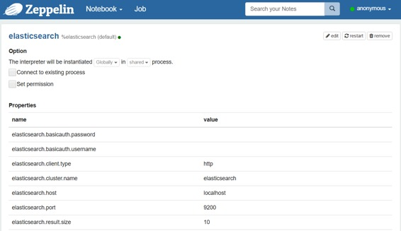
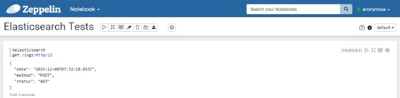
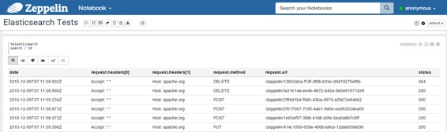
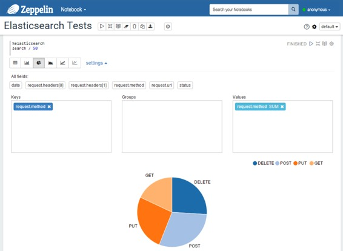
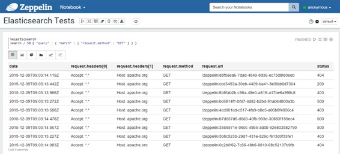
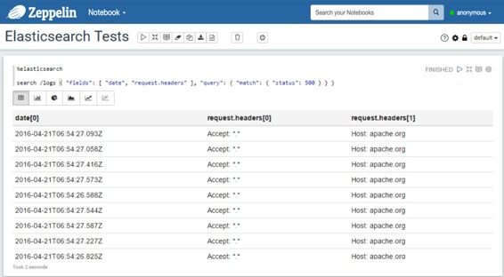
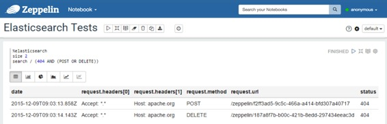
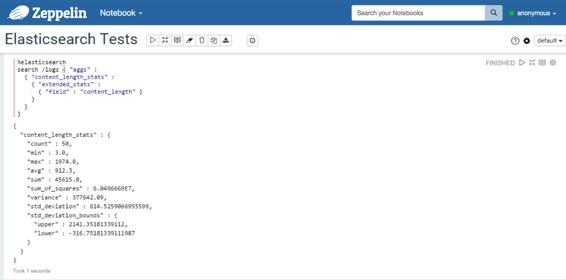
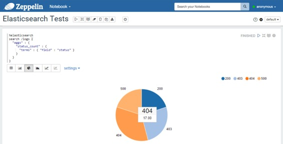

# Elasticsearch 解释器

原文链接 : [http://zeppelin.apache.org/docs/0.7.2/interpreter/elasticsearch.html](http://zeppelin.apache.org/docs/0.7.2/interpreter/elasticsearch.html)

译文链接 : [http://www.apache.wiki/pages/viewpage.action?pageId=10030782](http://www.apache.wiki/pages/viewpage.action?pageId=10030782)

贡献者 : [片刻](/display/~jiangzhonglian) [ApacheCN](/display/~apachecn) [Apache中文网](/display/~apachechina)

## 概述

[Elasticsearch](https://www.elastic.co/products/elasticsearch)是一个高度可扩展的开源全文搜索和分析引擎。它允许您快速，实时地存储，搜索和分析大量数据。它通常用作为具有复杂的搜索功能和要求的应用程序提供的底层引擎/技术。

## 配置

| 属性 | 默认 | 描述 |
| --- | --- | --- |
| elasticsearch.cluster.name | elasticsearch | 群集名称 |
| elasticsearch.host | localhost | 集群中节点的主机 |
| elasticsearch.port | 9300 | 连接端口**（重要提示：它取决于客户端类型，传输或http）** |
| elasticsearch.client.type | transport | Elasticsearch（transport或http）的客户端类型**（Important：端口取决于此值）** |
| elasticsearch.basicauth.username |   | 基本认证用户名（http） |
| elasticsearch.basicauth.password |   | 基本认证密码（http） |
| elasticsearch.result.size | 10 | 搜索查询结果集的大小 |



> **注意＃1：**您可以添加更多属性来配置Elasticsearch客户端。
> 
> **注意＃2：**如果使用Shield，您可以添加一个名称为`shield.user`包含名称和密码（格式：）的值的属性`username:password`。有关Shield配置的更多详细信息，请参阅[Shield参考指南](https://www.elastic.co/guide/en/shield/current/_using_elasticsearch_java_clients_with_shield.html)。不要忘记，在解释器目录（`ZEPPELIN_HOME/interpreters/elasticsearch`）中复制屏蔽客户端jar 。

## 启用弹性搜索解释器

在笔记本中，要启用**弹性搜索解释器**，请单击**齿轮**图标，然后选择**弹性搜索**。

## 使用弹性搜索解释器

在段落中，用于`%elasticsearch`选择Elasticsearch解释器，然后输入所有命令。要获取可用命令的列表，请使用`help`。

```
%elasticsearch
help 

Elasticsearch interpreter: 
General format: <command> /<indices>/<types>/<id> <option> <JSON> 
  - indices: list of indices separated by commas (depends on the command)
  - types: list of document types separated by commas (depends on the command) 
Commands: 
  - search /indices/types <query> 
    . indices and types can be omitted (at least, you have to provide '/') 
    . a query is either a JSON-formatted query, nor a lucene query 
  - size <value> 
    . defines the size of the result set (default value is in the config)
    . if used, this command must be declared before a search command 
  - count /indices/types <query> 
    . same comments as for the search 
  - get /index/type/id 
  - delete /index/type/id 
  - index /index/type/id <json-formatted document> 
    . the id can be omitted, elasticsearch will generate one  
```

> **提示：**使用（Ctrl +。）进行自动完成。

### 得到

使用`get`命令，您可以通过ID查找文档。结果是一个JSON文档。

```
%elasticsearch 
get /index/type/id  
```

例： 



### 搜索

使用该`search`命令，您可以向Elasticsearch发送搜索查询。有两种查询格式：

*   您可以提供JSON格式的查询，这正是您在使用Elasticsearch的REST API时提供的。

    *   有关搜索查询的内容的详细信息，请参阅[Elasticsearch搜索API参考文档](https://www.elastic.co/guide/en/elasticsearch/reference/current/search.html)。
*   您还可以提供a的内容`query_string`。
    *   这是一个查询的快捷方式： `{ "query": { "query_string": { "query": "__HERE YOUR QUERY__", "analyze_wildcard": true } } }`
    *   有关[此类查询](https://www.elastic.co/guide/en/elasticsearch/reference/current/query-dsl-query-string-query.html#query-string-syntax)的内容的详细信息，请参阅[Elasticsearch查询字符串语法](https://www.elastic.co/guide/en/elasticsearch/reference/current/query-dsl-query-string-query.html#query-string-syntax)。

```
%elasticsearch 
search /index1,index2,.../type1,type2,...  <JSON document containing the query or query_string elements>  
```

如果要修改结果集的大小，可以在搜索命令之前添加一个设置大小的行。

```
%elasticsearch 
size 50 
search /index1,index2,.../type1,type2,...  <JSON document containing the query or query_string elements>  
```

> 搜索查询还可以包含[聚合](https://www.elastic.co/guide/en/elasticsearch/reference/current/search-aggregations.html)。如果至少有一个聚合，则显示第一个聚合的结果，否则显示搜索命中。

例子：

*   使用JSON查询：

    ```
    %elasticsearch 
    search / { "query": { "match_all": { } } } 

    %elasticsearch 
    search /logs { "query": { "query_string": { "query": "request.method:GET AND status:200" } } } 

    %elasticsearch 
    search /logs { "aggs": {
    "content_length_stats": {
      "extended_stats": {
        "field": "content_length"
      }
    }
    } } 
    ```

*   使用query_string元素：

    ```
    %elasticsearch 
    search /logs request.method:GET AND status:200 

    %elasticsearch 
    search /logs (404 AND (POST OR DELETE)) 
    ```

> **重要提示**：Elasticsearch中的文档是一个JSON文档，因此它是层次结构的，而不是SQL表中的一行。对于弹性解释器，搜索查询的结果是平坦的。

假设我们有一个JSON文档：

```
{ 
  "date": "2015-12-08T21:03:13.588Z", 
  "request": { 
    "method": "GET", 
    "url": "/zeppelin/4cd001cd-c517-4fa9-b8e5-a06b8f4056c4", 
    "headers": [ "Accept: *.*", "Host: apache.org"] 
  }, 
  "status": "403", 
  "content_length": 1234 
}  
```

数据将如下所示：

| CONTENT_LENGTH | 日期 | request.headers [0] | request.headers [1] | request.method | request.url | 状态 |
| --- | --- | --- | --- | --- | --- | --- |
| 1234 | 2015-12-08T21：03：13.588Z | Accept: *.* | Host: apache.org | GET | /zeppelin/4cd001cd-c517-4fa9-b8e5-a06b8f4056c4 | 403 |

例子：

*   包含结果的表格：
    

*   您还可以使用预定义的图表： 
    
*   使用JSON查询：
    
*   使用包含`fields`参数（用于过滤响应中的字段）的JSON查询：在这种情况下，响应中的所有字段值都是数组，因此，在平坦化结果之后，所有字段名称的格式为`field_name[x]` 
    
*   使用查询字符串： 
    
*   使用包含多值度量聚合的查询：
    
*   使用包含多桶聚合的查询：
    

### 计数

使用该`count`命令，您可以对某些索引和类型中可用的文档进行计数。您还可以提供查询。

```
%elasticsearch 
count /index1,index2,.../type1,type2,... <JSON document containing the query OR a query string>  
```

例子：

*   没有查询： 

    

*   有一个查询： 
    

### 指数

使用该`index`命令，您可以在Elasticsearch中插入/更新文档。

```
%elasticsearch 
index /index/type/id <JSON document> 

%elasticsearch 
index /index/type <JSON document>  
```

### 删除

使用该`delete`命令，您可以删除文档。

```
%elasticsearch 
delete /index/type/id  
```

### 应用Zeppelin动态表单

您可以在查询内使用[Zeppelin 动态表单](http://www.apache.wiki/pages/viewpage.action?pageId=10030585)。您可以同时使用`text input`和`select form`参数化功能。

```
%elasticsearch 
size ${limit=10}
search /index/type { "query": { "match_all": { } } } 
```