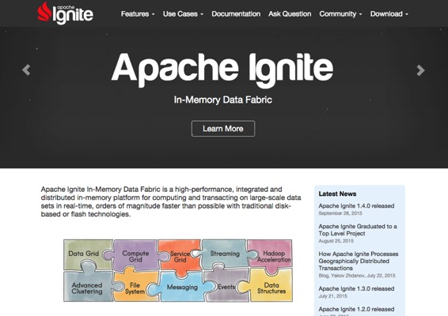
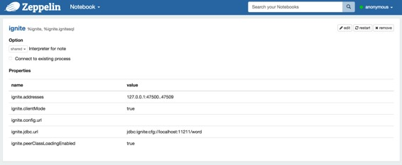
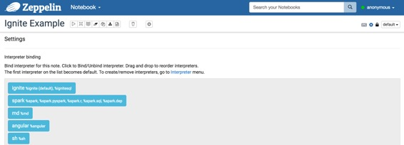
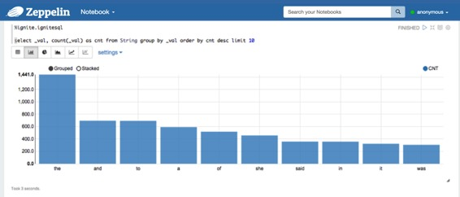

# Ignite 解释器

原文链接 : [http://zeppelin.apache.org/docs/0.7.2/interpreter/ignite.html](http://zeppelin.apache.org/docs/0.7.2/interpreter/ignite.html)

译文链接 : [http://www.apache.wiki/pages/viewpage.action?pageId=10030819](http://www.apache.wiki/pages/viewpage.action?pageId=10030819)

贡献者 : [片刻](/display/~jiangzhonglian) [ApacheCN](/display/~apachecn) [Apache中文网](/display/~apachechina)

## 概述

[Apache Ignite](https://ignite.apache.org/)内存数据结构是一种高性能，集成和分布式内存平台，用于实时计算和处理大规模数据集，比传统的基于磁盘或闪存技术的速度更快。



您可以使用Zeppelin从Ignite SQL解释器检索缓存中的分布式数据。此外，Ignite解释器允许您在SQL不符合您的要求的情况下执行任何Scala代码。例如，您可以将数据填充到缓存中或执行分布式计算。

## 安装和运行Ignite示例

为了使用Ignite解释器，您可以在一些简单的步骤中安装Apache Ignite：

1.  Ignite仅提供源或二进制版本的示例。下载Ignite [源版本](https://ignite.apache.org/download.html#sources)或[二进制版本，](https://ignite.apache.org/download.html#binaries)无论你想要什么。但是您必须下载Ignite作为相同版本的Zeppelin的。如果不是，您不能在Zeppelin上使用scala代码。受支持的Ignite版本在每个Zeppelin 版本的“支持的[解释器”表中](https://zeppelin.apache.org/supported_interpreters.html#ignite)指定。如果您在使用Zeppelin的主分支，请参阅`ignite.version`在`path/to/your-Zeppelin/ignite/pom.xml`。
2.  示例作为单独的Maven项目发送，因此要开始运行，您只需将提供的`&lt;dest_dir&gt;/apache-ignite-fabric-{version}-bin/examples/pom.xml`文件导入到您喜欢的IDE（如Eclipse）中。

*   在Eclipse的情况下，Eclipse - &gt; File - &gt; Import - &gt; Existing Maven Projects
*   将示例目录路径设置为Eclipse，然后选择pom.xml。
*   然后启动`org.apache.ignite.examples.ExampleNodeStartup`（或任何你想要的）运行至少一个或多个点火节点。运行示例代码时，可能会注意到节点数逐个增加。

> **小费。如果要在cli IDE上运行Ignite示例，则可以从IDE导出可执行Jar文件。然后使用以下命令运行它。**

```
$ nohup java -jar </path/to/your Jar file name> 
```

## 配置Ignite解释器

在“解释器”菜单中，您可以编辑Ignite解释器或创建新的。Zeppelin提供了Ignite的这些属性。

| 物业名称 | 值 | 描述 |
| --- | --- | --- |
| ignite.addresses | 127.0.0.1:47500..47509 | Ignite集群主机的Coma分离列表。有关详细信息，请参阅[Ignite Cluster Configuration]（[https://apacheignite.readme.io/docs/cluster-config](https://apacheignite.readme.io/docs/cluster-config)）部分。 |
| ignite.clientMode | true | 您可以连接到Ignite集群作为客户端或服务器节点。有关详细信息，请参阅[Ignite Clients vs. Servers]（）部分。使用true或false值分别连接客户端或服务器模式。 |
| ignite.config.url |   | 配置URL 覆盖所有其他设置。 |
| ignite.jdbc.url | jdbc:ignite:cfg://default-ignite-jdbc.xml | 点击JDBC连接URL。 |
| ignite.peerClassLoadingEnabled | true | 启用同级加载。有关详细信息，请参阅[零部署]（）部分。使用true或false值来分别启用或禁用P2P类加载。 |



## 如何使用

 配置Ignite解释器后，创建自己的笔记本。然后，您可以绑定如下图像的解释器。



有关更多的解释器绑定信息，请参阅[此处](http://zeppelin.apache.org/docs/0.7.1/manual/interpreters.html#what-is-interpreter-setting)。

### 点击SQL解释器

为了执行SQL查询，使用`%ignite.ignitesql`前缀。
假设您正在运行`org.apache.ignite.examples.streaming.wordcount.StreamWords`，那么您可以使用“单词”缓存（当然，您必须将此缓存名称指定给`ignite.jdbc.url`Zeppelin 的Ignite解释器设置部分）。例如，您可以使用以下查询在单词缓存中选择前10个单词

```
%ignite.ignitesql 
select _val, count(_val) as cnt from String group by _val order by cnt desc limit 10 
```



只要您的Ignite版本和Zeppelin Ignite版本相同，您还可以使用scala代码。在您下载自己的Ignite之前，请检查Zeppelin Ignite版本。

```
%ignite 
import org.apache.ignite._ 
import org.apache.ignite.cache.affinity._ 
import org.apache.ignite.cache.query._ 
import org.apache.ignite.configuration._ 

import scala.collection.JavaConversions._ 

val cache: IgniteCache[AffinityUuid, String] = ignite.cache("words") 

val qry = new SqlFieldsQuery("select avg(cnt), min(cnt), max(cnt) from (select count(_val) as cnt from String group by _val)", true) 

val res = cache.query(qry).getAll() 

collectionAsScalaIterable(res).foreach(println _) 
```

``

Apache Ignite还为Zeppelin [“Ignite with Apache Zeppelin”](https://apacheignite.readme.io/docs/data-analysis-with-apache-zeppelin)提供了指导性文档。