# JDBC通用 解释器

原文链接 : [http://zeppelin.apache.org/docs/0.7.2/interpreter/jdbc.html](http://zeppelin.apache.org/docs/0.7.2/interpreter/jdbc.html)

译文链接 : [http://www.apache.wiki/pages/viewpage.action?pageId=10030838](http://www.apache.wiki/pages/viewpage.action?pageId=10030838)

贡献者 : [片刻](/display/~jiangzhonglian) [ApacheCN](/display/~apachecn) [Apache中文网](/display/~apachechina)

## 概述

JDBC解释器允许您无缝地创建到任何数据源的JDBC连接。

在运行每个语句后，将立即应用插入，更新和升级。

到目前为止，已经通过以下测试：

| 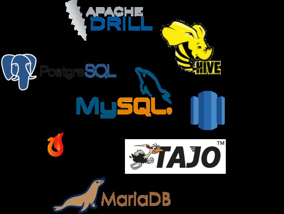 | 

*   [Postgresql](http://www.postgresql.org/) - [JDBC驱动](https://jdbc.postgresql.org/)
*   [Mysql](https://www.mysql.com/) - [JDBC驱动](https://dev.mysql.com/downloads/connector/j/)
*   [MariaDB](https://mariadb.org/) - [JDBC驱动程序](https://mariadb.com/kb/en/mariadb/about-mariadb-connector-j/)
*   [Redshift](https://aws.amazon.com/documentation/redshift/) - [JDBC驱动](https://docs.aws.amazon.com/redshift/latest/mgmt/configure-jdbc-connection.html)
*   [Apache Hive](https://hive.apache.org/) - [JDBC驱动](https://cwiki.apache.org/confluence/display/Hive/HiveServer2+Clients#HiveServer2Clients-JDBC)
*   [Apache Phoenix](https://phoenix.apache.org/) 本身是一个JDBC驱动
*   [Apache Drill](https://drill.apache.org/) - [JDBC驱动](https://drill.apache.org/docs/using-the-jdbc-driver)
*   [Apache Tajo](http://tajo.apache.org/) - [JDBC驱动](https://tajo.apache.org/docs/current/jdbc_driver.html)

 |
| --- | --- |

如果您使用的其他数据库不在上述列表中，请随时分享您的用例。这将有助于提高JDBC解释器的功能。

## 创建一个新的JDBC解释器

首先，`+ Create`在解释器设置页面的右上角单击按钮。

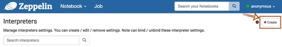

 `Interpreter name`用任何你想要用作别名的填充字段（如mysql，mysql2，hive，redshift等）。请注意，此别名将用于`%interpreter_name`在段落中调用解释器。然后选择`jdbc`为`Interpreter group`。


JDBC解释器的默认驱动程序设置为`PostgreSQL`。这意味着Zeppelin `PostgreSQL`本身就包括驱动程序jar。因此，您不需要为连接添加任何依赖项（例如`PostgreSQL`驱动程序jar 的工件名称或路径）`PostgreSQL`。JDBC解释器属性默认定义如下。

| 名称 | 默认值 | 描述 |
| --- | --- | --- |
| common.max_count | 1000 | 要显示的SQL结果的最大数量 |
| default.driver | org.postgresql.Driver | JDBC驱动程序名称 |
| default.password |   | JDBC用户密码 |
| default.url | jdbc:postgresql://localhost:5432/ | JDBC的URL |
| default.user | gpadmin | JDBC用户名 |

如果你想连接其他数据库如`Mysql`，`Redshift`和`Hive`，你需要编辑的属性值。您还可以使用[Credential](http://zeppelin.apache.org/docs/0.7.1/security/datasource_authorization.html)进行JDBC身份验证。在解释器设置页面中，如果`default.user`和`default.password`属性被删除（使用X按钮）进行数据库连接，则JDBC解释器将从[Credential](http://zeppelin.apache.org/docs/0.7.1/security/datasource_authorization.html)获取帐户[信息](http://zeppelin.apache.org/docs/0.7.1/security/datasource_authorization.html)。

下面的例子是`Mysql`连接。

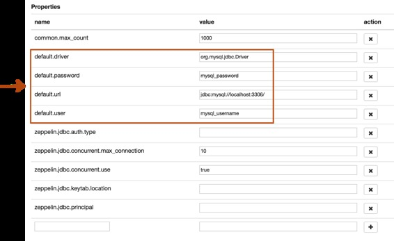

最后一步是**依赖关系设置**。由于Zeppelin `PostgreSQL`默认仅包含驱动程序jar，因此您需要为其他数据库添加每个驱动程序的maven坐标或JDBC驱动程序的jar文件路径。

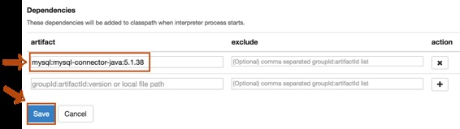

而已。您可以在[本节](http://zeppelin.apache.org/docs/0.7.1/interpreter/jdbc.html#examples)中找到更多JDBC连接设置示例（[Mysql](http://zeppelin.apache.org/docs/0.7.1/interpreter/jdbc.html#mysql)，[MariaDB](http://zeppelin.apache.org/docs/0.7.1/interpreter/jdbc.html#mariadb)，[Redshift](http://zeppelin.apache.org/docs/0.7.1/interpreter/jdbc.html#redshift)，[Apache Hive](http://zeppelin.apache.org/docs/0.7.1/interpreter/jdbc.html#apache-hive)，[Apache Phoenix](http://zeppelin.apache.org/docs/0.7.1/interpreter/jdbc.html#apache-phoenix)和[Apache Tajo](http://zeppelin.apache.org/docs/0.7.1/interpreter/jdbc.html#apache-tajo)）。

## 更多属性

您可以在下面指定更多的JDBC解释器属性。

| 物业名称 | 描述 |
| --- | --- |
| common.max_result | 要显示的SQL结果的最大数量，以防止浏览器超载。这是所有连接的常见属性 |
| zeppelin.jdbc.auth.type | 支持的认证方式类型有`SIMPLE`，和`KERBEROS` |
| zeppelin.jdbc.principal | 从keytab加载的主要名称 |
| zeppelin.jdbc.keytab.location | keytab文件的路径 |
| default.jceks.file | jceks存储路径（例如：jceks://file/tmp/zeppelin.jceks） |
| default.jceks.credentialKey | jceks凭证钥匙 |

您还可以使用此[方法](http://docs.oracle.com/javase/7/docs/api/java/sql/DriverManager.html#getConnection%28java.lang.String,%20java.util.Properties%29)添加更多属性。例如，如果一个连接需要一个schema参数，那么它必须添加如下的属性：

| 名称 | 值 |
| --- | --- |
| default.schema | SCHEMA_NAME |

## 将JDBC插件绑定到笔记本

要绑定解释器设置页面中创建的口译员，请单击右上角的齿轮图标。

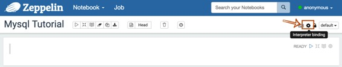

根据用例选择（蓝色）或取消选择（白色）解释器按钮。如果您需要在笔记本中使用多个解释器，请激活几个按钮。不要忘记点击`Save`按钮，否则您将面临`Interpreter *** is not found`错误。


## 如何使用

### 使用JDBC解释器运行段落

要测试您的数据库和Zeppelin是否成功连接，请在段落的顶部输入`%jdbc_interpreter_name`（例如`%mysql`）并运行`show databases`。

```
%jdbc_interpreter_name
show databases 
```

如果段落`FINISHED`没有任何错误，则会在上一个之后自动添加一个新的段落`%jdbc_interpreter_name`。所以你不需要在每个段落的标题中键入这个前缀。

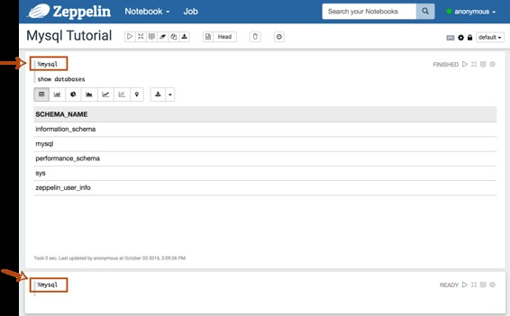

### 应用Zeppelin动态表单

您可以在查询内使用[Zeppelin 动态表单](http://www.apache.wiki/pages/viewpage.action?pageId=10030585)。您可以使用参数化功能`text input`和`select form`参数化功能。

```
%jdbc_interpreter_name
SELECT name, country, performer
FROM demo.performers
WHERE name='{{performer=Sheryl Crow|Doof|Fanfarlo|Los Paranoia}}' 
```

## 例子

以下是您可以参考的一些例子。包括以下连接器，您可以连接每个数据库，只要它可以配置它的JDBC驱动程序。

### Postgres

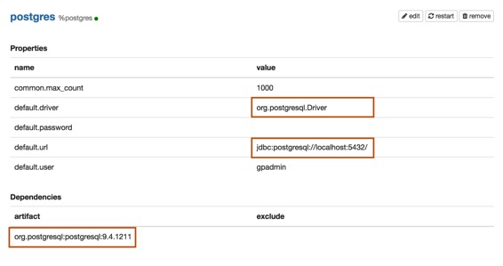

属性[](http://zeppelin.apache.org/docs/0.7.1/interpreter/jdbc.html#properties)

| 名称 | 值 |
| --- | --- |
| default.driver | org.postgresql.Driver |
| default.url | jdbc:postgresql://localhost:5432/ |
| default.user | mysql_user |
| default.password | mysql_password |

[Postgres JDBC驱动程序文档](https://jdbc.postgresql.org/documentation/documentation.html)

依赖

| Artifact | Excludes |
| --- | --- |
| org.postgresql:postgresql:9.4.1211 |   |

[Maven Repository: org.postgresql:postgresql](https://mvnrepository.com/artifact/org.postgresql/postgresql)

### Mysql

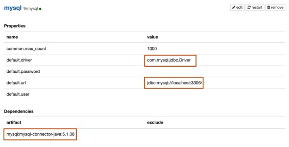

属性[](http://zeppelin.apache.org/docs/0.7.1/interpreter/jdbc.html#properties-1)

| 名称 | 值 |
| --- | --- |
| default.driver | com.mysql.jdbc.Driver |
| default.url | jdbc:mysql://localhost:3306/ |
| default.user | mysql_user |
| default.password | mysql_password |

[Mysql JDBC驱动程序文档](https://dev.mysql.com/downloads/connector/j/)

依赖[](http://zeppelin.apache.org/docs/0.7.1/interpreter/jdbc.html#dependencies-1)

| Artifact | Excludes |
| --- | --- |
| mysql:mysql-connector-java:5.1.38 |   |

[Maven Repository: mysql:mysql-connector-java](https://mvnrepository.com/artifact/mysql/mysql-connector-java)

### MariaDB

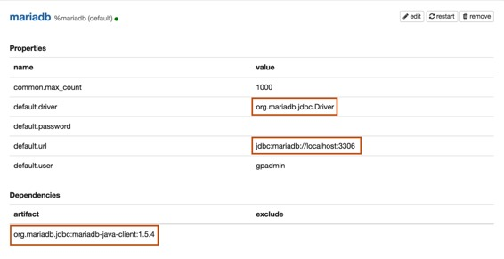

属性

| 名称 | 值 |
| --- | --- |
| default.driver | org.mariadb.jdbc.Driver |
| default.url | jdbc:mariadb://localhost:3306 |
| default.user | mariadb_user |
| default.password | mariadb_password |

[MariaDB JDBC驱动程序文档](https://mariadb.com/kb/en/mariadb/about-mariadb-connector-j/)

依赖[](http://zeppelin.apache.org/docs/0.7.1/interpreter/jdbc.html#dependencies-2)

| Artifact | Excludes |
| --- | --- |
| org.mariadb.jdbc:mariadb-java-client:1.5.4 |   |

[Maven Repository: org.mariadb.jdbc:mariadb-java-client](https://mvnrepository.com/artifact/org.mariadb.jdbc/mariadb-java-client)

### Redshift[](http://zeppelin.apache.org/docs/0.7.1/interpreter/jdbc.html#redshift)

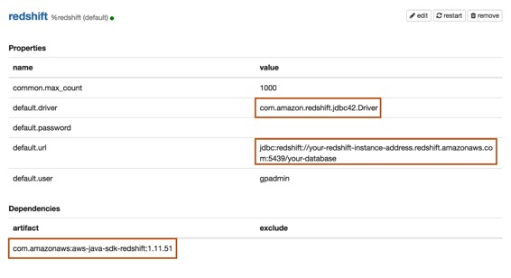

属性

| 名称 | 值 |
| --- | --- |
| default.driver | com.amazon.redshift.jdbc42.Driver |
| default.url | jdbc:redshift://your-redshift-instance-address.redshift.amazonaws.com:5439/your-database |
| default.user | redshift_user |
| default.password | redshift_password |

[AWS Redshift JDBC驱动程序文档](http://docs.aws.amazon.com/redshift/latest/mgmt/configure-jdbc-connection.html)

依赖

| Artifact | Excludes |
| --- | --- |
| com.amazonaws:aws-java-sdk-redshift:1.11.51 |   |

[Maven Repository: com.amazonaws:aws-java-sdk-redshift](https://mvnrepository.com/artifact/com.amazonaws/aws-java-sdk-redshift)

### Apache Hive

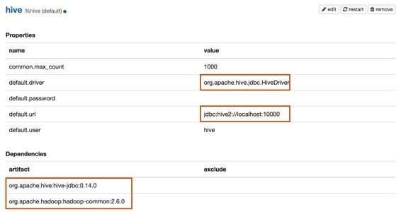

属性[](http://zeppelin.apache.org/docs/0.7.1/interpreter/jdbc.html#properties-4)

| 名称 | 值 |
| --- | --- |
| default.driver | org.apache.hive.jdbc.HiveDriver |
| default.url | jdbc:hive2://localhost:10000 |
| default.user | hive_user |
| default.password | hive_password |

[Apache Hive 1 JDBC驱动程序文档](https://cwiki.apache.org/confluence/display/Hive/HiveServer2+Clients#HiveServer2Clients-JDBC) [Apache Hive 2 JDBC驱动程序文档](https://cwiki.apache.org/confluence/display/Hive/HiveServer2+Clients#HiveServer2Clients-JDBC)

依赖

| Artifact | Excludes |
| --- | --- |
| org.apache.hive:hive-jdbc:0.14.0 |   |
| org.apache.hadoop:hadoop-common:2.6.0 |   |

[Maven Repository : org.apache.hive:hive-jdbc](https://mvnrepository.com/artifact/org.apache.hive/hive-jdbc)

### Apache Phoenix

Phoenix支持`thick`和`thin`连接类型：

*   [Thick client](http://zeppelin.apache.org/docs/0.7.1/interpreter/jdbc.html#thick-client-connection)更快，但必须直接连接到ZooKeeper和HBase RegionServers。
*   [Thin client](http://zeppelin.apache.org/docs/0.7.1/interpreter/jdbc.html#thin-client-connection)具有较少的依赖关系，并通过[Phoenix Query Server](http://phoenix.apache.org/server.html)实例进行连接。

对您的连接类型使用适当的`default.driver`，`default.url`和依赖性工件。

Thick client连接

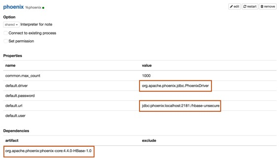

属性

| 名称 | 值 |
| --- | --- |
| default.driver | org.apache.phoenix.jdbc.PhoenixDriver |
| default.url | jdbc:phoenix:localhost:2181:/hbase-unsecure |
| default.user | phoenix_user |
| default.password | phoenix_password |

依赖[](http://zeppelin.apache.org/docs/0.7.1/interpreter/jdbc.html#dependencies-5)

| Artifact | Excludes |
| --- | --- |
| org.apache.phoenix:phoenix-core:4.4.0-HBase-1.0 |   |

[Maven Repository: org.apache.phoenix:phoenix-core](https://mvnrepository.com/artifact/org.apache.phoenix/phoenix-core)

Thin client 连接

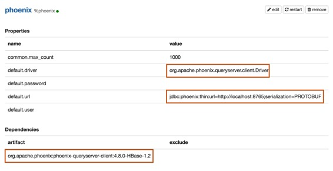

属性[](http://zeppelin.apache.org/docs/0.7.1/interpreter/jdbc.html#properties-6)

| 名称 | 值 |
| --- | --- |
| default.driver | org.apache.phoenix.queryserver.client.Driver |
| default.url | jdbc:phoenix:thin:url=http://localhost:8765;serialization=PROTOBUF |
| default.user | phoenix_user |
| default.password | phoenix_password |

依赖

在添加以下依赖项之一之前，首先检查Phoenix版本。

| Artifact | Excludes | Description |
| --- | --- | --- |
| org.apache.phoenix:phoenix-server-client:4.7.0-HBase-1.1 |   | For Phoenix `4.7` |
| org.apache.phoenix:phoenix-queryserver-client:4.8.0-HBase-1.2 |   | For Phoenix `4.8+` |

[Maven Repository: org.apache.phoenix:phoenix-queryserver-client](https://mvnrepository.com/artifact/org.apache.phoenix/phoenix-queryserver-client)

### Apache Tajo

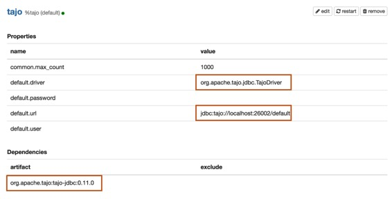

属性[](http://zeppelin.apache.org/docs/0.7.1/interpreter/jdbc.html#properties-7)

| 名称 | 值 |
| --- | --- |
| default.driver | org.apache.tajo.jdbc.TajoDriver |
| default.url | jdbc:tajo://localhost:26002/default |

[Apache Tajo JDBC驱动程序文档](https://tajo.apache.org/docs/current/jdbc_driver.html)

依赖

| Artifact | Excludes |
| --- | --- |
| org.apache.tajo:tajo-jdbc:0.11.0 |   |

[Maven Repository: org.apache.tajo:tajo-jdbc](https://mvnrepository.com/artifact/org.apache.tajo/tajo-jdbc)

## 错误报告

如果您使用JDBC解释器发现错误，请创建一个[JIRA](https://issues.apache.org/jira/browse/ZEPPELIN) ticket。