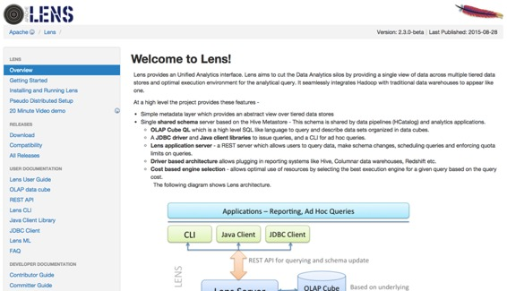
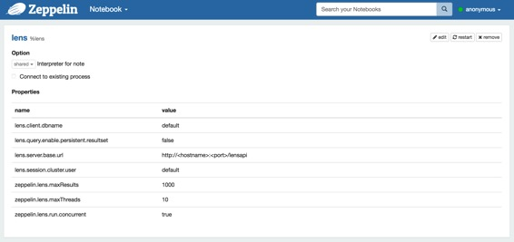
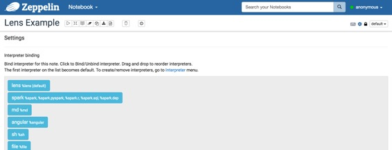
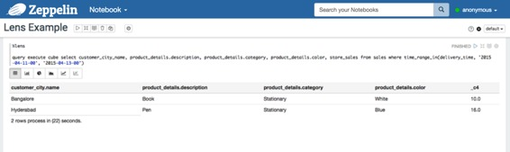
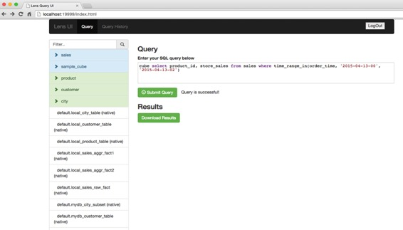

# Lens 解释器

原文链接 : [http://zeppelin.apache.org/docs/0.7.2/interpreter/lens.html](http://zeppelin.apache.org/docs/0.7.2/interpreter/lens.html)

译文链接 : [http://www.apache.wiki/pages/viewpage.action?pageId=10030852](http://www.apache.wiki/pages/viewpage.action?pageId=10030852)

贡献者 : [片刻](/display/~jiangzhonglian) [ApacheCN](/display/~apachecn) [Apache中文网](/display/~apachechina)

## 概观

[Apache Lens](https://lens.apache.org/)提供统一分析界面。Lens旨在通过跨多个分层数据存储提供单一数据视图并为分析查询提供最佳执行环境，从而减少数据分析孤立。它将Hadoop与传统的数据仓库无缝集成在一起的工具之一。



## 安装和运行Lens

为了使用Lens解释器，您可以通过以下简单的步骤安装Apache Lens：

1.  从[ASF](http://www.apache.org/dyn/closer.lua/lens/2.3-beta)下载Lens的最新版本。或者旧版本可以[在档案馆](http://archive.apache.org/dist/lens/)找到。
2.  在运行镜头之前，您必须设置HIVE _HOME和HADOOP_ HOME。如果你想获得更多的信息，请参考[这里](http://lens.apache.org/lenshome/install-and-run.html#Installation)。镜头还提供伪分布模式。[Lens伪分布式设置](http://lens.apache.org/lenshome/pseudo-distributed-setup.html)是通过使用[docker](https://www.docker.com/)处理器完成的。Hive服务器和hadoop守护程序作为镜头伪分布式设置中的单独进程运行。
3.  现在，您可以启动镜头服务器（或停止）。

```
./bin/lens-ctl start (or stop) 
```

## 配置Lens解释器

在“解释器”菜单中，您可以编辑Lens解释器或创建新的Lens解释器。Zeppelin提供Lens的这些属性。

| 物业名称 | 值 | 描述 |
| --- | --- | --- |
| lens.client.dbname | default | 数据库模式名称 |
| lens.query.enable.persistent.resultset | false | 是否为查询启用持久性结果集。启用后，服务器将从驱动程序中获取结果，如果有的话将自定义格式，并存储在配置的位置。查询输出的文件名是queryhandle-id，带有已配置的扩展名 |
| lens.server.base.url | http://hostname:port/lensapi | Lens服务器的基本URL。你必须编辑你可能使用的“hostname”和“port”（例如: http://0.0.0.0:9999/lensapi） |
| lens.session.cluster.user | default | Hadoop集群用户名 |
| zeppelin.lens.maxResult | 1000 | 要显示的最大行数 |
| zeppelin.lens.maxThreads | 10 | 如果并发是真的，那么有多少个线程？ |
| zeppelin.lens.run.concurrent | true | 同时执行Lens会话 |
| XXX | YYY | [配置Lens服务器]（）中的其他任何内容 |



### 解释器绑定为Zeppelin笔记本

配置Lens解释器后，创建自己的笔记本，然后您可以绑定如下图像的解释器。



有关更多的解释器绑定信息，请参阅[此处](http://zeppelin.apache.org/docs/manual/interpreters.html)。

### 如何使用

您可以使用[OLAP Cube ](http://lens.apache.org/user/olap-cube.html)[QL](http://lens.apache.org/user/cli.html)来分析数据，这是一种高级SQL类似语言来查询和描述以数据立方体组织的数据集。您可能会遇到OLAP立方体像这个[视频教程](https://cwiki.apache.org/confluence/display/LENS/2015/07/13/20+Minute+video+demo+of+Apache+Lens+through+examples)。您可以在此视频中看到，它们使用的是镜头客户机外壳（./ bin / lens-cli.sh）。所有这些功能也可以使用镜头解释器在Zeppelin上使用。

*   创建和使用（切换）数据库。

    ```
    create database newDb
    use newDb
    ```

*   创建存储。

    ```
    create storage your/path/to/lens/client/examples/resources/db-storage.xml 
    ```

*   创建尺寸，显示它们的字段和连接链。

    ```
    create dimension your/path/to/lens/client/examples/resources/customer.xml
    dimension show fields customer
    dimension show joinchains customer 
    ```

*   创建缓存，显示它们的字段和连接链。

    ```
    create cube your/path/to/lens/client/examples/resources/sales-cube.xml
    cube show fields sales
    cube show joinchains sales
    ```

*   创造Dimtables和事实。

    ```
    create dimtable your/path/to/lens/client/examples/resources/customer_table.xml

    create fact your/path/to/lens/client/examples/resources/sales-raw-fact.xml
    ```

*   添加分区到Dimtable和Fact。

    ```
    dimtable add single-partition --dimtable_name customer_table --storage_name local --path your/path/to/lens/client/examples/resources/customer-local-part.xml

    fact add partitions --fact_name sales_raw_fact --storage_name local --path your/path/to/lens/client/examples/resources/sales-raw-local-parts.xml
    ```

*   现在，您可以对多维数据集运行查询。

    ```
    query execute cube select customer_city_name, product_details.description, product_details.category, product_details.color, store_sales from sales where time_range_in(delivery_time, '2015-04-11-00', '2015-04-13-00')
    ```

    

这些只是Lens提前提供的例子。如果您想探索Lens的整个[教程](https://cwiki.apache.org/confluence/display/LENS/2015/07/13/20+Minute+video+demo+of+Apache+Lens+through+examples)，请参阅[教程视频](https://cwiki.apache.org/confluence/display/LENS/2015/07/13/20+Minute+video+demo+of+Apache+Lens+through+examples)。

## Lens UI服务

Lens还提供Web UI服务。一旦服务器启动，您可以打开http://serverhost:19999/index.html上的服务并浏览。您也可以在这里检查您所制作的结构并使用查询。

