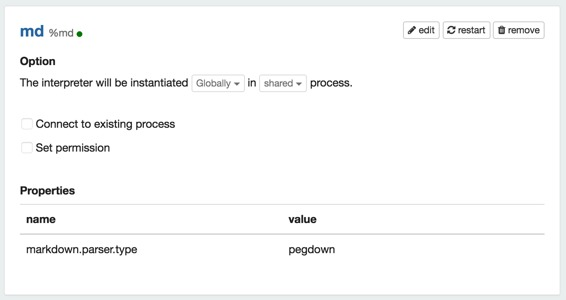
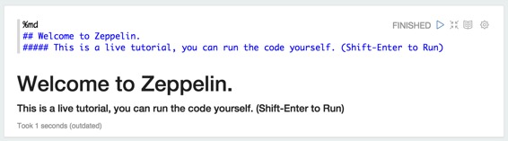
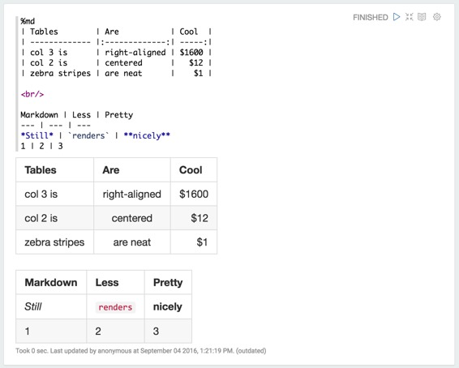
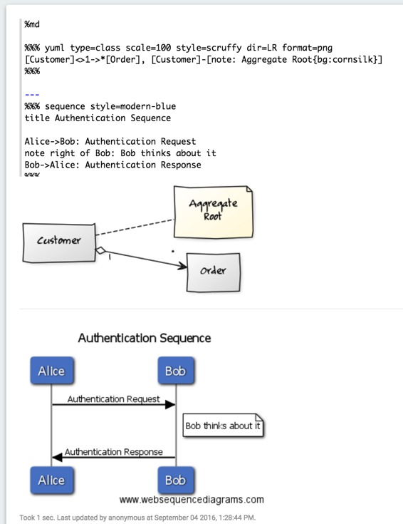

# Markdown 解释器

原文链接 : [http://zeppelin.apache.org/docs/0.7.2/interpreter/markdown.html](http://zeppelin.apache.org/docs/0.7.2/interpreter/markdown.html)

译文链接 : [http://www.apache.wiki/pages/viewpage.action?pageId=10030867](http://www.apache.wiki/pages/viewpage.action?pageId=10030867)

贡献者 : [片刻](/display/~jiangzhonglian) [ApacheCN](/display/~apachecn) [Apache中文网](/display/~apachechina)

## 概述

[Markdown](http://daringfireball.net/projects/markdown/)是一种纯文本格式化语法，可以将其转换为HTML。Apache Zeppelin使用[pegdown](https://github.com/sirthias/pegdown)和[markdown4j](https://github.com/jdcasey/markdown4j)作为markdown解析器。

在Zeppelin笔记本中，您可以`%md`在段落的开头使用Markdown解释器，并从Markdown纯文本生成静态html。

在Zeppelin中，Markdown解释器默认启用，并使用[pegdown](https://github.com/sirthias/pegdown)解析器。

## 案例

以下示例演示了Zeppelin笔记本中Markdown的基本用法。

## 数学表达

Markdown解释器在内部利用％html显示系统。这意味着您可以将数学表达式与markdown语法相结合。有关更多信息，请参阅[数学表达](http://zeppelin.apache.org/docs/0.7.1/displaysystem/basicdisplaysystem.html#mathematical-expressions)部分。

## 配置

| 名称 | 默认值 | 描述 |
| --- | --- | --- |
| markdown.parser.type | pegdown | Markdown解析器类型。
可用值：pegdown，markdown4j。 |

### Pegdown解析器

`pegdown` 解析器提供github风味的markdown。

 

`pegdown`解析器也提供了[YUML](http://yuml.me/)和[Websequence](https://www.websequencediagrams.com/)插件。

### Markdown4j解析器

由于pegdown解析器更准确，并提供更多的markdown语法
`markdown4j`选项可能会被删除。但是要保持这个解析器的向后兼容性。