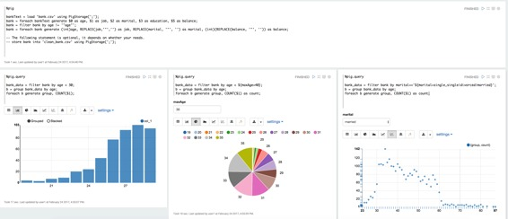

# Pig 解释器

原文链接 : [http://zeppelin.apache.org/docs/0.7.2/interpreter/pig.html](http://zeppelin.apache.org/docs/0.7.2/interpreter/pig.html)

译文链接 : [http://www.apache.wiki/pages/viewpage.action?pageId=10030871](http://www.apache.wiki/pages/viewpage.action?pageId=10030871)

贡献者 : [片刻](/display/~jiangzhonglian) [ApacheCN](/display/~apachecn) [Apache中文网](/display/~apachechina)

## 概述

[Apache Pig](https://pig.apache.org/)是分析大型数据集的平台，包括用于表达数据分析程序的高级语言，以及用于评估这些程序的基础设施。Pig程序的显着特点在于它们的结构适用于大量的并行化，从而使它们能够处理非常大的数据集。

## 支持的解释器类型 

*   `%pig.script`（默认的Pig解释器，所以你可以使用`%pig`）

    `%pig.script`就像猪unt壳。您可以在Pig grunt shell中运行的任何操作都可以在解释器中运行`%pig.script`，它用于运行Pig脚本，您不需要可视化数据，适合数据发送。

*   `%pig.query`

    `%pig.query`与之相比稍有不同`%pig.script`。它用于通过猪拉丁进行探索性数据分析，您可以利用齐柏林的可视化功能。还有就是在两者之间的最后一条语句2个细微差别`%pig.script`和`%pig.query`

    *   最后一句话中没有猪别名`%pig.query`（见下面的例子）。
    *   最后一个声明必须单行 `%pig.query`

## 支持运行时模式

*   本地
*   MapReduce的
*   Tez_Local（仅支持Tez 0.7）
*   Tez（仅支持Tez 0.7）

## 如何使用

### 如何设置Pig

*   本地模式

    在本地模式下不需要做任何事情

*   MapReduce模式

    需要指定HADOOP_CONF_DIR `ZEPPELIN_HOME/conf/zeppelin-env.sh`。

*   Tez本地模式

    tez本地模式不需要做任何事情

*   Tez模式

    需要指定HADOOP_CONF_DIR和TEZ_CONF_DIR `ZEPPELIN_HOME/conf/zeppelin-env.sh`。

### 如何配置解释器

在口译员菜单中，您必须创建一个新的Pig解释器。默认情况下，Pig解释器具有以下属性。您可以在这里设置任何Pig属性，将其传递给Pig引擎。（如tez.queue.name＆mapred.job.queue.name）。此外，我们使用段落标题作为作业名称（如果存在），否则使用猪脚本的最后一行。所以你可以使用它来查找在YARN RM UI中运行的应用程序。

| 属性 | 默认 | 描述 |
| --- | --- | --- |
| zeppelin.pig.execType | mapreduce | 猪运行时的执行模式。本地&#124; mapreduce &#124; tez_local &#124; TEZ |
| zeppelin.pig.includeJobStats | false | 是否显示jobStats信息 `%pig.script` |
| zeppelin.pig.maxResult | 1000 | 最大行号显示在 `%pig.query` |
| tez.queue.name | default | tez引擎的队列名称 |
| mapred.job.queue.name | default | mapreduce引擎的队列名称 |

### 案例

##### pig

```
%pig 

bankText = load 'bank.csv' using PigStorage(';'); 
bank = foreach bankText generate $0 as age, $1 as job, $2 as marital, $3 as education, $5 as balance;  
bank = filter bank by age != '"age"'; 
bank = foreach bank generate (int)age, REPLACE(job,'"','') as job, REPLACE(marital, '"', '') as marital, (int)(REPLACE(balance, '"', '')) as balance; 
store bank into 'clean_bank.csv' using PigStorage(';'); -- this statement is optional, it just show you that most of time %pig.script is used for data munging before querying the data.   
```

##### pig.query

获取年龄小于30的每个年龄的数量

```
%pig.query 

bank_data = filter bank by age < 30; 
b = group bank_data by age; 
foreach b generate group, COUNT($1);  
```

与上述相同，但使用动态文本形式，以便使用可以在文本框中指定变量maxAge。（见下面的屏幕截图）。动态形式是齐柏林很酷的功能，您可以参考此[链接](http://zeppelin.apache.org/docs/0.7.1/interpreter/(../manual/dynamicform.html)）了解详情。

```
%pig.query 

bank_data = filter bank by age < ${maxAge=40}; 
b = group bank_data by age; 
foreach b generate group, COUNT($1) as count;  
```

获取具体婚姻类型的每个年龄的数量，也在这里使用动态表单。用户可以在下拉列表中选择婚姻类型（见下面的屏幕截图）。

```
%pig.query 

bank_data = filter bank by marital=='${marital=single,single|divorced|married}'; 
b = group bank_data by age; 
foreach b generate group, COUNT($1) as count;  
```

以上示例在Zeppelin的Pig教程中，您可以查看详细信息。这是截图。



数据共享`%pig`和`%pig.query`，这样就可以做一些常见的工作`%pig`，并以此为基础进行的数据不同种类的查询`%pig`。此外，我们建议您明确指定别名，以便可视化文件正确显示列名称。在上面的例子2和3中`%pig.query`，我们命名`COUNT($1)`为`count`。如果你不这样做，那么我们将使用position来命名它。例如在上面的第一个例子中`%pig.query`，我们将用`col_1`图表来表示`COUNT($1)`。