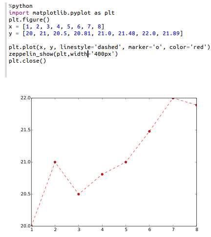

# Python 2＆3解释器

原文链接 : [http://zeppelin.apache.org/docs/0.7.2/interpreter/python.html](http://zeppelin.apache.org/docs/0.7.2/interpreter/python.html)

译文链接 : [http://www.apache.wiki/pages/viewpage.action?pageId=10030879](http://www.apache.wiki/pages/viewpage.action?pageId=10030879)

贡献者 : [片刻](/display/~jiangzhonglian) [ApacheCN](/display/~apachecn) [Apache中文网](/display/~apachechina)

## 配置

| 属性 | 默认 | 描述 |
| --- | --- | --- |
| zeppelin.python | python | 已经安装的Python二进制文件的路径（可以是python2或python3）。如果python不在您的$ PATH中，您可以设置绝对目录（例如：/usr/bin/python） |
| zeppelin.python.maxResult | 1000 | 要显示的最大数据帧数。 |

## 启用Python解释器

在笔记本中，要启用**Python解释**器，请单击“ **齿轮”**图标，然后选择“ **Python”**

## 使用Python解释器

在段落中，使用**_％python_**选择**Python解释**器，然后输入所有命令。

解释器只有在已经安装了python的情况下才可以工作（解释器不带自己的python二进制文件）。

要访问帮助，请键入**help()**

## Python环境

### 默认

默认情况下，PythonInterpreter将使用在`zeppelin.python`属性中定义的python命令来运行python进程。解释器可以使用已经安装的所有模块（带pip，easy_install ...）

### Conda

[Conda](http://conda.pydata.org/)是一个用于python的软件包管理系统和环境管理系统。 `%python.conda`解释器可让您在环境之间切换。

#### 用法

列出你的环境

```
%python.conda 
```

激活环境

```
%python.conda activate [ENVIRONMENT_NAME] 
```

停用

```
%python.conda deactivate 
```

### Docker

`%python.docker` 解释器允许PythonInterpreter在指定的docker容器中创建python进程。

#### 用法

激活环境

```
%python.docker activate [Repository] 
%python.docker activate [Repository:Tag] 
%python.docker activate [Image Id]  
```

停用

```
%python.docker deactivate 
```

案例

```
# activate latest tensorflow image as a python environment 
%python.docker activate gcr.io/tensorflow/tensorflow:latest 
```

## 使用Zeppelin动态表单 

您可以在Python代码中使用[Zeppelin 动态表单](http://www.apache.wiki/pages/viewpage.action?pageId=10030585)。

**Zeppelin动态表单只能在系统中安装py4j Python库时使用。如果没有，可以安装它`pip install py4j`。**

示例：

```
%python
### Input form
print (z.input("f1","defaultValue")) 

### Select form
print (z.select("f1",[("o1","1"),("o2","2")],"2")) 

### Checkbox form
print("".join(z.checkbox("f3", [("o1","1"), ("o2","2")],["1"]))) 
```

## Matplotlib集成

python解释器可以使用`pyplot`模块自动显示matplotlib数字：

```
%python
import matplotlib.pyplot as plt
plt.plot([1, 2, 3]) 
```

这是在Zeppelin笔记本中使用matplotlib的推荐方法。默认情况下，此命令的输出将通过隐式使用`%html`魔术将其转换为HTML 。使用内置`z.configure_mpl()`方法可以实现其他配置。例如，

```
z.configure_mpl(width=400, height=300, fmt='svg')
plt.plot([1, 2, 3]) 
```

将产生一个SVG格式的400x300图像，默认情况下通常为600x400和PNG。在将来，`angular`可以使用另一个可选的选项来使从一个段落直接从另一段生成的图形更新（输出将`%angular`代替`%html`）。但是，该功能在解释器中已经`pyspark`可用。更多细节可以在包含的“Zeppelin Tutorial：Python - matplotlib basic”教程笔记本中找到。

如果Zeppelin找不到matplotlib后端文件（通常应该在其中找到`$ZEPPELIN_HOME/interpreter/lib/python`）`PYTHONPATH`，则后端将自动设置为agg，并且（否则不推荐使用）的说明可用于更有限的内联绘图。

如果无法加载内联后端，请使用`z.show(plt)`：`python %python import matplotlib.pyplot as plt plt.figure() (.. ..) z.show(plt) plt.close() `该`z.show()`功能可以使用可选参数来调整图形尺寸（宽度和高度）以及输出格式（png或可选的svg）。

```
%python
z.show(plt, width='50px')
z.show(plt, height='150px', fmt='svg') 
```



## Pandas整合

Apache Zeppelin [桌面显示系统](http://zeppelin.apache.org/docs/0.7.1/displaysystem/basicdisplaysystem.html#table) 提供内置的数据可视化功能。Python解释器利用它可视化Pandas DataFrames，虽然类似的`z.show()`API，与[Matplotlib集成一样](http://zeppelin.apache.org/docs/0.7.1/interpreter/python.html#matplotlib-integration)。

例：

```
import pandas as pd
rates = pd.read_csv("bank.csv", sep=";")
z.show(rates) 
```

## 在Pandas DataFrames上的SQL

有一个方便的`%python.sql`解释器，与Zeppelin中的Apache Spark体验相匹配，可以使用SQL语言来查询[Pandas DataFrames](http://pandas.pydata.org/pandas-docs/stable/generated/pandas.DataFrame.html)，并通过内置[表格显示系统](http://zeppelin.apache.org/docs/0.7.1/displaysystem/basicdisplaysystem.html#table)可视化结果。

**预申请**

*   Pandas： `pip install pandas`
*   PandaSQL： `pip install -U pandasql`

如果默认绑定解释器是Python（首先在解释器列表中，在_齿轮图标下_），您可以将其用作`%sql`ie

*   第一段

    ```
    import pandas as pd
    rates = pd.read_csv("bank.csv", sep=";") 
    ```

*   下一段

    ```
    %sql
    SELECT * FROM rates WHERE age &lt; 40 
    ```

否则可以称为 `%python.sql`

## 技术说明

有关当前实现的深入技术细节请参考[python / README.md](https://github.com/apache/zeppelin/blob/master/python/README.md)。

### Python解释器中尚未实现某些功能

*   中断段落执行（`cancel()`方法）目前仅在Linux和MacOs中受支持。如果解释器在另一个操作系统（例如MS Windows）中运行，则中断一个段落将关闭整个解释器。打开JIRA票（[ZEPPELIN-893](https://issues.apache.org/jira/browse/ZEPPELIN-893)），在下一个版本的解释器中实现此功能。
*   webUI（`getProgress()`方法）中的进度条目前尚未实现。
*   代码完成目前尚未实施。