# R 解释器

原文链接 : [http://zeppelin.apache.org/docs/0.7.2/interpreter/r.html](http://zeppelin.apache.org/docs/0.7.2/interpreter/r.html)

译文链接 : [http://www.apache.wiki/pages/viewpage.action?pageId=10030900](http://www.apache.wiki/pages/viewpage.action?pageId=10030900)

贡献者 : [片刻](/display/~jiangzhonglian) [ApacheCN](/display/~apachecn) [Apache中文网](/display/~apachechina)

## 概述

[R](https://www.r-project.org/)是用于统计计算和图形的免费软件环境。

要在Apache Zeppelin中运行R代码和可视化图形，您将需要在主节点（或您的开发笔记本电脑）上使用R。

*   对于Centos： `yum install R R-devel libcurl-devel openssl-devel`
*   对于Ubuntu： `apt-get install r-base`

使用简单的R命令验证安装：

```
R -e "print(1+1)" 
```

要享受plots，请安装附加库：

```
+ devtools with `R -e "install.packages('devtools', repos = 'http://cran.us.r-project.org')"` 
+ knitr with `R -e "install.packages('knitr', repos = 'http://cran.us.r-project.org')"` 
+ ggplot2 with `R -e "install.packages('ggplot2', repos = 'http://cran.us.r-project.org')"` 
+ Other vizualisation librairies: `R -e "install.packages(c('devtools','mplot', 'googleVis'), repos = 'http://cran.us.r-project.org'); require(devtools); install_github('ramnathv/rCharts')"` 
```

我们建议您还安装以下可选的R库，用于快乐的数据分析：

*   glmnet
*   PROC
*   data.table
*   caret
*   sqldf
*   wordcloud

## 配置

要使用R解释器运行Zeppelin，`SPARK_HOME`必须设置环境变量。最好的方式是编辑`conf/zeppelin-env.sh`。如果没有设置，R解释器将无法与Spark进行接口。

你也应该复制`conf/zeppelin-site.xml.template`到`conf/zeppelin-site.xml`。这将确保齐柏林首次见到R解释器。

## 使用R解释器

默认情况下，将R解释显示为两个Zeppelin解释器，`%r`和`%knitr`。

`%r`将表现得像普通REPL。您可以像CLI中一样执行命令。

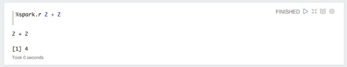

R基本绘图得到完全支持

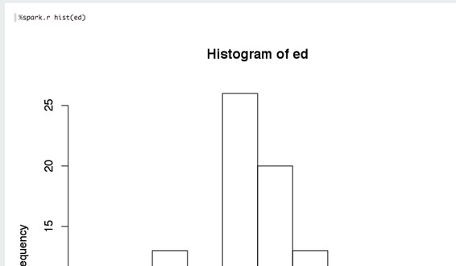

如果您返回一个data.frame，则Zeppelin将尝试使用Zeppelin的内置可视化进行显示。

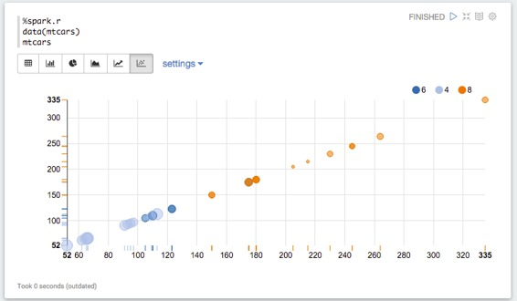

`%knitr`接口直接针对`knitr`第一行的chunk选项：

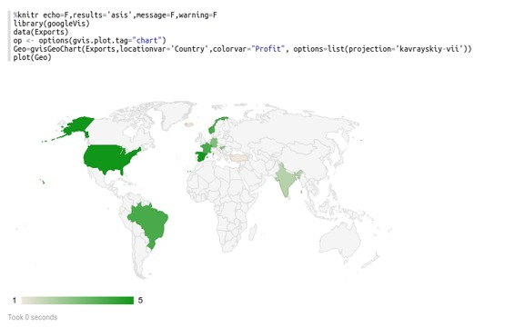

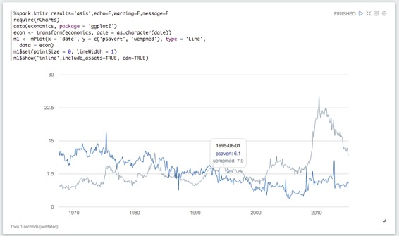

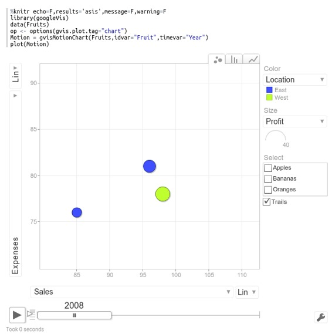

两位解释器的环境相同。如果您定义了一个变量`%r`，那么如果您使用一个调用，它将在范围内`knitr`。

## 使用SparkR＆语言间移动

如果`SPARK_HOME`设置，`SparkR`包将自动加载：

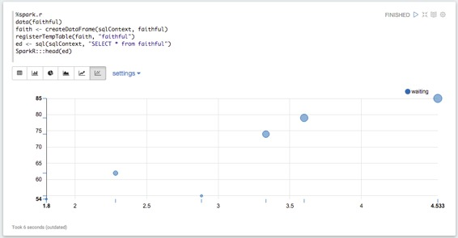

星火上下文和语境SQL创建并注入当地环境自动`sc`和`sql`。

同样的情况下与共享`%spark`，`%sql`并`%pyspark`解释：

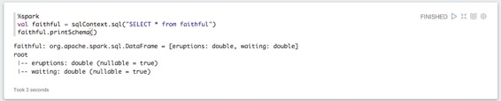

您还可以使普通的R变量在scala和Python中可访问：

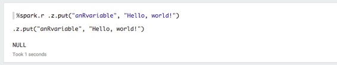

反之亦然：

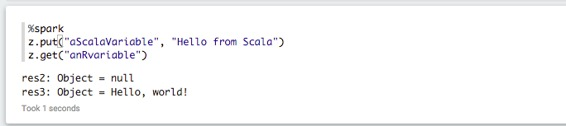

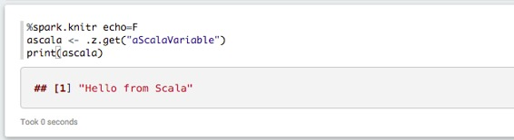

## 警告和故障排除

*   R解释器几乎所有的问题都是由于错误设置造成的`SPARK_HOME`。R解释器必须加载`SparkR`与运行版本的Spark匹配的软件包版本，并通过搜索来实现`SPARK_HOME`。如果Zeppelin未配置为与Spark接口`SPARK_HOME`，则R解释器将无法连接到Spark。

*   该`knitr`环境是持久的。如果您从Zeppelin运行一个更改变量的块，则再次运行相同的块，该变量已被更改。使用不变变量。

*   （请注意，`%spark.r`和`%r`是调用同一解释的两种不同的方式，因为是`%spark.knitr`和`%knitr`默认情况下，Zeppelin将R解释器放在`%spark.`翻译组。

*   使用`%r`解释器，如果你返回一个data.frame，HTML或一个图像，它将主导结果。所以如果你执行三个命令，一个是`hist()`，所有你会看到的是直方图，而不是其他命令的结果。这是一个Zeppelin限制。

*   如果您从解释器返回data.frame（例如，从调用`head()`）`%spark.r`，则将由Zeppelin的内置数据可视化系统进行解析。

*   为什么`knitr`不是的`rmarkdown`？为什么没有`htmlwidgets`？为了支持`htmlwidgets`，它具有间接依赖，`rmarkdown`使用`pandoc`，这需要写入和读取光盘。这使它比`knitr`RAM完全运行的速度慢许多倍。

*   为什么不`ggvis`和`shiny`？支持`shiny`需要将反向代理集成到Zeppelin中，这是一项任务。

*   最大的OS X和不区分大小写的文件系统。如果您尝试安装在不区分大小写的文件系统（Mac OS X默认值）上，则maven可能无意中删除安装目录，因为`r`它们`R`成为相同的子目录。

*   错误`unable to start device X11`与REPL解释。检查你的shell登录脚本，看看它们是否在`DISPLAY`调整环境变量。这在某些操作系统上是常见的，作为ssh问题的解决方法，但可能会干扰R绘图。

*   akka库版本或`TTransport`错误。如果您尝试使用SPARK_HOME运行Zeppelin，该版本的Spark版本与`-Pspark-1.x`编译Zeppelin时指定的版本不同。