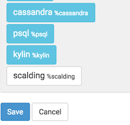

# Scalding 解释器

原文链接 : [http://zeppelin.apache.org/docs/0.7.2/interpreter/scalding.html](http://zeppelin.apache.org/docs/0.7.2/interpreter/scalding.html)

译文链接 : [http://www.apache.wiki/pages/viewpage.action?pageId=10030908](http://www.apache.wiki/pages/viewpage.action?pageId=10030908)

贡献者 : [片刻](/display/~jiangzhonglian) [ApacheCN](/display/~apachecn) [Apache中文网](/display/~apachechina)

[Scalding](https://github.com/twitter/scalding)是一个用于编写MapReduce工作的开源Scala库。

## 构建Scalding 解释器

您必须首先通过启用**烫伤**配置文件来构建Scalding解释器，如下所示：

```
mvn clean package -Pscalding -DskipTests 
```

## 启用Scalding 解释器

在笔记本电脑，使用Scalding解释器，点击**齿轮**图标，选择Scalding，并创下**保存**。




## 配置解释器

Scalding解释器有两种模式：

*   本地
*   HDFS

在本地模式下，您可以访问本地服务器上的文件，并在本地完成Scalding转换。

在hdfs模式下，您可以访问HDFS中的文件，并且烫印转换将以hadoop map-reduce作业运行。

Zeppelin配有预配置的Scalding解释器在本地模式。

要在hdfs模式下运行Scalding解释器，您必须执行以下操作：

**使用ZEPPELIN_CLASSPATH_OVERRIDES设置类路径**

在conf / _zeppelin env.sh中，您必须将ZEPPELIN_ CLASSPATH_OVERRIDES _设置_为“hadoop classpath”的内容，以及使用您的烫伤命令所需的自定义jar文件的目录。

**设置Scalding复制的参数**

默认参数为：“--local --repl”

对于hdfs模式，您需要添加：“--hdfs --repl”

如果要添加自定义jar，则需要添加：“-libjars directory / _：directory /_ ”

对于reducer估计，您需要添加以下内容：“-Dscalding.reducer.estimator.classes = com.twitter.scalding.reducer_estimation.InputSizeReducerEstimator”

**设置max.open.instances**

如果要控制最大数量的打开解释器，您必须为note选项选择“scoped”解释器，并设置max.open.instances参数。

## 测试解释器

### 本地模式

例如，通过使用“ [爱丽丝梦游仙境”](https://gist.github.com/johnynek/a47699caa62f4f38a3e2)教程，我们将计算单词（当然！），并绘制书中前十个单词的图形。

```
%scalding 

import scala.io.Source 

// Get the Alice in Wonderland book from gutenberg.org: 
val alice = Source.fromURL("http://www.gutenberg.org/files/11/11.txt").getLines 
val aliceLineNum = alice.zipWithIndex.toList 
val alicePipe = TypedPipe.from(aliceLineNum) 

// Now get a list of words for the book: 
val aliceWords = alicePipe.flatMap { case (text, _) => text.split("\\s+").toList } 

// Now lets add a count for each word: 
val aliceWithCount = aliceWords.filterNot(_.equals("")).map { word => (word, 1L) } 

// let's sum them for each word: 
val wordCount = aliceWithCount.group.sum 

print ("Here are the top 10 words\n") 
val top10 = wordCount 
  .groupAll 
  .sortBy { case (word, count) => -count } 
  .take(10) 
top10.dump 
```

```
%scalding 

val table = "words\t count\n" + top10.toIterator.map{case (k, (word, count)) => s"$word\t$count"}.mkString("\n") 
print("%table " + table)  
```

如果您点击饼图的图标，您应该可以看到如下图表： 


### HDFS模式

**测试模式**

```
%scalding 
mode  
```

此命令应打印：

```
res4: com.twitter.scalding.Mode = Hdfs(true,Configuration: core-default.xml, core-site.xml, mapred-default.xml, mapred-site.xml, yarn-default.xml, yarn-site.xml, hdfs-default.xml, hdfs-site.xml) 
```

**测试HDFS读取**

```
val testfile = TypedPipe.from(TextLine("/user/x/testfile")) 
testfile.dump  
```

此命令应打印hdfs文件/user/x/testfile 的内容。

**测试**map-reduce job****

```
val testfile = TypedPipe.from(TextLine("/user/x/testfile")) 
val a = testfile.groupAll.size.values 
a.toList  
```

该命令应该创建一个map reduce作业。

## 未来的工作

*   更好的用户反馈（hadoop url，进度更新）
*   能够取消工作
*   能够动态加载jar而不重新启动解释器
*   多用户可扩展性（在不同服务器上运行烫伤解释器）