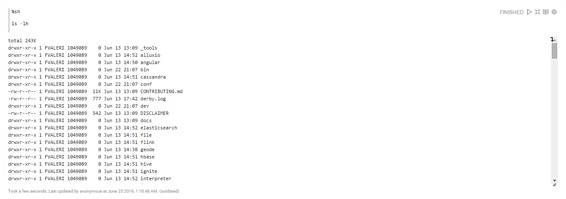

# Shell 解释器

原文链接 : [http://zeppelin.apache.org/docs/0.7.2/interpreter/shell.html](http://zeppelin.apache.org/docs/0.7.2/interpreter/shell.html)

译文链接 : [http://www.apache.wiki/pages/viewpage.action?pageId=10030917](http://www.apache.wiki/pages/viewpage.action?pageId=10030917)

贡献者 : [片刻](/display/~jiangzhonglian) [ApacheCN](/display/~apachecn) [Apache中文网](/display/~apachechina)

## 概述

Shell解释器使用[Apache Commons Exec](https://commons.apache.org/proper/commons-exec)执行外部进程。在Zeppelin笔记本中，您可以`%sh`在段落的开头调用系统shell并运行命令。

> **注意：**目前，每个命令以Zeppelin服务器的运行方式运行。

## 配置

在“Zeppelin”下拉菜单中的“Interpreters”菜单中，您可以设置Shell解释器的属性值。

| 名称 | 值 | 描述 |
| --- | --- | --- |
| shell.command.timeout.millisecs | 60000 | Shell命令以毫秒为单位超时 |
| zeppelin.shell.auth.type |   | 支持的验证方式类型有SIMPLE和KERBEROS |
| zeppelin.shell.principal |   | 从keytab加载的主要名称 |
| zeppelin.shell.keytab.location |   | keytab文件的路径 |

## 示例 

以下示例演示了Zeppelin笔记本中Shell的基本用法。

如果您需要有关使用Shell解释器的**Zeppelin 解释器设置**的更多信息，请阅读[什么是解释器设置？](http://www.apache.wiki/pages/viewpage.action?pageId=10030641)第一节。