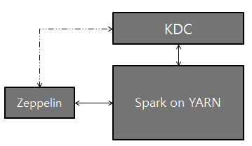

# Spark 解释器

原文链接 : [http://zeppelin.apache.org/docs/0.7.2/interpreter/spark.html](http://zeppelin.apache.org/docs/0.7.2/interpreter/spark.html)

译文链接 : [http://www.apache.wiki/pages/viewpage.action?pageId=10030923](http://www.apache.wiki/pages/viewpage.action?pageId=10030923)

贡献者 : [片刻](/display/~jiangzhonglian) [ApacheCN](/display/~apachecn) [Apache中文网](/display/~apachechina)

## 概述

[Apache Spark](http://spark.apache.org/)是一种快速和通用的集群计算系统。它提供Java，Scala，Python和R中的高级API，以及支持一般执行图的优化引擎。Zeppelin支持Apache Spark，Spark解释器组由5个解释器组成。

| 名称 | 类 | 描述 |
| --- | --- | --- |
| ％spark | SparkInterpreter | 创建一个SparkContext并提供Scala环境 |
| ％spark.pyspark | PySparkInterpreter | 提供Python环境 |
| ％spark.r | SparkRInterpreter | 提供具有SparkR支持的R环境 |
| ％spark.sql | SparkSQLInterpreter | 提供SQL环境 |
| ％spark.dep | DepInterpreter | 依赖加载器 |

[ ](http://zeppelin.apache.org/docs/0.7.1/interpreter/spark.html#configuration)

## 配置

Spark解释器可以配置为由Zeppelin提供的属性。您还可以设置表中未列出的其他Spark属性。有关其他属性的列表，请参阅[Spark可用属性](http://spark.apache.org/docs/latest/configuration.html#available-properties)。

| 属性 | 默认 | 描述 |
| --- | --- | --- |
| ARGS |   | Spark命令行参考 |
| master | local[*] | Spark master uri.
例如：spark://masterhost:7077 |
| spark.app.name | Zeppelin | Spark应用的名称。 |
| spark.cores.max |   | 要使用的核心总数。
空值使用所有可用的核心。 |
| spark.executor.memory | 1g | 每个worker实例的执行程序内存。
ex）512m，32g |
| zeppelin.dep.additionalRemoteRepository | spark-packages, 
[http://dl.bintray.com/spark-packages/maven](http://dl.bintray.com/spark-packages/maven), 
false; |  `id,remote-repository-URL,is-snapshot;`
每个远程存储库的列表。 |
| zeppelin.dep.localrepo | local-repo | 依赖加载器的本地存储库 |
| zeppelin.pyspark.python | python | Python命令来运行pyspark |
| zeppelin.spark.concurrentSQL | python | 如果设置为true，则同时执行多个SQL。 |
| zeppelin.spark.maxResult | 1000 | 要显示的Spark SQL结果的最大数量。 |
| zeppelin.spark.printREPLOutput | true | 打印REPL输出 |
| zeppelin.spark.useHiveContext | true | 如果它是真的，使用HiveContext而不是SQLContext。 |
| zeppelin.spark.importImplicit | true | 导入含义，UDF集合和sql如果设置为true。 |

没有任何配置，Spark解释器在本地模式下开箱即用。但是，如果要连接到Spark群集，则需要按照以下两个简单步骤进行操作。

### 1.导出SPARK_HOME

在`conf/zeppelin-env.sh`，导出`SPARK_HOME`环境变量与您的Spark安装路径。

例如，

```
export SPARK_HOME=/usr/lib/spark 
```

您可以选择设置更多的环境变量

```
# set hadoop conf dir
export HADOOP_CONF_DIR=/usr/lib/hadoop 

# set options to pass spark-submit command
export SPARK_SUBMIT_OPTIONS="--packages com.databricks:spark-csv_2.10:1.2.0" 

# extra classpath. e.g. set classpath for hive-site.xml
export ZEPPELIN_INTP_CLASSPATH_OVERRIDES=/etc/hive/conf 
```

对于Windows，确保你`winutils.exe`在`%HADOOP_HOME%\bin`。有关详细信息，请参阅[在Windows上运行Hadoop的问题](https://wiki.apache.org/hadoop/WindowsProblems)。

### 2.在“解释器”菜单中设置主机

启动Zeppelin后，转到**解释器**菜单并在Spark解释器设置中编辑**主**属性。该值可能因您的Spark群集部署类型而异。

例如，

*   **local[*]**  本地模式
*   **spark://master:7077** standalone 集群模式
*   **yarn-client** Yarn 客户端模式
*   **mesos://host:5050** Mesos 集群模式

而已。Zeppelin将使用任何版本的Spark和任何部署类型，而不用这种方式重建Zeppelin。有关Spark＆Zeppelin版本兼容性的更多信息，请参阅[Zeppelin下载页面](https://zeppelin.apache.org/download.html)中的“可用的口译员”部分。

> 请注意，不导出`SPARK_HOME`，它以本地模式运行，包含版本的Spark。附带的版本可能因构建配置文件而异。

## SparkContext，SQLContext，SparkSession，ZeppelinContext

SparkContext，SQLContext和ZeppelinContext会自动创建并显示为变量名`sc`，`sqlContext`并`z`分别在Scala，Python和R环境中公开。从0.6.1起，`spark`当您使用Spark 2.x时，SparkSession可以作为变量使用。

> 请注意，Scala / Python / R环境共享相同的SparkContext，SQLContext和ZeppelinContext实例。

## 依赖管理 

在Spark解释器中加载外部库有两种方法。首先是使用解释器设置菜单，其次是加载Spark属性。

### 1.通过解释器设置设置依赖关系

有关详细信息，请参阅[解释器依赖管理](http://www.apache.wiki/pages/viewpage.action?pageId=10030743)。

### 2.加载Spark属性

一旦`SPARK_HOME`被设置`conf/zeppelin-env.sh`，Zeppelin使用`spark-submit`作为Spark解释赛跑者。`spark-submit`支持两种方式来加载配置。第一个是命令行选项，如--master和飞艇可以通过这些选项`spark-submit`通过导出`SPARK_SUBMIT_OPTIONS`在`conf/zeppelin-env.sh`。二是从中读取配置选项`SPARK_HOME/conf/spark-defaults.conf`。用户可以设置分发库的Spark属性有：

| 火花defaults.conf | SPARK_SUBMIT_OPTIONS | 描述 |
| --- | --- | --- |
| spark.jars | --jars | 包含在驱动程序和执行器类路径上的本地jar的逗号分隔列表。 |
| spark.jars.packages | --packages | 逗号分隔列表，用于包含在驱动程序和执行器类路径上的jar的maven坐标。将搜索当地的maven repo，然后搜索maven中心和由–repositories提供的任何其他远程存储库。坐标的格式应该是`groupId:artifactId:version`。 |
| spark.files | --files | 要放置在每个执行器的工作目录中的逗号分隔的文件列表。 |

以下是几个例子：

*   `SPARK_SUBMIT_OPTIONS` 在 `conf/zeppelin-env.sh`

    ```
    export SPARK_SUBMIT_OPTIONS="--packages com.databricks:spark-csv_2.10:1.2.0 --jars /path/mylib1.jar,/path/mylib2.jar --files /path/mylib1.py,/path/mylib2.zip,/path/mylib3.egg" 
    ```

*   `SPARK_HOME/conf/spark-defaults.conf`

    ```
    spark.jars        /path/mylib1.jar,/path/mylib2.jar 
    spark.jars.packages   com.databricks:spark-csv_2.10:1.2.0 
    spark.files       /path/mylib1.py,/path/mylib2.egg,/path/mylib3.zip  
    ```

### 3.通过％spark.dep解释器加载动态依赖关系

> 注：`%spark.dep`解释负载库`%spark`和`%spark.pyspark`而不是 `%spark.sql`翻译。所以我们建议你改用第一个选项。

当你的代码需要外部库，而不是下载/复制/重新启动Zeppelin，你可以使用`%spark.dep`解释器轻松地完成以下工作。

*   从maven库递归加载库
*   从本地文件系统加载库
*   添加额外的maven仓库
*   自动将库添加到SparkCluster（可以关闭）

解释器利用Scala环境。所以你可以在这里编写任何Scala代码。需要注意的是`%spark.dep`解释前应使用`%spark`，`%spark.pyspark`，`%spark.sql`。

这是用法

```
%spark.dep
z.reset() // clean up previously added artifact and repository 

// add maven repository
z.addRepo("RepoName").url("RepoURL") 

// add maven snapshot repository
z.addRepo("RepoName").url("RepoURL").snapshot() 

// add credentials for private maven repository
z.addRepo("RepoName").url("RepoURL").username("username").password("password") 

// add artifact from filesystem
z.load("/path/to.jar") 

// add artifact from maven repository, with no dependency
z.load("groupId:artifactId:version").excludeAll() 

// add artifact recursively
z.load("groupId:artifactId:version") 

// add artifact recursively except comma separated GroupID:ArtifactId list
z.load("groupId:artifactId:version").exclude("groupId:artifactId,groupId:artifactId, ...") 

// exclude with pattern
z.load("groupId:artifactId:version").exclude(*)
z.load("groupId:artifactId:version").exclude("groupId:artifactId:*")
z.load("groupId:artifactId:version").exclude("groupId:*") 

// local() skips adding artifact to spark clusters (skipping sc.addJar())
z.load("groupId:artifactId:version").local() 
```

## ZeppelinContext

Zeppelin 在Scala / Python环境中自动注入`ZeppelinContext`变量`z`。`ZeppelinContext`提供了一些额外的功能和实用程序。

### 对象交换

`ZeppelinContext`扩展地图，它在Scala和Python环境之间共享。所以你可以把Scala的一些对象从Python中读出来，反之亦然。

**Scala**

```
// Put object from scala
%spark
val myObject = ...
z.put("objName", myObject) 

// Exchanging data frames
myScalaDataFrame = ...
z.put("myScalaDataFrame", myScalaDataFrame) 

val myPythonDataFrame = z.get("myPythonDataFrame").asInstanceOf[DataFrame] 
```

**Python**  展开原码

```
# Get object from python
%spark.pyspark
myObject = z.get("objName")

# Exchanging data frames
myPythonDataFrame = ...
z.put("myPythonDataFrame", postsDf._jdf)

myScalaDataFrame = DataFrame(z.get("myScalaDataFrame"), sqlContext) 
```

### 表格创作

`ZeppelinContext`提供了创建表单的功能。在Scala和Python环境中，您可以以编程方式创建表单。

**Scala**

```
%spark
/* Create text input form */
z.input("formName") 

/* Create text input form with default value */
z.input("formName", "defaultValue") 

/* Create select form */
z.select("formName", Seq(("option1", "option1DisplayName"),
                         ("option2", "option2DisplayName"))) 

/* Create select form with default value*/
z.select("formName", "option1", Seq(("option1", "option1DisplayName"),
                                    ("option2", "option2DisplayName"))) 
```

```
%spark.pyspark
# Create text input form
z.input("formName")

# Create text input form with default value
z.input("formName", "defaultValue")

# Create select form
z.select("formName", [("option1", "option1DisplayName"),
                      ("option2", "option2DisplayName")])

# Create select form with default value
z.select("formName", [("option1", "option1DisplayName"),
                      ("option2", "option2DisplayName")], "option1") 
```

```
在sql环境中，可以在简单的模板中创建表单。
```

```
%spark.sql
select * from ${table=defaultTableName} where text like '%${search}%' 
```

要了解有关动态表单的更多信息，请检查[Zeppelin 动态表单](http://www.apache.wiki/pages/viewpage.action?pageId=10030585)。

[ ](http://zeppelin.apache.org/docs/0.7.1/interpreter/spark.html#matplotlib-integration-pyspark)

## Matplotlib集成（pyspark）

这两个`python`和`pyspark`解释器都内置了对内联可视化的支持`matplotlib`，这是一个流行的python绘图库。更多细节可以在[python解释器文档中找到](http://zeppelin.apache.org/docs/0.7.1/interpreter/python.html)，因为matplotlib的支持是相同的。通过利用齐柏林内置的[角度显示系统](http://zeppelin.apache.org/docs/0.7.1/displaysystem/back-end-angular.html)，可以通过pyspark进行更先进的交互式绘图，如下所示：


## 解释器设置选项

您可以选择其中之一`shared`，`scoped`以及`isolated`配置Spark解释器的选项。Spark解释器为每个笔记本创建分离的Scala编译器，但在`scoped`模式（实验）中共享一个SparkContext。它在每个笔记本`isolated`模式下创建分离的SparkContext 。

## 用Kerberos设置Zeppelin

使用Zeppelin，Kerberos Key Distribution Center（KDC）和Spark on YARN进行逻辑设置：



### 配置设置

1.  在安装Zeppelin的服务器上，安装Kerberos客户端模块和配置，krb5.conf。这是为了使服务器与KDC进行通信。

2.  设置`SPARK_HOME`在`[ZEPPELIN_HOME]/conf/zeppelin-env.sh`使用火花提交（此外，您可能需要设置`export HADOOP_CONF_DIR=/etc/hadoop/conf`）

3.  将以下两个属性添加到Spark configuration（`[SPARK_HOME]/conf/spark-defaults.conf`）中：

    ```
    spark.yarn.principal 
    spark.yarn.keytab 
    ```

    &gt; **注意：**如果您没有访问以上spark-defaults.conf文件的权限，可以选择地，您可以通过Zeppelin UI中的“解释器”选项卡将上述行添加到“Spark Interpreter”设置。

4.  而已。玩Zeppelin！