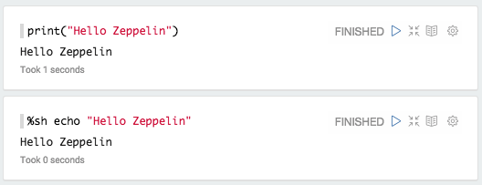
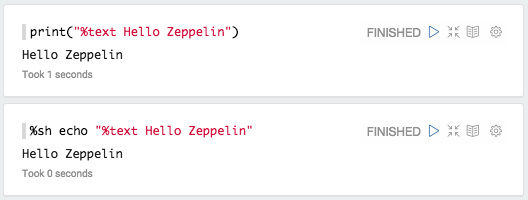
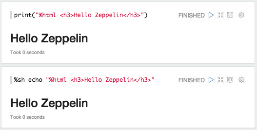
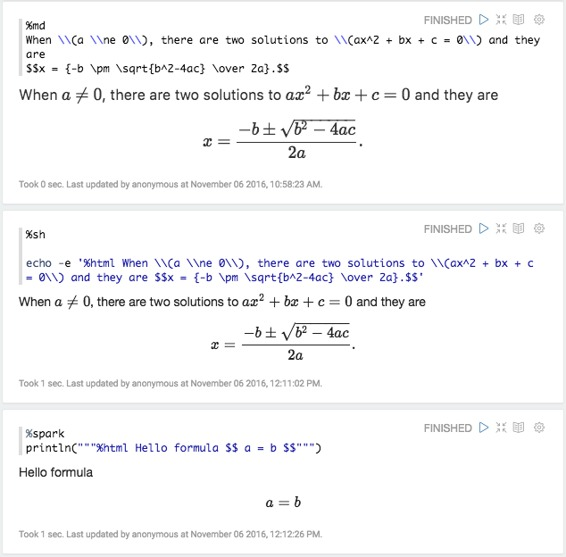
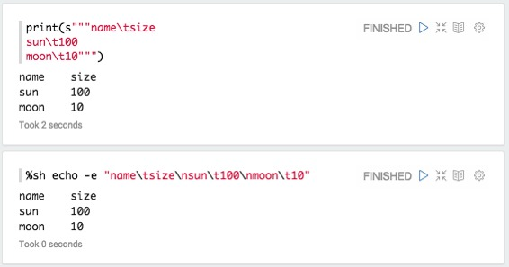
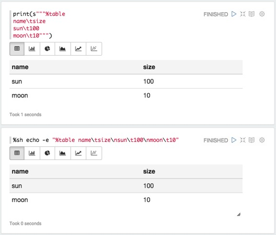
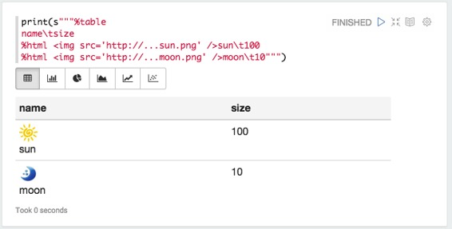

# 系统基本显示

原文链接 : [http://zeppelin.apache.org/docs/0.7.2/displaysystem/basicdisplaysystem.html](http://zeppelin.apache.org/docs/0.7.2/displaysystem/basicdisplaysystem.html)

译文链接 : [http://www.apache.wiki/pages/viewpage.action?pageId=10030651](http://www.apache.wiki/pages/viewpage.action?pageId=10030651)

贡献者 : [片刻](/display/~jiangzhonglian) [ApacheCN](/display/~apachecn) [Apache中文网](/display/~apachechina)

## 文本

默认情况下，Apache Zeppelin使用`text`显示系统打印解释器响应作为纯文本。

您可以明确表示您正在使用`text`显示系统。

## HTML

使用`%html`指令，Zeppelin将您的输出视为HTML

### 数学表达

HTML显示系统使用[MathJax](https://www.mathjax.org/)自动格式化数学表达式。您可以使用 `\\( INLINE EXPRESSION \\)`和`$$ EXPRESSION $$`格式化。例如

## 表

例如，如果您将具有由`\n`（换行符）和列以`\t`（tab）分隔的数据以第一行作为标题行分隔的数据

您可以简单地使用`%table`显示系统来利用Zeppelin的内置可视化功能。

如果表格内容开始`%html`，它将被解释为一个HTML。

**注意：**显示系统是后端独立的。