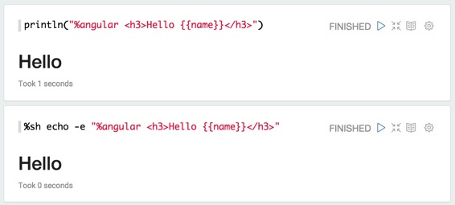
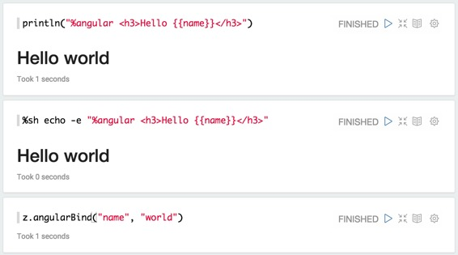
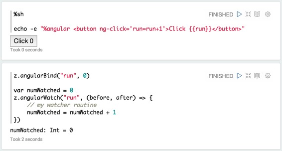
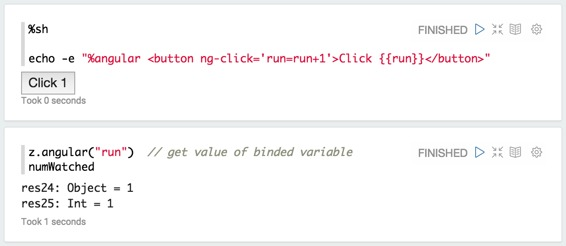
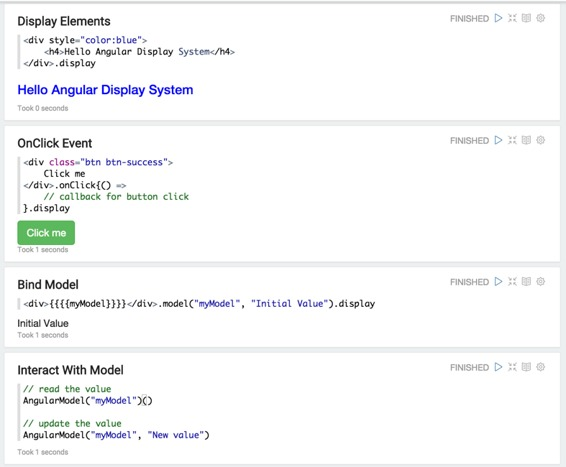

# 后端Angular API

原文链接 : [http://zeppelin.apache.org/docs/0.7.2/displaysystem/back-end-angular.html](http://zeppelin.apache.org/docs/0.7.2/displaysystem/back-end-angular.html)

译文链接 : [http://www.apache.wiki/pages/viewpage.action?pageId=10030654](http://www.apache.wiki/pages/viewpage.action?pageId=10030654)

贡献者 : [片刻](/display/~jiangzhonglian) [ApacheCN](/display/~apachecn) [Apache中文网](/display/~apachechina)

## 概观

角度显示系统将输出视为[AngularJS](https://angularjs.org/)的视图模板。它编译模板并将其显示在Apache Zeppelin中。Zeppelin在您的解释器和您编译的**AngularJS视图**模板之间提供了一个网关。因此，您不仅可以从解释器更新范围变量，还可以在解释器中进行更新，这是JVM进程。

## 基本用法

### 打印AngularJS视图

要使用角度显示系统，您应该从头开始`%angular`。 



由于`name`未定义，`Hello`将显示`Hello`。

> **请注意：**显示系统与后端无关。

### 绑定/解除绑定变量

通过**ZeppelinContext**，您可以将变量绑定/解除绑定到**AngularJS视图**。目前，它只适用于**Spark Interpreter（scala）**。

```
// bind my 'object' as angular scope variable 'name' in current notebook.
z.angularBind(String name, Object object) 

// bind my 'object' as angular scope variable 'name' in all notebooks related to current interpreter.
z.angularBindGlobal(String name, Object object) 

// unbind angular scope variable 'name' in current notebook.
z.angularUnbind(String name) 

// unbind angular scope variable 'name' in all notebooks related to current interpreter.
z.angularUnbindGlobal(String name) 
```

使用上面的例子，我们来绑定`world`变量`name`。然后您可以看到**AngularJs视图**立即更新。



### 观察/不记事变数

通过**ZeppelinContext**，您可以在**AngularJs视图**中观看/解除**变量**。目前，它只适用于**Spark Interpreter（scala）**。

```
// register for angular scope variable 'name' (notebook)
z.angularWatch(String name, (before, after) => { ... }) 

// unregister watcher for angular variable 'name' (notebook)
z.angularUnwatch(String name) 

// register for angular scope variable 'name' (global)
z.angularWatchGlobal(String name, (before, after) => { ... }) 

// unregister watcher for angular variable 'name' (global)
z.angularUnwatchGlobal(String name) 
```

```
让我们做一个按钮。点击时，值run将被增加1乘以1。
```



`z.angularBind("run", 0)`将初始化`run`为零。然后，它也将适用`run`于`z.angularWatch()`。单击按钮时，您将看到两者`run`并`numWatched`递增1。



## 让我们让它更简单和更直观

在本节中，我们将介绍一种在Zeppelin 中使用**角度显示系统**的更简单和直观的方法。

这里有一些用法。

### Import

```
// In notebook scope
import org.apache.zeppelin.display.angular.notebookscope._
import AngularElem._ 

// In paragraph scope
import org.apache.zeppelin.display.angular.paragraphscope._
import AngularElem._
```

### 显示元素

```
// automatically convert to string and print with %angular display system directive in front.
<div><div>.display 
```

### 事件处理程序
[](http://zeppelin.apache.org/docs/0.7.1/displaysystem/back-end-angular.html#display-element)

```
// on click
<div></div>.onClick(() => {
   my callback routine
}).display 

// on change
<div></div>.onChange(() => {
  my callback routine
}).display 

// arbitrary event
<div></div>.onEvent("ng-click", () => {
  my callback routine
}).display
```

### 绑定模型

```
// bind model
<div></div>.model("myModel").display 

// bind model with initial value
<div></div>.model("myModel", initialValue).display
```

### 与模型交互

```
// read model
AngularModel("myModel")() 

// update model
AngularModel("myModel", "newValue")
```

### 示例：基本使用

使用上述基本用法，您可以像下面的示例一样应用它们。

#### 显示元素

```
<div style="color:blue">
  <h4>Hello Angular Display System</h4>
</div>.display
```

#### OnClick事件

```
<div class="btn btn-success">
  Click me
</div>.onClick{() =>
  // callback for button click
}.display
```

#### 绑定模型

```
<div>{{{{myModel}}}}</div>.model("myModel", "Initial Value").display
```

#### **与模型交互**

```
// read the value
AngularModel("myModel")() 

// update the value
AngularModel("myModel", "New value")
```

```

```

### 示例：字符串转换器

使用下面的示例，您可以将小写字符串转换为大写。

```
// clear previously created angular object.
AngularElem.disassociate 

val button = <div class="btn btn-success btn-sm">Convert</div>.onClick{() =>
  val inputString = AngularModel("input")().toString
  AngularModel("title", inputString.toUpperCase)
} 

<div>
  { <h4> {{{{title}}}}</h4>.model("title", "Please type text to convert uppercase") }
   Your text { <input type="text"></input>.model("input", "") }
  {button}
</div>.display
```

