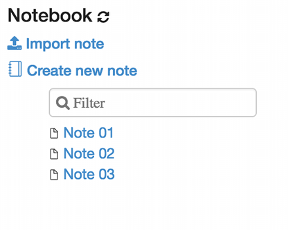
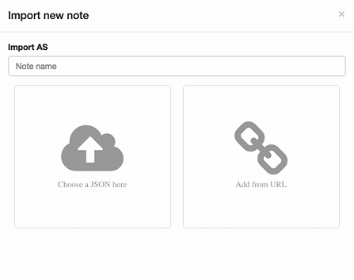
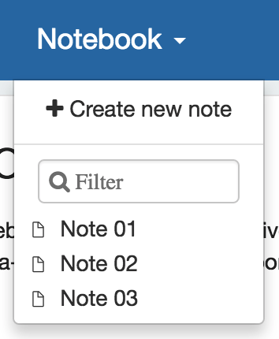
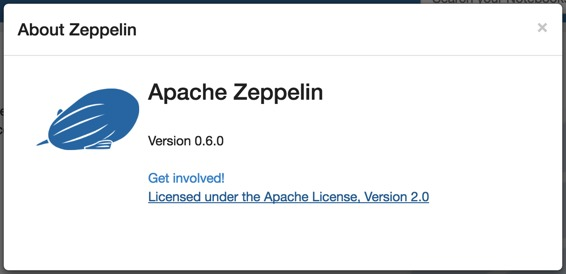
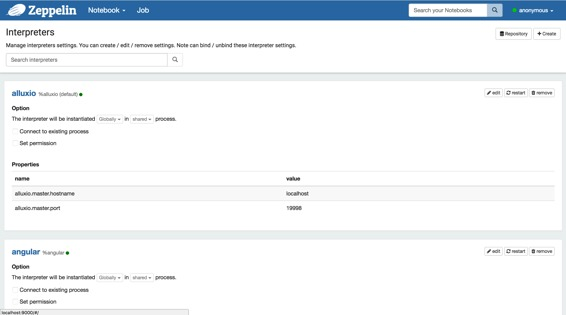
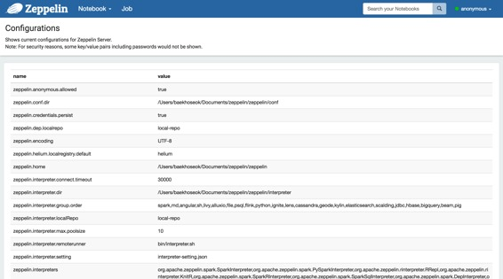
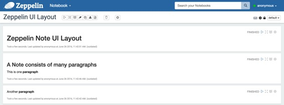
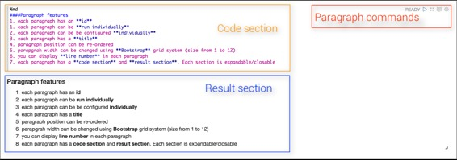
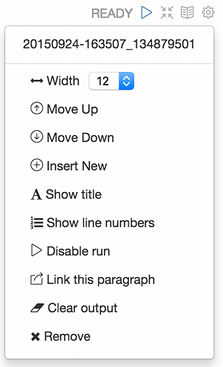
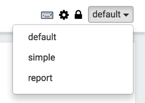

# 探索Apache Zeppelin UI

原文链接 : [http://zeppelin.apache.org/docs/0.7.2/quickstart/explorezeppelinui.html](http://zeppelin.apache.org/docs/0.7.2/quickstart/explorezeppelinui.html)

译文链接 : [http://www.apache.wiki/pages/viewpage.action?pageId=10030562](http://www.apache.wiki/pages/viewpage.action?pageId=10030562)

贡献者 : [片刻](/display/~jiangzhonglian) [ApacheCN](/display/~apachecn) [Apache中文网](/display/~apachechina)

## 首页

你第一次连接到Zeppelin，你将会在主页面上看到下面的截图。

页面左侧列出所有现有的笔记。这些笔记默认存储在`$ZEPPELIN_HOME/notebook`文件夹中。

您可以使用输入文本形式通过名称过滤它们。您还可以创建一个新的笔记，刷新现有笔记的列表（万一手动将其复制到`$ZEPPELIN_HOME/notebook`文件夹中）并导入笔记。

当点击`Import Note`链接时，会打开一个新的对话框。从那里您可以从本地磁盘或从远程位置导入您的笔记，如果您提供的URL。

默认情况下，导入的注释的名称与原始注释相同，但您可以通过提供新的名称来覆盖它。

## 菜单

### 笔记本

该`Notebook`菜单提出与主页中的笔记管理部分几乎相同的功能。从下拉菜单中，您可以：

1.  打开选定的音符
2.  按名称过滤节点
3.  创建一个新的音符

### 设置

此菜单可让您访问设置并显示有关Zeppelin的信息。`anonymous`如果使用默认的shiro 配置，用户名设置为。如果要设置身份验证，请参阅[Shiro身份验证](http://zeppelin.apache.org/docs/0.7.1/security/shiroauthentication.html)。

#### 关于Zeppelin

您可以在此菜单中查看Zeppelin版本。

#### 解释器

在此菜单中，您可以：

1.  配置现有的**解释器实例**
2.  添加/删除**解释器实例**

**
**

#### 凭据

此菜单允许您保存传递给口译员的数据源的凭据。

#### 配置

此菜单显示配置文件中设置的所有Zeppelin配置 `$ZEPPELIN_HOME/conf/zeppelin-site.xml`

## 注释布局

每个Zeppelin笔记由1 .. N段组成。该笔记可以看作是一个段落容器。

### 段落

每个段落由两部分组成：`code section`您将源代码放在`result section`哪里，您可以在其中看到代码执行的结果。

在每个段落的右上角都有一些命令：

*   执行段落代码
*   隐藏/显示 `code section`
*   隐藏/显示 `result section`
*   配置段落

要配置段落，只需点击齿轮图标：

从这个对话框可以（按降序排列）：

*   找到**段落id**（**20150924-163507_134879501**）
*   控制段宽。由于Zeppelin正在使用**Twitter Bootstrap**的网格系统，因此每段宽度可以从1变为12
*   移动第1段
*   将第1段向下移动
*   创建一个新段落
*   更改段落标题
*   显示/隐藏行号 `code section`
*   禁用此段落的运行按钮
*   将当前段落导出为**iframe**，并在新窗口中打开**iframe** 
*   清除 `result section`
*   删除当前段落

### 注意工具栏

在笔记的顶部，您可以找到一个显示命令按钮以及配置，安全性和显示选项的工具栏。

在最右边显示注释名称，只需点击它即可显示输入表单并进行更新。

在工具栏的中间，您可以找到命令按钮：

*   执行所有段落**顺序**，在他们的显示顺序
*   隐藏/显示`code section`所有段落
*   隐藏/显示`result section`所有段落
*   清除`result section`所有段落
*   克隆当前笔记
*   将当前注释导出到JSON文件。_Please注意的是，`code section`和`result section`所有段落将用于出口。如果您在`result section`某些段落中有重的数据，建议您在导出之前清理它们
*   提交当前节点内容
*   删除注释
*   使用CRON语法调度**所有段落的**执行

在笔记工具栏的右侧，您可以找到配置图标：

*   显示所有的键盘摇柄
*   配置解释器绑定到当前注释
*   配置注释权限
*   开关之间的节点的显示模式`default`，`simple`和`report`

