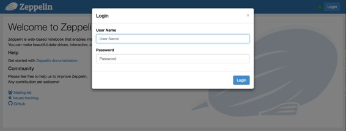

# Shiro 授权

原文链接 : [http://zeppelin.apache.org/docs/0.7.2/security/shiroauthentication.html](http://zeppelin.apache.org/docs/0.7.2/security/shiroauthentication.html)

译文链接 : [http://www.apache.wiki/pages/viewpage.action?pageId=10030709](http://www.apache.wiki/pages/viewpage.action?pageId=10030709)

贡献者 : [小瑶](/display/~chenyao) [ApacheCN](/display/~apachecn) [Apache中文网](/display/~apachechina)

## 概观

**[Apache Shiro](http://shiro.apache.org/)** 是一个功能强大且易于使用的 **Java** 安全框架，可执行身份验证，授权，加密和会话管理。在本文档中，我们将逐步介绍 **Shiro** 如何用于 **Zeppelin** **notebook authentication** ( 笔记本验证 )。

当您连接到 **Apache Zeppelin** 时，系统将要求您输入凭据。登录后，您可以访问包括其他用户注释在内的所有备注。

## 安全设置

您可以通过一些简单的步骤设置 **Zeppelin notebook authentication** 。

### 1.启用 Shiro

默认情况下是在 **conf** ，你将会找到 **shiro.ini.template** ，以此文件为例，强烈建议您通过执行以下命令创建文件 **shiro.ini**

```
cp conf/shiro.ini.template conf/shiro.ini
```

有关 **shiro.ini** 文件格式的更多信息 ，请参阅 [Shiro配置](http://shiro.apache.org/configuration.html#Configuration-INISections) 。

### 2.Secure the Websocket channel ( 固定 WebSocket 通道 )

在 **conf/zeppelin-site.xml** 中设置属性 **zeppelin.anonymous.allowed** 为 **false** 。如果您还没有这个文件，只需将** conf/zeppelin-site.xml.template** 复制到 **conf/zeppelin-site.xml** 。

### 3.启动 Zeppelin

```
bin/zeppelin-daemon.sh start (or restart)
```

然后你可以浏览 **Zeppelin** 在 [http://localhost:8080](http://localhost:8080) 。

### 4.登录

最后，您可以使用以下 用户名/密码 组合之一进行登录。



```
[users]

admin = password1, admin
user1 = password2, role1, role2
user2 = password3, role3
user3 = password4, role2
```

你可以为密码旁边的每个用户设置角色。

## Groups and permissions (optional) ( 组和权限(可选) )

如果要利用用户组和权限，请在 **shiro.ini** 中的 **[main]** 段下使用 **LDAP** 或 **AD** 的以下配置之一。

```
activeDirectoryRealm = org.apache.zeppelin.realm.ActiveDirectoryGroupRealm
activeDirectoryRealm.systemUsername = userNameA
activeDirectoryRealm.systemPassword = passwordA
activeDirectoryRealm.searchBase = CN=Users,DC=SOME_GROUP,DC=COMPANY,DC=COM
activeDirectoryRealm.url = ldap://ldap.test.com:389
activeDirectoryRealm.groupRolesMap = "CN=aGroupName,OU=groups,DC=SOME_GROUP,DC=COMPANY,DC=COM":"group1"
activeDirectoryRealm.authorizationCachingEnabled = false

ldapRealm = org.apache.zeppelin.server.LdapGroupRealm
# search base for ldap groups (only relevant for LdapGroupRealm):
ldapRealm.contextFactory.environment[ldap.searchBase] = dc=COMPANY,dc=COM
ldapRealm.contextFactory.url = ldap://ldap.test.com:389
ldapRealm.userDnTemplate = uid={0},ou=Users,dc=COMPANY,dc=COM
ldapRealm.contextFactory.authenticationMechanism = SIMPLE
```

还要定义系统中要拥有的角色/组，如下所示;

```
[roles]
admin = *
hr = *
finance = *
group1 = *
```

## Configure Realm (optional) ( 配置领域(可选) )

领域负责 **Apache Zeppelin** 的身份验证和授权。默认情况下，**Apache Zeppelin** 使用 **[IniRealm](https://shiro.apache.org/static/latest/apidocs/org/apache/shiro/realm/text/IniRealm.html)** （用户和组可配置在 **conf/shiro.ini** 文件** [user] **和** [group]** 部分）。您还可以利用 **Shiro Realms** ，如 **[JndiLdapRealm](https://shiro.apache.org/static/latest/apidocs/org/apache/shiro/realm/ldap/JndiLdapRealm.html)** ，** [JdbcRealm](https://shiro.apache.org/static/latest/apidocs/org/apache/shiro/realm/jdbc/JdbcRealm.html) **或创建 [我们自己的](https://shiro.apache.org/static/latest/apidocs/org/apache/shiro/realm/AuthorizingRealm.html) 。要了解有关 **Apache Shiro** 领域的更多信息，请查看 [此文档](http://shiro.apache.org/realm.html)。

我们还提供社区自定义领域。

### 活动目录

```
activeDirectoryRealm = org.apache.zeppelin.realm.ActiveDirectoryGroupRealm
activeDirectoryRealm.systemUsername = userNameA
activeDirectoryRealm.systemPassword = passwordA
activeDirectoryRealm.hadoopSecurityCredentialPath = jceks://file/user/zeppelin/conf/zeppelin.jceks
activeDirectoryRealm.searchBase = CN=Users,DC=SOME_GROUP,DC=COMPANY,DC=COM
activeDirectoryRealm.url = ldap://ldap.test.com:389
activeDirectoryRealm.groupRolesMap = "CN=aGroupName,OU=groups,DC=SOME_GROUP,DC=COMPANY,DC=COM":"group1"
activeDirectoryRealm.authorizationCachingEnabled = false
```

而不是在 **shiro.ini** 管理员的明文中指定 **systemPassword** 管理员可以选择在 **“hadoop凭据”** 中指定相同。使用 **hadoop** 凭据命令行创建密钥库文件，因为 **hadoop commons** 应该在类路径中 

`hadoop credential create activeDirectoryRealm.systempassword -provider jceks://file/user/zeppelin/conf/zeppelin.jceks`

更改Shiro.ini文件中的以下值，并取消注释行：

`activeDirectoryRealm.hadoopSecurityCredentialPath = jceks://file/user/zeppelin/conf/zeppelin.jceks`

### LDAP

```
ldapRealm = org.apache.zeppelin.realm.LdapGroupRealm
# search base for ldap groups (only relevant for LdapGroupRealm):
ldapRealm.contextFactory.environment[ldap.searchBase] = dc=COMPANY,dc=COM
ldapRealm.contextFactory.url = ldap://ldap.test.com:389
ldapRealm.userDnTemplate = uid={0},ou=Users,dc=COMPANY,dc=COM
ldapRealm.contextFactory.authenticationMechanism = SIMPLE
```

### PAM

**[PAM](https://en.wikipedia.org/wiki/Pluggable_authentication_module)** 认证支持允许在 **Zeppelin** 正在运行的主机上重用现有的认证模块。在典型的系统模块中，每个服务配置例如 **sshd** ， **passwd** 等 **/etc/pam.d/ **。您可以重新使用这些服务之一或为 **Zeppelin** 创建自己的服务。激活 **PAM** 认证需要两个参数：1. **realm**：正在使用的 **Shiro** 域 2\. **service** ：配置为使用的服务 **/etc/pam.d/** 。这里的名称需要与下面的文件名相同 **/etc/pam.d/**

```
[main]
 pamRealm=org.apache.zeppelin.realm.PamRealm
 pamRealm.service=sshd
```

### ZeppelinHub

**[ZeppelinHub](https://www.zeppelinhub.com/)** 是一种服务，可同步您的 **Apache Zeppelin** 笔记本，并使您轻松协作。

为了使登录您的 **ZeppelinHub** 证书，应用以下变化`**conf/shiro.ini** `下 `**[main]** `节。

```
### A sample for configuring ZeppelinHub Realm
zeppelinHubRealm = org.apache.zeppelin.realm.ZeppelinHubRealm
## Url of ZeppelinHub
zeppelinHubRealm.zeppelinhubUrl = https://www.zeppelinhub.com
securityManager.realms = $zeppelinHubRealm
```

注意

**ZeppelinHub** 没有被转交给 **Apache Zeppelin** 项目。

## 保护您的Zeppelin信息（可选）

默认情况下，定义的任何人都** [users]** 可以在 **Apache Zeppelin** 中共享解释器设置，凭证和配置信息。有时您可能希望隐藏这些用于您的用例的信息。由于 **Shiro** 提供了基于 **URL** 的安全性，您可以通过在下面的行中注释或取消注释来隐藏信息** conf/shiro.ini** 。

```
[urls]

/api/interpreter/** = authc, roles[admin]
/api/configurations/** = authc, roles[admin]
/api/credential/** = authc, roles[admin]
```

在这种情况下，只有具有 **admin** 角色的角色才能看到解释器设置，凭据和配置信息。如果要向其他用户授予此权限，您可以按照在部分中定义的角色[]进行更改** [users]** 。

注意

所有上述配置都在 **conf/shiro.ini** 文件中定义。

## 其他认证方式

*   [使用 **NGINX** 的 **HTTP** 基本认证](http://zeppelin.apache.org/docs/0.7.2/security/authentication.html)