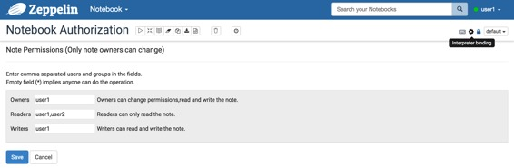
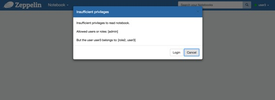

# 笔记本 授权

原文链接 : [http://zeppelin.apache.org/docs/0.7.2/security/notebook_authorization.html](http://zeppelin.apache.org/docs/0.7.2/security/notebook_authorization.html)

译文链接 : [http://www.apache.wiki/pages/viewpage.action?pageId=10031004](http://www.apache.wiki/pages/viewpage.action?pageId=10031004)

贡献者 : [片刻](/display/~jiangzhonglian) [ApacheCN](/display/~apachecn) [Apache中文网](/display/~apachechina)

## 概述

我们假设有一个**Shiro Authentication**组件，它将用户字符串和一组组字符串与每个NotebookSocket相关联。如果您尚未设置身份验证组件，请先检查[Apache Zeppelin的Shiro身份验证](http://www.apache.wiki/pages/viewpage.action?pageId=10030709)。

[ ](http://zeppelin.apache.org/docs/0.7.2/security/notebook_authorization.html#authorization-setting)

## 授权设置

您可以在每个笔记本中设置Zeppelin笔记本的权限。当然只有**笔记本拥有者**可以改变这个配置。只需单击**锁定图标**，然后打开笔记本中的权限设置页面。

您可以看到，每个Zeppelin笔记本有3个实体：

*   Owners ( users or groups )
*   Readers ( users or groups )
*   Writers ( users or groups )



用逗号分隔的**用户**和**组中**配置的`conf/shiro.ini`文件填写每个表单。如果表单为空（*），则表示任何用户都可以执行该操作。

如果没有**读**权限的人尝试访问笔记本电脑，或者没有**写**权限的人正在尝试编辑笔记本，则Zeppelin将要求登录或阻止用户。



## 单独的笔记本工作区（公共和私人）

默认情况下，授权权限允许其他用户查看新创建的笔记，意思是工作区`public`。这种行为是可控的，可以通过`ZEPPELIN_NOTEBOOK_PUBLIC`在`conf/zeppelin-env.sh`或通过`zeppelin.notebook.public`属性中的任何一个变量进行设置`conf/zeppelin-site.xml`。因此，为了使新创建的笔记只出现在您的`private`工作空间默认情况下，你可以设定`ZEPPELIN_NOTEBOOK_PUBLIC`到`false`你`conf/zeppelin-env.sh`如下：

```
export ZEPPELIN_NOTEBOOK_PUBLIC="false"
```

或者设置`zeppelin.notebook.public`属性`false`中`conf/zeppelin-site.xml`，如下所示：

```
<property> 
  <name>zeppelin.notebook.public</name> 
  <value>false</value> 
  <description>Make notebook public by default when created, private otherwise</description> 
</property> 
```

在幕后，当您创建一个新的笔记时，该`owners`字段将填充当前用户，`readers`并将`writers`字段留空。具有至少一个空授权字段的所有注释都被视为处于工作`public`区。因此，当将`zeppelin.notebook.public`（或对应`ZEPPELIN_NOTEBOOK_PUBLIC`）设置为false时，新创建的注释`readers`和`writers`现有用户填充的字段，使笔记在工作区中`private`显示。

[ ](http://zeppelin.apache.org/docs/0.7.2/security/notebook_authorization.html#how-it-works)

## 怎么运行的

在本节中，我们将介绍笔记本授权在后台方面如何工作的细节。

### NotebookServer

该[NotebookServer](https://github.com/apache/zeppelin/blob/master/zeppelin-server/src/main/java/org/apache/zeppelin/socket/NotebookServer.java)每一个笔记本电脑业务划分为三大类：**读**，**写**，**管理**。在执行笔记本操作之前，它会检查用户和与之关联的组是否`NotebookSocket`具有权限。例如，在执行**Read**操作之前，它检查用户和组是否至少有一个属于**Reader**实体的实体。

### Notebook REST API调用

Zeppelin 对笔记本电脑权限信息执行[REST API调用](https://github.com/apache/zeppelin/blob/master/zeppelin-server/src/main/java/org/apache/zeppelin/rest/NotebookRestApi.java)。在后端，Zeppelin获取连接的用户信息，如果与当前用户关联的用户和组具有至少一个属于笔记本的所有者实体的实体，则可以进行操作。