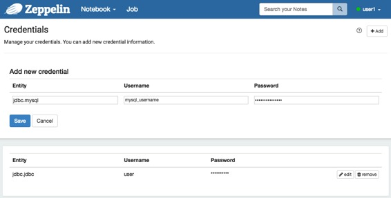

# 数据源 授权

原文链接 : [http://zeppelin.apache.org/docs/0.7.2/security/datasource_authorization.html](http://zeppelin.apache.org/docs/0.7.2/security/datasource_authorization.html)

译文链接 : [http://www.apache.wiki/pages/viewpage.action?pageId=10031006](http://www.apache.wiki/pages/viewpage.action?pageId=10031006)

贡献者 : [小瑶](/display/~chenyao) [ApacheCN](/display/~apachecn) [Apache中文网](/display/~apachechina)

## 概述

数据源授权涉及对数据源进行身份验证，如 **Mysql** 数据库，并确定用户权限。 **Apache Zeppelin** 允许用户使用自己的凭据与数据源进行身份验证。

例如，假设您在具有凭据的 **Vertica** 数据库中有一个帐户。您可能希望使用此帐户创建一个 **JDBC** 连接，而不是在 **conf / shiro.ini** 中定义的所有用户创建一个共享帐户。在这种情况下，您可以将凭据信息添加到 **Apache Zeppelin** 中，并使用以下简单步骤。

## How to save the credential information? ( 如何保存凭证信息？ )

您可以在数据源的下拉菜单中添加新的凭据，可以传递给解释器。

**Entity** ( 实体 ) 可以是区分每个凭证集的关键（我们建议 **Entity** ( 实体 ) 的惯例是 **[Interpreter Group].[Interpreter Name]** ）请查看 [解释器组](http://zeppelin.apache.org/docs/0.7.2/manual/interpreters.html#what-is-interpreter-group) 的详细信息。

键入用户名和密码为您自己的凭据。 ex） **MySQL** 解释器的 **Mysql** 用户和密码。

根据 **conf / shiro.ini** 中定义的用户保存凭据。如果您没有[在 **Apache Zeppelin** 中激活 **shiro** 身份验证](http://zeppelin.apache.org/docs/0.7.2/security/shiroauthentication.html)，则您的凭据信息将被保存为匿名。所有凭证信息也可以在 **conf / credentials.json** 中找到。

#### JDBC interpreter ( JDBC解释器 )

您需要维护每个用户的连接池。解释方法将用户字符串作为参数，并使用用户连接池中的连接执行 jdbc 调用。

#### Presto

如果 **Presto DB** 服务器使用用户的 **HDFS** 授权运行后端代码，则不需要密码。

#### Vertica and Mysql

您必须存储用户的密码信息。

## 请注意

作为数据源认证功能的第一步，[**ZEPPELIN-82**8](https://issues.apache.org/jira/browse/ZEPPELIN-828) 在 **Pull Request[＃860](https://github.com/apache/zeppelin/pull/860)** 中被提出并实现。目前，只有定制的第三方解释器才能使用此功能。我们计划在不久的将来将这一机制应用于[社区管理解释器](http://zeppelin.apache.org/docs/0.7.2/manual/interpreterinstallation.html#available-community-managed-interpreters)。请跟踪 **[ZEPPELIN-1070](https://issues.apache.org/jira/browse/ZEPPELIN-1070)** 。