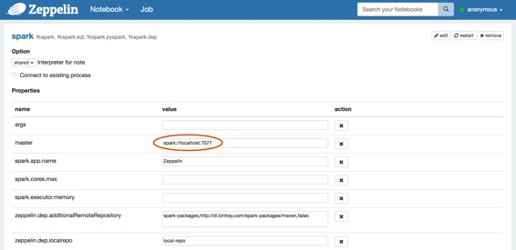
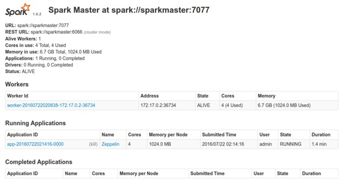
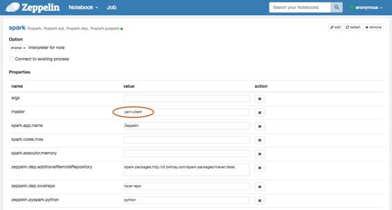
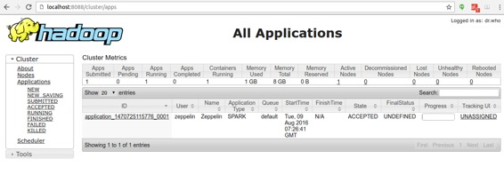
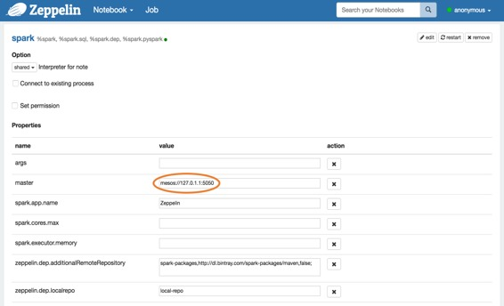
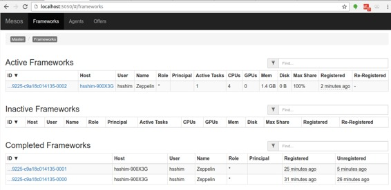

# Zeppelin on Spark Cluster Mode( Spark 集群模式下的 Zeppelin )

原文链接 : [http://zeppelin.apache.org/docs/0.7.2/install/spark_cluster_mode.html](http://zeppelin.apache.org/docs/0.7.2/install/spark_cluster_mode.html)

译文链接 : [http://www.apache.wiki/pages/viewpage.action?pageId=10031041](http://www.apache.wiki/pages/viewpage.action?pageId=10031041)

贡献者 : [小瑶](/display/~chenyao) [ApacheCN](/display/~apachecn) [Apache中文网](/display/~apachechina)

## 概述

到目前为止，**Apache Spark** 已经支持三种集群管理器类型（**Standalone**，**Apache Mesos** 和 **Hadoop YARN** ）。本文档将指导您如何使用 **Docker** 脚本使用 **Apache Zeppelin** 在3种类型的 **Spark** 集群管理器上构建和配置环境。所以首先在机器上安装 **docker** 。

## Spark standalone mode ( Spark独立模式 )

Spark standalone 是Spark附带的简单集群管理器，可以轻松设置集群。您可以通过以下步骤简单地设置 Spark独立环境。

注意

由于 **Apache Zeppelin** 和 **Spark** 为其 **Web UI** 使用相同的 **8080** 端口，因此您可能需要在 **conf / zeppelin-site.xml** 中更改 **zeppelin.server.port** 。

### 1.Build Docker file ( 构建 Docker 文件 )

您可以在脚本 **/ docker / spark-cluster-managers** 下找到 **docker** 脚本文件。

```
cd $ZEPPELIN_HOME/scripts/docker/spark-cluster-managers/spark_standalone
docker build -t "spark_standalone" .
```

### 2.Run docker ( 运行 docker )

```
docker run -it \
-p 8080:8080 \
-p 7077:7077 \
-p 8888:8888 \
-p 8081:8081 \
-h sparkmaster \
--name spark_standalone \
spark_standalone bash;
```

请注意，在这里运行 **docker** 容器的 **sparkmaster** 主机名应该在 **/ etc / hosts** 中定义。

### 3.Configure Spark interpreter in Zeppelin ( 在 Zeppelin 中配置 Spark 解释器 )

将 **Spark master** 设置为 **spark://&lt;hostname&gt;:7077** 在 **Zeppelin** 的解释器设置页面上。



### 4.Run Zeppelin with Spark interpreter ( 用 Spark 解释器运行 Zeppelin )

在 **Zeppelin** 中运行带有 **Spark** 解释器的单个段落后，浏览 **https：// &lt;hostname&gt;：8080**，并检查 **Spark** 集群是否运行正常。



您还可以通过以下命令简单地验证 **Spark** 在 **Docker** 中运行良好。

```
ps -ef | grep spark
```

## Spark on YARN mode ( Spark 在 YARN 模式下 )

您可以通过以下步骤简单地设置** [Spark on YARN](http://spark.apache.org/docs/latest/running-on-yarn.html) docker** 环境。

注意

由于 **Apache Zeppelin** 和 **Spark** 为其 **Web UI** 使用相同的 **8080** 端口，因此您可能需要在 **conf / zeppelin-site.xml** 中更改 **zeppelin.server.port** 。

### 1.Build Docker file ( 构建Docker文件 )

您可以在脚本 **/ docker / spark-cluster-managers** 下找到 **docker** 脚本文件。

```
cd $ZEPPELIN_HOME/scripts/docker/spark-cluster-managers/spark_yarn_cluster
docker build -t "spark_yarn" .
```

### 2.Run docker ( 运行 docker )

```
docker run -it \
 -p 5000:5000 \
 -p 9000:9000 \
 -p 9001:9001 \
 -p 8088:8088 \
 -p 8042:8042 \
 -p 8030:8030 \
 -p 8031:8031 \
 -p 8032:8032 \
 -p 8033:8033 \
 -p 8080:8080 \
 -p 7077:7077 \
 -p 8888:8888 \
 -p 8081:8081 \
 -p 50010:50010 \
 -p 50075:50075 \
 -p 50020:50020 \
 -p 50070:50070 \
 --name spark_yarn \
 -h sparkmaster \
 spark_yarn bash;
```

请注意，在这里运行 **docker** 容器的 **sparkmaster** 主机名应该在 **/ etc / hosts** 中定义。

### 3.Verify running Spark on YARN ( 验证在YARN上运行Spark )

您可以通过以下命令简单地验证 **Spark** 和 **YARN** 的进程在 **Docker** 中运行良好。

```
ps -ef
```

您还可以在 **http：// &lt;hostname&gt;：50070 /** ，**YARN on http：// &lt;hostname&gt;：8088 / cluster** 和 **Spark on http：// &lt;hostname&gt;：8080 /** 上查看 **HDFS** 的每个应用程序 **Web UI** 。

### 4.Configure Spark interpreter in Zeppelin ( 在 Zeppelin 中配置 Spark 解释器 )

将以下配置设置到 **conf / zeppelin-env.sh** 。

```
export MASTER=yarn-client
export HADOOP_CONF_DIR=[your_hadoop_conf_path]
export SPARK_HOME=[your_spark_home_path]
```

**HADOOP_CONF_DIR**（ **Hadoop** 配置路径）在 **/ scripts / docker / spark-cluster-managers / spark_yarn_cluster / hdfs_conf** 中定义。

不要忘记在 **Zeppelin Interpreters** 设置页面中将 **Spark master** 设置为 **yarn-client** ，如下所示。



### 5.Run Zeppelin with Spark interpreter ( 使用Spark解释器运行Zeppelin )

在 **Zeppelin** 中使用 **Spark** 解释器运行单个段落后，浏览 h**ttp：// &lt;hostname&gt;：8088 / cluster / apps** 并检查 **Zeppelin** 应用程序运行是否正常。



## Spark on Mesos mode ( Spark 在 Mesos 模式 )

你可以通过以下步骤简单地设置 **[Spark on Mesos](http://spark.apache.org/docs/latest/running-on-mesos.html)** 环境。

### 1.Build Docker file ( 构建 docker 文件 )

```
cd $ZEPPELIN_HOME/scripts/docker/spark-cluster-managers/spark_mesos
docker build -t "spark_mesos" .
```

### 2.Run docker ( 运行 docker )

```
docker run --net=host -it \
-p 8080:8080 \
-p 7077:7077 \
-p 8888:8888 \
-p 8081:8081 \
-p 8082:8082 \
-p 5050:5050 \
-p 5051:5051 \
-p 4040:4040 \
-h sparkmaster \
--name spark_mesos \
spark_mesos bash;
```

请注意，在这里运行 **docker** 容器的 **sparkmaster** 主机名应该在 **/ etc / hosts** 中定义。

### 3.Verify running Spark on Mesos ( 验证在Mesos上运行Spark )

您可以通过以下命令简单地验证 **Spark** 和 **Mesos** 的进程在 **Docker** 中运行良好。

```
ps -ef
```

您还可以在 **http：// &lt;hostname&gt;：5050 / cluster** 和 **Spark on http：// &lt;hostname&gt;：8080 /** 上检查 **Mesos** 的每个应用程序 **Web UI** 。

### 4.Configure Spark interpreter in Zeppelin ( 在Zeppelin中配置Spark解释器 )

```
export MASTER=mesos://127.0.1.1:5050
export MESOS_NATIVE_JAVA_LIBRARY=[PATH OF libmesos.so]
export SPARK_HOME=[PATH OF SPARK HOME]
```

不要忘记将 **Spark master** 设置为 **mesos：//127.0.1.1：5050** 在 **Zeppelin Interpreters** 设置页面中，如下所示。



### 5.Run Zeppelin with Spark interpreter ( 使用Spark解释器运行Zeppelin )

在 **Zeppelin** 中使用 **Spark** 解释器运行一个段落后，浏览**http://&lt;hostname&gt;:5050/#/frameworks** ，并检查 **Zeppelin** 应用程序运行是否正常。



### Troubleshooting for Spark on Mesos ( Spark在Mesos上的故障排除 )

*   如果 **hostname **有问题，请在执行 **dockerrun** 时使用 **--add-host** 选项

```
## use `--add-host=moby:127.0.0.1` option to resolve
## since docker container couldn't resolve `moby`

: java.net.UnknownHostException: moby: moby: Name or service not known
        at java.net.InetAddress.getLocalHost(InetAddress.java:1496)
        at org.apache.spark.util.Utils$.findLocalInetAddress(Utils.scala:789)
        at org.apache.spark.util.Utils$.org$apache$spark$util$Utils$$localIpAddress$lzycompute(Utils.scala:782)
        at org.apache.spark.util.Utils$.org$apache$spark$util$Utils$$localIpAddress(Utils.scala:782)
```

*   如果您与 **mesos master** 有问题，请尝试使用 **mesos：//127.0.0.1** 而不是 **mesos：//127.0.1.1** 

```
I0103 20:17:22.329269   340 sched.cpp:330] New master detected at master@127.0.1.1:5050
I0103 20:17:22.330749   340 sched.cpp:341] No credentials provided. Attempting to register without authentication
W0103 20:17:22.333531   340 sched.cpp:736] Ignoring framework registered message because it was sentfrom 'master@127.0.0.1:5050' instead of the leading master 'master@127.0.1.1:5050'
W0103 20:17:24.040252   339 sched.cpp:736] Ignoring framework registered message because it was sentfrom 'master@127.0.0.1:5050' instead of the leading master 'master@127.0.1.1:5050'
W0103 20:17:26.150250   339 sched.cpp:736] Ignoring framework registered message because it was sentfrom 'master@127.0.0.1:5050' instead of the leading master 'master@127.0.1.1:5050'
W0103 20:17:26.737604   339 sched.cpp:736] Ignoring framework registered message because it was sentfrom 'master@127.0.0.1:5050' instead of the leading master 'master@127.0.1.1:5050'
W0103 20:17:35.241714   336 sched.cpp:736] Ignoring framework registered message because it was sentfrom 'master@127.0.0.1:5050' instead of the leading master 'master@127.0.1.1:5050'
```