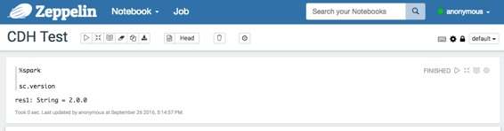
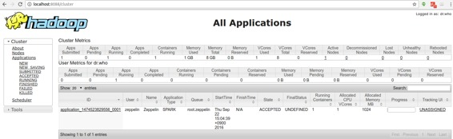

# Zeppelin on CDH ( Zeppelin 在 CDH 上 )

原文链接 : [http://zeppelin.apache.org/docs/0.7.2/install/cdh.html](http://zeppelin.apache.org/docs/0.7.2/install/cdh.html)

译文链接 : [http://www.apache.wiki/pages/viewpage.action?pageId=10031042](http://www.apache.wiki/pages/viewpage.action?pageId=10031042)

贡献者 : [片刻](/display/~jiangzhonglian) [ApacheCN](/display/~apachecn) [Apache中文网](/display/~apachechina)

### 1.导入Cloudera QuickStart Docker映像

> [Cloudera](http://www.cloudera.com/)已经在自己的容器中正式提供了CDH Docker Hub。请查看[本指南页面](http://www.cloudera.com/documentation/enterprise/latest/topics/quickstart_docker_container.html#cloudera_docker_container)了解更多信息。

您可以从Cloudera Docker Hub中拉出Docker镜像。

```
docker pull cloudera/quickstart:latest
```

### 2\. Run docker

```
docker run -it \
 -p 80:80 \
 -p 4040:4040 \
 -p 8020:8020 \
 -p 8022:8022 \
 -p 8030:8030 \
 -p 8032:8032 \
 -p 8033:8033 \
 -p 8040:8040 \
 -p 8042:8042 \
 -p 8088:8088 \
 -p 8480:8480 \
 -p 8485:8485 \
 -p 8888:8888 \
 -p 9083:9083 \
 -p 10020:10020 \
 -p 10033:10033 \
 -p 18088:18088 \
 -p 19888:19888 \
 -p 25000:25000 \
 -p 25010:25010 \
 -p 25020:25020 \
 -p 50010:50010 \
 -p 50020:50020 \
 -p 50070:50070 \
 -p 50075:50075 \
 -h quickstart.cloudera --privileged=true \
 agitated_payne_backup /usr/bin/docker-quickstart;
```

### 3.验证运行CDH

要验证应用程序是否正常运行，请检查Web界面上的HDFS `http://&lt;hostname&gt;:50070/`和YARN `http://&lt;hostname&gt;:8088/cluster`。

### 4.在Zeppelin中配置Spark解释器

设置以下配置`conf/zeppelin-env.sh`。

```
export MASTER=yarn-client 
export HADOOP_CONF_DIR=[your_hadoop_conf_path] 
export SPARK_HOME=[your_spark_home_path] 
```

`HADOOP_CONF_DIR`（Hadoop配置路径）定义在`/scripts/docker/spark-cluster-managers/cdh/hdfs_conf`。

不要忘记在“Zeppelin **Interpreters”**设置页面中设置Spark `master`，如下所示。`yarn-client`  


### [使用Spark解释器运行Zeppelin](http://zeppelin.apache.org/docs/0.7.2/install/cdh.html#5-run-zeppelin-with-spark-interpreter)

在Zeppelin中使用Spark解释器运行一个段落后，



 浏览`http://&lt;hostname&gt;:8088/cluster/apps`检查Zeppelin应用程序是否运行良好。

