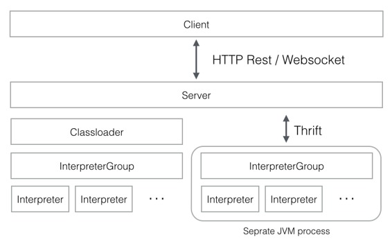

# Writing a New Interpreter ( 写一个新的解释器 )

原文链接 : [http://zeppelin.apache.org/docs/0.7.2/development/writingzeppelininterpreter.html](http://zeppelin.apache.org/docs/0.7.2/development/writingzeppelininterpreter.html)

译文链接 : [http://www.apache.wiki/pages/viewpage.action?pageId=10030728](http://www.apache.wiki/pages/viewpage.action?pageId=10030728)

贡献者 : [小瑶](/display/~chenyao) [ApacheCN](/display/~apachecn) [Apache中文网](/display/~apachechina)

## 什么是 Apache Zeppelin Interpreter

**Apache Zeppelin Interpreter** 是一种语言后端。例如，在 **Zeppelin** 中使用 **scala** 代码，您需要一个 **scala** 解释器。每个解释器都属于一个解释器组。相同的解释器中的解释器可以互相引用。例如，**SparkSqlInterpreter** 可以引用 **SparkInterpreter** ，以便在它们在同一个组中时从其获取**SparkContext** 。



[**InterpreterSetting** ](https://github.com/apache/zeppelin/blob/master/zeppelin-zengine/src/main/java/org/apache/zeppelin/interpreter/InterpreterSetting.java)是给定的**[ InterpreterGroup](https://github.com/apache/zeppelin/blob/master/zeppelin-interpreter/src/main/java/org/apache/zeppelin/interpreter/InterpreterGroup.java)** 和一个启动/停止解释器的单元的配置。同一个 **InterpreterSetting** 中的所有解释器都在单独的 **JVM** 进程中启动。解释器通过 [**Thrift** ](https://github.com/apache/zeppelin/blob/master/zeppelin-interpreter/src/main/thrift/RemoteInterpreterService.thrift)与 **Zeppelin engine** 通信。

在创建新的解释器时，您可以在 “解释器设置” 菜单中看到“每个音符”模式的“单独的解释器（范围/隔离）”，每个音符将创建新的解释器实例。但是它们在同一个 **InterpreterSettings** 中仍然运行在同一个 **JVM** 上。

## 制作你自己的 Interpreter

创建一个新的 **interpreter** 是非常简单的。只需扩展 [**org.apache.zeppelin.interpreter** ](https://github.com/apache/zeppelin/blob/master/zeppelin-interpreter/src/main/java/org/apache/zeppelin/interpreter/Interpreter.java)抽象类并实现一些方法。您可以在构建系统中包含 **org.apache.zeppelin：zeppelin-interpreter：[VERSION] artifact**。您应该将您的 jar 放在您的解释器目录下，并具有特定的目录名称。 **Zeppelin** 服务器递归地读取解释器目录，并初始化包括您自己的解释器在内的 **interpreter** 。

有三个位置可以存储您的 **interpreter group**，**name** 和 其他信息。 **Zeppelin** 服务器尝试找到以下位置。接下来， **Zeppelin** 尝试在您的解释器 **jar** 中找到** interpreter-setting.json**。

```
{ZEPPELIN_INTERPRETER_DIR}/{YOUR_OWN_INTERPRETER_DIR}/interpreter-setting.json
```

以下是您自己的 **interpreter** 上的 **interpreter-setting.json** 的例子。

```
[
  {
    "group": "your-group",
    "name": "your-name",
    "className": "your.own.interpreter.class",
    "properties": {
      "properties1": {
        "envName": null,
        "propertyName": "property.1.name",
        "defaultValue": "propertyDefaultValue",
        "description": "Property description"
      },
      "properties2": {
        "envName": PROPERTIES_2,
        "propertyName": null,
        "defaultValue": "property2DefaultValue",
        "description": "Property 2 description"
      }, ...
    },
    "editor": {
      "language": "your-syntax-highlight-language",
      "editOnDblClick": false
    }
  },
  {
    ...
  }
]
```

最后， **Zeppelin** 使用以下静态初始化：

```
static {
  Interpreter.register("MyInterpreterName", MyClassName.class.getName());
}
```

**静态初始化已被弃用，直到 0.6.0 才会被支持。**

在解释器配置过程中，名称将会稍后出现在解释器名称选项框中。解释器的名字是您以后写的，以确定应使用此解释器解释的段落。

```
%MyInterpreterName
some interpreter specific code...
```

## Editor setting for Interpreter ( 解释器的编辑器设置 )

您可以将编辑器对象添加到** interpreter-setting.json** 文件中以指定段落编辑器设置。

### Language ( 语言 )

如果解释器使用特定的编程语言（如 Scala ， Python ， SQL ），则通常建议将语法突出显示添加到注释段落编辑器中。

要查看支持的语言列表，请参阅 **zeppelin-web / bower_components / ace-builds / src-noconflict** 或 [**github.com/ajaxorg/ace-builds** ](https://github.com/ajaxorg/ace-builds/tree/master/src-noconflict)下的 **model - *.js** 文件。

如果要添加一组新的语法高亮：

1.  将 **model-*.js** 文件添加到** zeppelin-web / bower.json** （当内置时， **zeppelin-web / src / index.html** 将自动更改）。

将语言字段添加到编辑对象。请注意，如果您不指定语言字段，则您的解释器将使用纯文本模式进行语法突出显示。假设您要将语言设置为 **java** ，然后添加：

```
"editor": {
  "language": "java"
}
```

### Edit on double click ( 双击编辑 )

如果您的解释器使用标记语言（如 **markdown** 或 **HTML** ），请将 **editOnDblClick** 设置为 **true** ，以便文本编辑器在对话框上双击并在段落运行中关闭。否则将其设置为 **false** 。

```
"editor": {
  "editOnDblClick": false
}
```

## Install your interpreter binary ( 安装你的解释器二进制文件 )

一旦您构建了您的解释器，您可以将其放在解释器目录下，并具有所有的依赖关系。

```
[ZEPPELIN_HOME]/interpreter/[INTERPRETER_NAME]/
```

## Configure your interpreter ( 配置您的解释器 )

要配置您的解释器，您需要遵循以下步骤：

1.  将解释器类名添加到 **conf / zeppelin-site.xml** 中的 **zeppelin.interpreters** 属性。属性值以逗号分隔 **[INTERPRETER_CLASS_NAME]** 。例如，

    ```
    &lt;property&gt;
    &lt;name&gt;zeppelin.interpreters&lt;/name&gt;
    &lt;value&gt;org.apache.zeppelin.spark.SparkInterpreter,org.apache.zeppelin.spark.PySparkInterpreter,org.apache.zeppelin.spark.SparkSqlInterpreter,org.apache.zeppelin.spark.DepInterpreter,org.apache.zeppelin.markdown.Markdown,org.apache.zeppelin.shell.ShellInterpreter,org.apache.zeppelin.hive.HiveInterpreter,com.me.MyNewInterpreter&lt;/value&gt;
    &lt;/property&gt;
    ```

2.  将您的解释器添加到当没有 **zeppelin-site.xml** 时使用的默认配置。
3.  通过运行** ./bin/zeppelin-daemon.sh** 启动 **Zeppelin** 。

在解释器页面中，单击+创建按钮并配置您的解释器属性。现在你已经完成并准备好使用你的解释器。

注意

使用 **zeppelin** 发布的解释器有一个默认配置，当没有 **conf / zeppelin-site.xml** 时使用。

## Use your interpreter ( 使用你的解释器 )

### 0.5.0

在 **[NOTE]** 的指令中，**%[INTERPRETER_NAME]** 指令会调用您的解释器。请注意，**zeppelin.interpreters** 中的第一个解释器配置将是默认配置。

例如：

```
%myintp

val a = "My interpreter"
println(a)
```

### 0.6.0 and later

在一个注释的内部，**%INTERPRETER_GROUP].[INTERPRETER_NAME]** 指令将会调用您的解释器。

您可以省略 **[INTERPRETER_GROUP]** 或** [INTERPRETER_NAME]** 。如果您忽略** [INTERPRETER_NAME]** ，则会在** [INTERPRETER_GROUP]** 中选择第一个可用的解释器。同样，如果您跳过** [INTERPRETER_GROUP]** ，则会从默认解释器组中选择 **[INTERPRETER_NAME]** 。

例如，如果** mygrp group** 中有两个解释器 **myintp1** 和 **myintp2** ，可以像 **myintp1** 一样调用：

```
%mygrp.myintp1

codes for myintp1
```

你可以像 **myintp2** 一样调用

```
%mygrp.myintp2

codes for myintp2
```

如果省略您的解释器名称，它将在 **group ( myintp1 )** 中选择第一个可用的解释器。

```
%mygrp

codes for myintp1
```

当您的** interpreter group** 被选为 默认组 时，您只能省略您的** interpreter group** 。

```
%myintp2

codes for myintp2
```

## Examples ( 示例 )

查看一些与 **Zeppelin** 发布的 **interpreters** 。

*   [spark](https://github.com/apache/zeppelin/tree/master/spark)
*   [markdown](https://github.com/apache/zeppelin/tree/master/markdown)
*   [shell](https://github.com/apache/zeppelin/tree/master/shell)
*   [jdbc](https://github.com/apache/zeppelin/tree/master/jdbc)

## Contributing a new Interpreter to Zeppelin releases ( 为 Zeppelin 发行新的解释器 )

我们欢迎对新的解释器的贡献。请按照以下几个步骤进行：

*   首先，在 [这里](https://zeppelin.apache.org/contribution/contributions.html) 查看一般性贡献指南。
*   按照上述[ “解释器自己的解释器部分”](/pages/viewpage.action?pageId=10031094) 和 [“编辑器设置”](/pages/viewpage.action?pageId=10031094) 中的步骤进行。
*   添加您的解释器，如上面的 [配置您的解释器部分](/pages/viewpage.action?pageId=10031094) ;还将其添加到示例模板 **[zeppelin-site.xml.template](https://github.com/apache/zeppelin/blob/master/conf/zeppelin-site.xml.template)** 中。
*   添加测试！他们由 [Travis ](https://travis-ci.org/apache/zeppelin)经营所有变化，重要的是他们是独立的。
*   将您的解释器作为** pom.xml** 中的模块。
*   添加有关如何在 **docs / interpreter /** 下使用解释器的文档。以 **Markdown** 风格[为例](https://github.com/apache/zeppelin/blob/master/docs/interpreter/elasticsearch.md)。确保您列出配置设置，并提供在 **Markdown** 的代码框中使用解释器的工作示例。根据需要链接到图片（图片应转到** docs / assets / themes / zeppelin / img / docs-img /** ）。并在导航菜单（**docs / _includes / themes / zeppelin / _navigation.html**）中添加您的文档的链接。
*   最重要的是，确保所有依赖关系的传递关闭的许可证在 [许可证文件 ](https://github.com/apache/zeppelin/blob/master/zeppelin-distribution/src/bin_license/LICENSE)中列出。
*   提交您的更改，并在 [**GitHub** 上的项目 **Mirror**](https://github.com/apache/zeppelin) 上打开一个[** Pull** 请求](https://github.com/apache/zeppelin/pulls);检查以确保 **Travis CI** 构建正在通过。