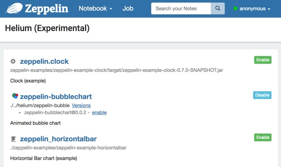
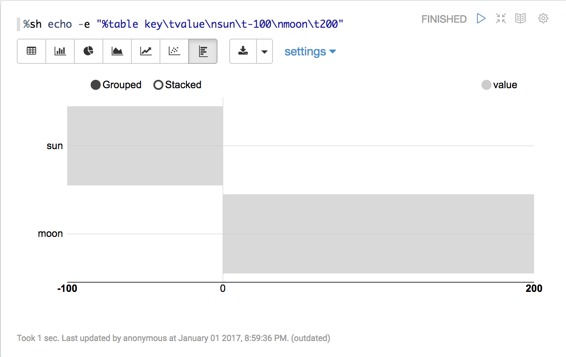

# Writing a new Visualization (Experimental) ( 编写新的可视化（实验） )

原文链接 : [http://zeppelin.apache.org/docs/0.7.2/development/writingzeppelinvisualization.html](http://zeppelin.apache.org/docs/0.7.2/development/writingzeppelinvisualization.html)

译文链接 : [http://www.apache.wiki/pages/viewpage.action?pageId=10031097](http://www.apache.wiki/pages/viewpage.action?pageId=10031097)

贡献者 : [小瑶](/display/~chenyao) [ApacheCN](/display/~apachecn) [Apache中文网](/display/~apachechina)

## 什么是 Apache zeppelin 可视化

**Apache Zeppelin** 可视化是一种可插拔的软件包，可以在运行时通过 **Zeppelin** 中的 **Helium **框架 加载/卸载。可视化是一个 **javascript npm** 包，用户可以像 **notebook **中任何其他内置的可视化一样使用它们。

## 它是怎么运行的？

### 1.Load Helium package files from registry ( 从注册表中加载 Helium 包 )

**Zeppelin** 需要知道可视化包可用。 **Zeppelin** 默认从本地注册表（默认为 **helium/** 目录）搜索 **Helium** 包文件。 **Helium** 包文件提供 **name** ，**artifact** 等信息。它类似于 **npm** 包中的 **package.json** 。

这是一个例子 **helium/zeppelin-example-horizontalbar.json**

```
{
  "type" : "VISUALIZATION",
  "name" : "zeppelin_horizontalbar",
  "description" : "Horizontal Bar chart (example)",
  "artifact" : "./zeppelin-examples/zeppelin-example-horizontalbar",
  "license" : "Apache-2.0",
  "icon" : "<i class='fa fa-bar-chart rotate90flipX'></i>"
}
```

查看 [创建 **helium package file**](http://zeppelin.apache.org/docs/0.7.2/development/writingzeppelinvisualization.html#3-create-helium-package-file) 部分以了解它。

### 2.Enable packages ( 启用包 )

一旦 **Zeppelin** 从本地注册表加载 **Helium** 包文件，可用的包将显示在 **Helium menu **中。

点击 “**enable** ( 启用 )” 按钮。



### 3.Create and load visualization bundle on the fly ( 快速创建并加载可视化包 )

一旦启用可视化包，**HeliumVisualizationFactory** 将创建一个 **js bundle** 。 ** js bundle** 由 **helium/visualization/load rest api** 端点提供。

### 4.Run visualization ( 运行可视化 )

**Zeppelin** 显示加载的可视化的附加按钮。用户可以像任何其他内置可视化一样使用。



## Write new Visualization ( 编写新的可视化 )

### 1.Create a npm package ( 创建一个 npm 包 )

在新的 **Visualization** 目录中创建一个 **[package.json](https://docs.npmjs.com/files/package.json)** 。通常，您可以在 **package.json** 中添加任何依赖项，但 **Zeppelin** 可视化包只允许两个依赖关系：** [zeppelin-vis](https://github.com/apache/zeppelin/tree/master/zeppelin-web/src/app/visualization)** 和** [zeppelin-tabledata](https://github.com/apache/zeppelin/tree/master/zeppelin-web/src/app/tabledata)** 。

下面是一个例子：

```
{
  "name": "zeppelin_horizontalbar",
  "description" : "Horizontal Bar chart",
  "version": "1.0.0",
  "main": "horizontalbar",
  "author": "",
  "license": "Apache-2.0",
  "dependencies": {
    "zeppelin-tabledata": "*",
    "zeppelin-vis": "*"
  }
}
```

### 2.Create your own visualization ( 创建你自己的可视化 )

要创建自己的可视化，您需要创建一个 **js** 文件，并从 **[zeppelin-vis](https://github.com/apache/zeppelin/tree/master/zeppelin-web/src/app/visualization)** 包导入 **[Visualization](https://github.com/apache/zeppelin/blob/master/zeppelin-web/src/app/visualization/visualization.js)** 类并扩展该类。 **[zeppelin-tabledata](https://github.com/apache/zeppelin/tree/master/zeppelin-web/src/app/tabledata)** 包提供了一些有用的转换，如 **pivot** ，可以在可视化中使用。 （也可以创建自己的 **transformation** ）。

**[Visualization](https://github.com/apache/zeppelin/blob/master/zeppelin-web/src/app/visualization/visualization.js)** 类，有几种方法需要  **override** 和 **implement** 。这是简单的可视化，只是打印 **Hello world**。

```
import Visualization from 'zeppelin-vis'
import PassthroughTransformation from 'zeppelin-tabledata/passthrough'

export default class helloworld extends Visualization {
  constructor(targetEl, config) {
    super(targetEl, config)
    this.passthrough = new PassthroughTransformation(config);
  }

  render(tableData) {
    this.targetEl.html('Hello world!')
  }

  getTransformation() {
    return this.passthrough
  }
}
```

要了解有关 **Visualization** 类的更多信息，请查看[**visualization.js**](https://github.com/apache/zeppelin/blob/master/zeppelin-web/src/app/visualization/visualization.js) 。

您可以在 [此处](https://github.com/apache/zeppelin/tree/master/zeppelin-examples/zeppelin-example-horizontalbar) 查看完整的可视化包示例。

**Zeppelin** 的内置可视化使用相同的 **API** ，因此您可以查看 **[built-in visualizations](https://github.com/apache/zeppelin/tree/master/zeppelin-web/src/app/visualization/builtins)** 作为附加示例。

### 3.Create **Helium package file ( 创建 Helium 包文件 )**

**Helium package file** 是一个 **json** 文件，提供有关应用程序的信息。 **Json** 文件包含以下信息

```
{
  "type" : "VISUALIZATION",
  "name" : "zeppelin_horizontalbar",
  "description" : "Horizontal Bar chart (example)",
  "license" : "Apache-2.0",
  "artifact" : "./zeppelin-examples/zeppelin-example-horizontalbar",
  "icon" : "<i class='fa fa-bar-chart rotate90flipX'></i>"
}
```

#### type ( 类型 )

创建可视化时，“**type** ( 类型 )” 应该是 “**VISUALIZATION** ( 可视化 )”。如果您对其他类型的软件包感兴趣，请查看 [**application** ( 应用程序 )](http://zeppelin.apache.org/docs/0.7.2/development/writingzeppelinapplication.html) 类型。

#### name ( 名称 )

可视化的名称。应该是独一无二的。允许 **[A-Za-z90-9_]** 。

#### description ( 描述 )

关于可视化的简短描述。

#### artifact

可视化 **npm** 包的位置。支持带有版本或本地文件系统路径的 **npm** 软件包。

例如

当 **artifact** 存在于 **npm** 存储库中时

```
artifact: "my-visualiztion@1.0.0"
```

当 **artifact** 存在于本地文件系统中时

```
artifact: "/path/to/my/visualization"
```

#### license ( 执照 )

许可信息。

例如

```
license: "Apache-2.0"
```

#### icon ( 图标 )

用于可视化选择按钮的图标。此字段中的字符串将被呈现为 **HTML** 标记。

例如

```
icon: "<i class='fa fa-coffee'></i>"
```

### 4.Run in dev mode ( 以开发者模式运行 )

将您的 **Helium** 包文件 放在本地注册表（ **ZEPPELIN_HOME /helium**）中。运行 **Zeppelin** 。然后在可视化开发模式下运行 **zeppelin-web** 。

```
cd zeppelin-web
yarn run visdev
```

您可以浏览 **localhost：9000** 。每次刷新您的浏览器，**Zeppelin** 将重建您的可视化并重新加载更改。