# 动态表单

原文链接 : [http://zeppelin.apache.org/docs/0.7.2/manual/dynamicform.html](http://zeppelin.apache.org/docs/0.7.2/manual/dynamicform.html)

译文链接 : [http://www.apache.wiki/pages/viewpage.action?pageId=10030585](http://www.apache.wiki/pages/viewpage.action?pageId=10030585)

贡献者 : [片刻](/display/~jiangzhonglian) [ApacheCN](/display/~apachecn) [Apache中文网](/display/~apachechina)

Apache Zeppelin动态创建输入表单。根据语言后端，创建动态表单有两种不同的方式。自定义语言后端可以选择要使用哪种类型的表单创建。

## 使用表单模板

此模式使用简单的模板语言创建表单。它简单易用。例如Markdown，Shell，Spark SQL语言后端使用它。

### 文本输入表单

要创建文本输入表单，请使用`${formName}`模板。

例如

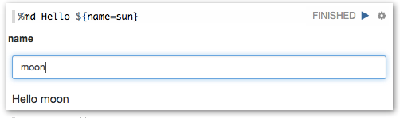

也可以提供默认值，使用`${formName=defaultValue}`。

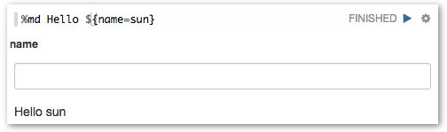

### 选择表单

要创建选择表单，请使用 `${formName=defaultValue,option1|option2...}`

例如

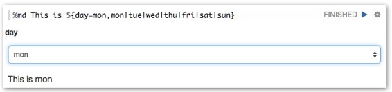

此外，您可以使用选项的显示名称和值分隔 `${formName=defaultValue,option1(DisplayName)|option2(DisplayName)...}`

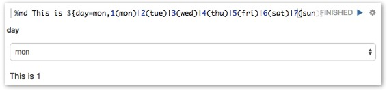

默认情况下更改选择后，段落将自动运行。但是，如果您在一个段落中有多种类型的动态表单，则可能需要在更改所有选项后运行该段落。您可以通过取消选中设置菜单中的以下“ **运行选择更改”**选项来控制此选项。即使您取消选中此选项，仍然可以通过按下来运行它`Enter`。

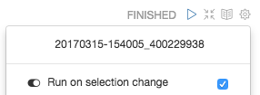

### 复选框表单

对于多选，您可以使用复选框来创建`${checkbox:formName=defaultValue1|defaultValue2...,option1|option2...}`。该变量将由基于所选项的逗号分隔字符串代替。例如：

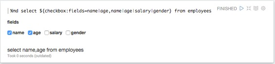

此外，您可以使用以下命令指定分隔符`${checkbox(delimiter):formName=...}`：

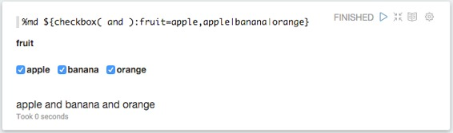

与[选择表单](http://zeppelin.apache.org/docs/0.7.1/manual/dynamicform.html#select-form)一样，默认情况下更改[选择后](http://zeppelin.apache.org/docs/0.7.1/manual/dynamicform.html#select-form)，段落将自动运行。但是，如果您在一个段落中有多种类型的动态表单，则可能需要在更改所有选项后运行该段落。您可以通过取消选中设置菜单中的以下“ **运行选择更改”**选项来控制此选项。即使您取消选中此选项，仍然可以通过按下来运行它`Enter`。


## 以编程方式创建

一些语言后端使用编程方式创建表单。例如[ZeppelinContext](http://zeppelin.apache.org/docs/0.7.1/interpreter/spark.html#zeppelincontext)提供了表单创建API

这里有一些例子。

### 文本输入表单

**Scala**

```
%spark
println("Hello "+z.input("name"))
```

**Python**  展开原码

```
%pyspark
print("Hello "+z.input("name"))
```

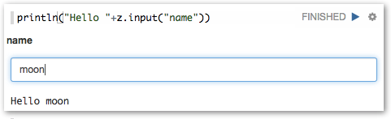

### 具有默认值的文本输入表单

**Scala**

```
%spark
println("Hello "+z.input("name", "sun"))
```

**Python**  展开原码

```
%pyspark
print("Hello "+z.input("name", "sun"))
```

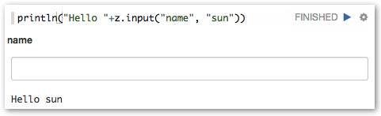

### 选择表单

**Scala**

```
%spark
println("Hello "+z.select("day", Seq(("1","mon"),
                                    ("2","tue"),
                                    ("3","wed"),
                                    ("4","thurs"),
                                    ("5","fri"),
                                    ("6","sat"),
                                    ("7","sun")))) 
```

**Python**  展开原码

```
%pyspark
print("Hello "+z.select("day", [("1","mon"),
                                ("2","tue"),
                                ("3","wed"),
                                ("4","thurs"),
                                ("5","fri"),
                                ("6","sat"),
                                ("7","sun")]))
```

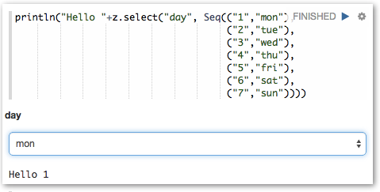

### **复选框表单**

**Scala**

```
%spark
val options = Seq(("apple","Apple"), ("banana","Banana"), ("orange","Orange"))
println("Hello "+z.checkbox("fruit", options).mkString(" and ")) 
```

**Python**  展开原码

```
%pyspark
options = [("apple","Apple"), ("banana","Banana"), ("orange","Orange")]
print("Hello "+ " and ".join(z.checkbox("fruit", options, ["apple"]))) 
```

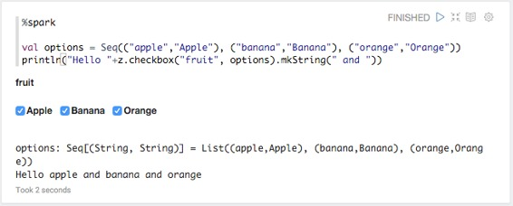