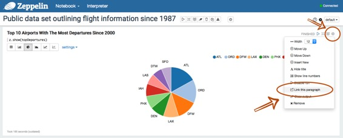
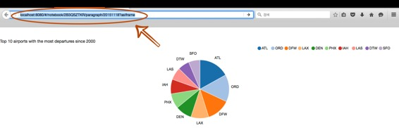
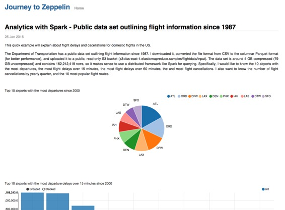

# 发表你的段落

原文链接 : [http://zeppelin.apache.org/docs/0.7.2/manual/publish.html](http://zeppelin.apache.org/docs/0.7.2/manual/publish.html)

译文链接 : [http://www.apache.wiki/pages/viewpage.action?pageId=10030598](http://www.apache.wiki/pages/viewpage.action?pageId=10030598)

贡献者 : [片刻](/display/~jiangzhonglian) [ApacheCN](/display/~apachecn) [Apache中文网](/display/~apachechina)

Apache Zeppelin提供了一个发布笔记本段落结果的功能。使用此功能，您可以在您自己的网站上显示Zeppelin笔记本段落结果。这很简单 只需`&lt;iframe&gt;`在页面中使用标签。

## 复制段落链接

发布段落结果的第一步是**复制段落链接**。

*   在您的Zeppelin笔记本中运行一个段落后，点击位于右侧的齿轮按钮。然后，单击**链接此段落**菜单，如下图所示。
    

*   只需复制提供的链接。
    

## 将段落嵌入到您的网站

要发布复制的段落，您可以`&lt;iframe&gt;`在网站页面中使用标签。例如:

```
<iframe src="http://< ip-address >:< port >/#/notebook/2B3QSZTKR/paragraph/...?asIframe" height="" width="" ></iframe>
```

 最后，您可以在您的网站上展示您美丽的可视化结果。



**注意**：要将该段落嵌入网站，Apache Zeppelin需要该网站可访问。请谨慎使用此功能，并在可靠的环境中使用，因为Zeppelin整个Webapp可由访问您的网站的任何人访问。