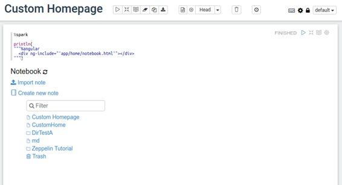

# 自定义Zeppelin主页

原文链接 : [http://zeppelin.apache.org/docs/0.7.2/manual/notebookashomepage.html](http://zeppelin.apache.org/docs/0.7.2/manual/notebookashomepage.html)

译文链接 : [http://www.apache.wiki/pages/viewpage.action?pageId=10030607](http://www.apache.wiki/pages/viewpage.action?pageId=10030607)

贡献者 : [片刻](/display/~jiangzhonglian) [ApacheCN](/display/~apachecn) [Apache中文网](/display/~apachechina)

Apache Zeppelin允许您使用您创建的笔记之一作为您的Zeppelin主页。为此，您可以对Zeppelin安装进行品牌定制，根据用户需求调整指导，甚至翻译成其他语言。

## 如何设置笔记作为您的Zeppelin主页

创建主页的过程非常简单，如下所示：

1.  使用Zeppelin创建一个注释
2.  在配置文件中设置note id
3.  重新启动Zeppelin

### 使用Zeppelin创建一个注释

使用Zeppelin创建一个新的笔记，您可以使用`%md`解释器进行降价内容或您喜欢的任何其他解释器。您还可以使用显示系统生成[文本](http://zeppelin.apache.org/docs/0.7.1/displaysystem/basicdisplaysystem.html#text)，[html](http://zeppelin.apache.org/docs/0.7.1/displaysystem/basicdisplaysystem.html#html)，[table](http://zeppelin.apache.org/docs/0.7.1/displaysystem/basicdisplaysystem.html#table)或Angular（[后端API](http://zeppelin.apache.org/docs/0.7.1/displaysystem/back-end-angular.html)，[前端API](http://zeppelin.apache.org/docs/0.7.1/displaysystem/front-end-angular.html)）。

运行（shift + Enter）注释并查看输出。（可选）将备注视图更改为报告以隐藏代码段。

### 在配置文件中设置note id

要在配置文件中设置注释ID，您应该将其从备注URL中的最后一个字中复制。例如:


将note id设置为`ZEPPELIN_NOTEBOOK_HOMESCREEN`环境变量或`zeppelin.notebook.homescreen`属性。

您还可以设置`ZEPPELIN_NOTEBOOK_HOMESCREEN_HIDE`环境变量或`zeppelin.notebook.homescreen.hide`属性来从记事列表中隐藏新的记事。

### 重新启动Zeppelin

重新启动您的Zeppelin服务器

```
./bin/zeppelin-daemon stop 
./bin/zeppelin-daemon start  
```

而已！打开浏览器并导航到Apache Zeppelin并查看您的自定义主页。

## 在自定义主页中显示注释列表

如果要在自定义Apache Zeppelin主页上显示笔记列表，您需要做的就是使用我们的％角度支持。

将以下代码添加到Apache Zeppelin注释中的段落中，并运行它。

```
%spark

println(
"""%angular
  <div ng-include="'app/home/notebook.html'"></div>
""") 
```

运行该段后，您将看到与此类似的输出：



而已！瞧！你有你的笔记列表。